# Bromite

---

 *[来源](https://www.bromite.org/)*

Bromite - 你的浏览器应该由你掌控。  
一个注重隐私，并且自带广告屏蔽器的 Chromium 修改版

开发者：[csagan5](https://github.com/csagan5) (Bromite Project)  
[官方网站](https://www.bromite.org/) | [源代码 (GitHub)](https://github.com/bromite/bromite) | [开源协议 (GPL3)](https://github.com/bromite/bromite/blob/master/LICENSE)

---

## 简介

当你看到上面的描述时，你可能会疑问：*“Chromium 是什么？我为什么从来都没有听说有人用过 Chromium? ”*

我们来换种方式描述 Chromium 吧，一句话来说：Chromium 是 Google Chrome（谷歌浏览器）的**母项目**。Google 在维护 Chromium 这个开源项目的同时，会将它的源代码进行修改，并且贴上不同的商标发行。在功能和使用上，两个浏览器几乎相同。

假如你无法理解上面的概念也没关系，只要把 Bromite ，我们这次要介绍的浏览器，看成 **Google Chrome 的修改版**就行了。

当我们最终安装完成并且打开这个浏览器的时候，假如你用过 Android 版 Chrome ，你会觉得 Bromite 的界面与操作和 Chrome 相差无几。

### 为什么用 Bromite ，而不用正统的 Chrome?

简短的答案：**你在使用 Chrome 的时候，也在使用 Google 的服务。**

你可能依然不理解这个答案，那我们来举个例子吧：当你使用 Chrome 访问一个外语网页时（比如，你的手机设置为中文语言，访问英文的网站），界面下方会弹出一个提示：

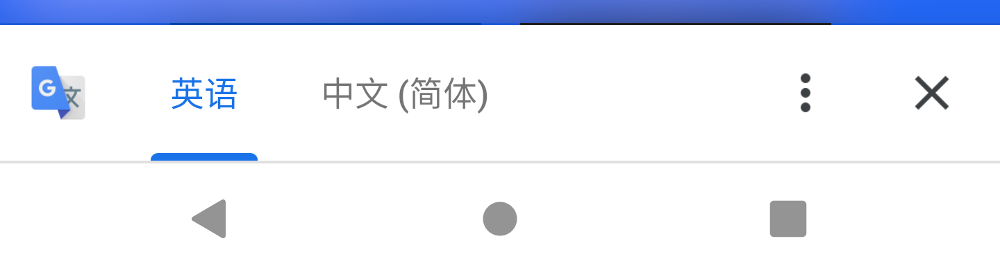

注意到左下角的  图标了吗？这代表着当你点下翻译（在这个特定的例子里，点击“中文（简体）”）的时候，Chrome 会连接 Google 翻译服务器并且让 Google 翻译来翻译页面的内容。

从隐私角度来讲，因为 Google 翻译并不是一个开放的服务，所以我们并不知道网页的内容在被送达到 Google 翻译之后发生了什么。Chrome 集成的 Google 服务还包括但不限于 [书签同步](https://support.google.com/chrome/answer/165139)，[“精简模式”](https://support.google.com/chrome/answer/2392284) 以及 [Google 新闻](https://news.google.com)。这些服务都由 Google 提供，而其中涉及的所有数据都经 Google 处理。

因此，Bromite 在 Chromium （Chrome的母项目）基础上，移除了上述来自 Google 的服务。

如果你想要一个 Chromium 内核的 Android 网页浏览器，却不想让自己的数据被商业公司处理，那么 Bromite 是你的绝佳选择。

## 下载和安装

### 通过官网安装 Bromite

> <i class="fa fa-check-circle" aria-hidden="true"></i> 如果你的设备上有 F-Droid 客户端，建议查看下方“通过 F-Droid 安装 Bromite”的指导。

点击，或是在你常用浏览器的地址栏中输入 [bromite.org](https://bromite.org) :

> <i class="fa fa-exclamation-triangle" aria-hidden="true"></i> 如果你在正在微信内阅读本文，请不要直接点击上方的链接；微信会对下载链接作出不可预测的行为。

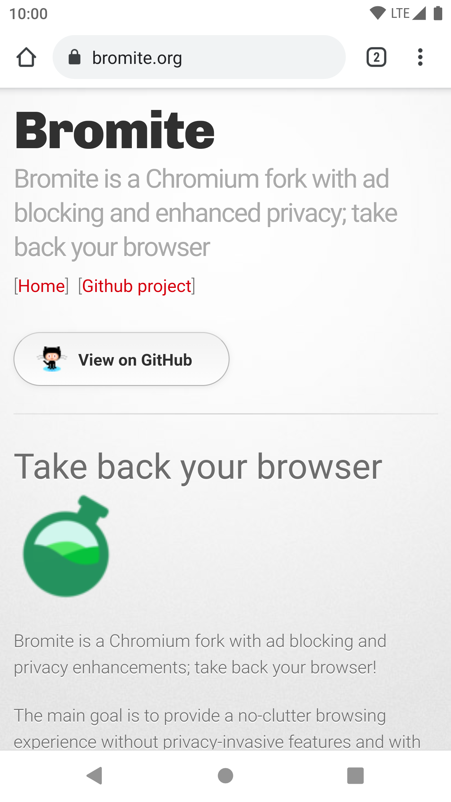

你可能在打开这个网页后非常疑惑：*为什么我看不到下载按钮？*

因为不同 Android 设备不同的硬件架构，不同的设备适用不同的安装包。要下载 Bromite, **滚动到这个页面的最底部**：

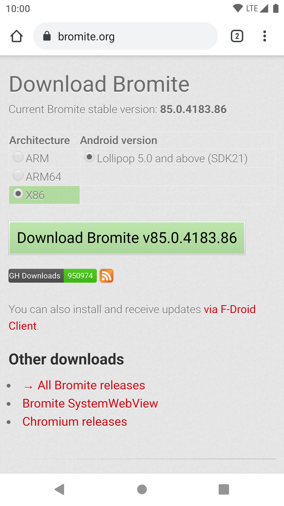

在上述的 "Download Bromite" 表格中，左侧的 "Architecture" 列代表你将要下载的安装包的**处理器架构**；一般情况下，你的设备的对应架构会被绿色高亮。在这个例子里，我使用的是一个运行在电脑上的 Android 模拟器，所以 "X86" 架构被高亮。右侧的 "Android Version" 列代表安装包对应的 Android 版本；目前 Bromite 只提供一个 Android 版本选项。

#### 在当前使用的设备上安装

要为你正在使用的设备下载和安装 Bromite ，选中**绿色高亮**的 "Architecture"，然后**点击 "Download Bromite ..."**

你的浏览器可能会询问是否保留该文件，**点击“确定”**。下载完成后，**点击“打开”来安装**。

> <i class="fa fa-info-circle" aria-hidden="true"></i> 假如你之前没有从目前使用的浏览器安装过应用，你需要进行一个额外的步骤允许应用安装。下面的视频展示了 Bromite 的安装以及允许未知来源应用的步骤。

#### 为其它设备安装，或者你的处理器架构没有被高亮

> <i class="fa fa-info-circle" aria-hidden="true"></i> 下面描述的是为其它设备下载 Bromite 安装包的方式。如果你不清楚你在做什么，请省略这一步。

如果你的处理器架构并没有被高亮，或者你要为其它设备下载和安装 Bromite, 你需要**选择这个设备对应的处理器架构**，然后**点击 "Download Bromite ..."**

> <i class="fa fa-info-circle" aria-hidden="true"></i> “处理器架构”可以理解为设备所使用的处理器的“内部语言”。不同的处理器“语言”之间并不互相兼容。

如果你正在为其它设备下载和安装 Bromite, 下载完成后，你需要将安装包传输到你的目标设备上，并且在目标设备上安装。在为其它设备下载 Bromite 的同时，你应该已经知道了在设备间传输文件的方式，在此不再赘述。

下方的表格列举了一般情况下，设备类型，发布年份以及处理器架构的关系。

> <i class="fa fa-exclamation-triangle" aria-hidden="true"></i> 下表对处理器架构的推测并非 100% 准确，仅供参考。

| 设备类型 / 发布年份 | 处理器架构 |
| -- | --: |
| Android 手机、平板（2017年及以后发布） | ARM64 |
| Android 手机、平板（2017年及以前发布），或者你不清楚需要下载什么，或者 ARM64 的安装包安装失败了 | ARM |
| Android 模拟器，双系统平板，Android-X86 电脑（Remix OS、凤凰 OS、Prime OS、Bliss OS X86 ...） | X86 |

### 通过 F-Droid 安装 Bromite

> <i class="fa fa-info-circle" aria-hidden="true"></i> 如果你已经跟着上一步通过官网安装了 Bromite，可以省略这一步。但你也可以为了后续更新的方便在 F-Droid 上添加 Bromite 的存储库。

F-Droid 的官方仓库并没有提供 Bromite，但是 Bromite Project 提供了可以添加到 F-Droid 客户端的仓库，让用户能更方便地更新 Bromite.

> <i class="fa fa-check-circle" aria-hidden="true"></i> 在进行下面的步骤之前，请确保你已经在设备上安装了 F-Droid 客户端。关于安装 F-Droid 的指导，请[点击这里](../../AppStores/F-Droid/F-Droid.md)。

要将 Bromite 的仓库添加到 F-Droid 客户端，**长按下方二维码**并**点击“复制链接”**，或者保存并识别下面的二维码：

> <i class="fa fa-exclamation-triangle" aria-hidden="true"></i> 请勿使用微信识别二维码。微信会对识别的链接作出不可预测的行为。

 *[来源](https://www.bromite.org/fdroid)*

**复制链接之后**， **打开 F-Droid 客户端，点击底栏的“设置”** 进入设置界面。在设置界面，**点击“存储库”**：

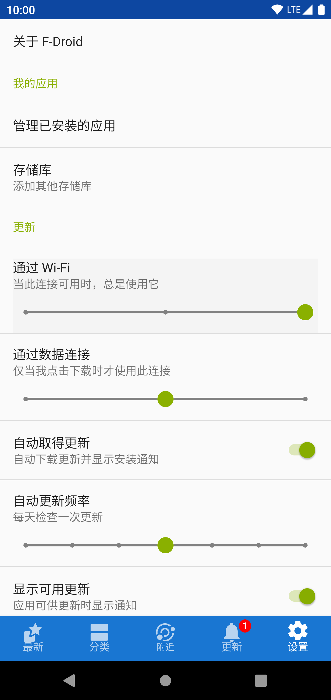

进入“存储库”之后，**点击右上角的 <i class="fa fa-plus" aria-hidden="true"></i> 号**：

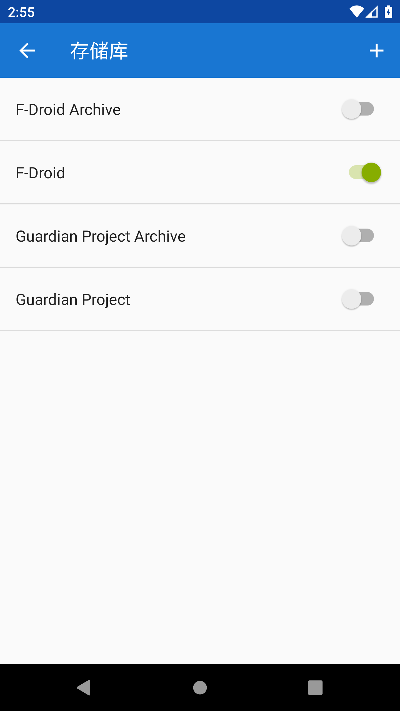

因为 F-Droid 会自动识别已经复制的内容，弹出的“添加新的存储库”对话框内应该已经填写了 Bromite F-Droid 存储库的信息。

> <i class="fa fa-info-circle" aria-hidden="true"></i> 如果对话框内的文本是空的，你应该回到这部分的开头，重新复制或者识别二维码所包含的链接。

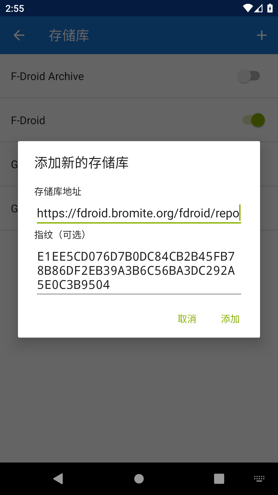

当你确认对话框内的信息无误，**点击“添加”** 来把 Bromite 的存储库添加到 F-Droid 里。当你点击完“添加”，“存储库”列表最底端会出现一个“未验证”的存储库。稍等片刻，F-Droid 客户端会自动验证该存储库，并且最终的存储库名为 **"Bromite official F-Droid repository"**.

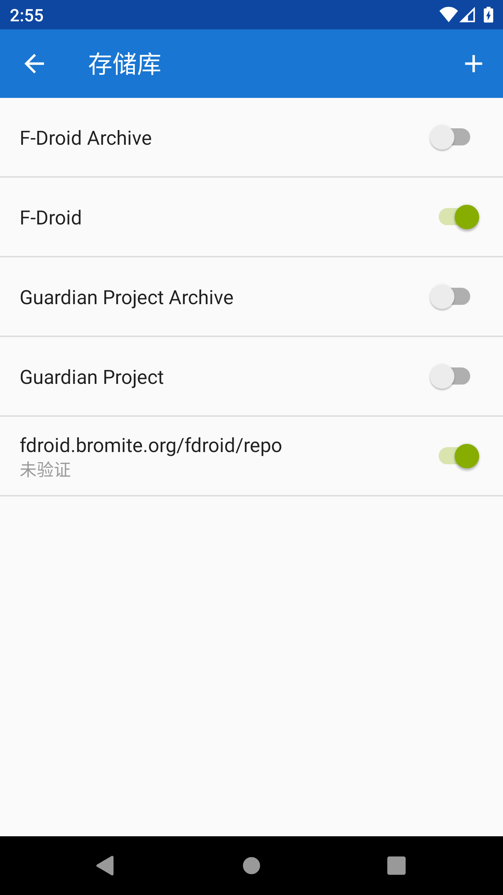
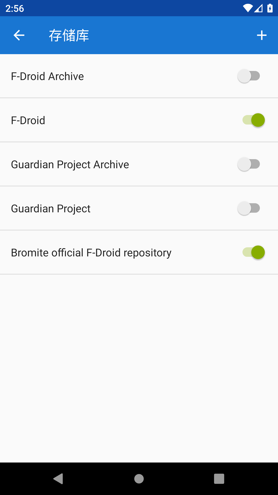

回到“设置”界面，**点击底栏的“最新”**，你就可以看到右下角的 <i class="fa fa-search" aria-hidden="true"></i> 按钮了。在“搜索”界面里**搜索 "Bromite"**, 然后在下方**点击 "Bromite"** 行来查看 Bromite 的详细信息。在此你可以**点击“安装”来安装 Bromite**. 关于在 F-Droid 里搜索和安装应用的详细指导，请[点击这里](../../AppStores/F-Droid/F-Droid.md)。

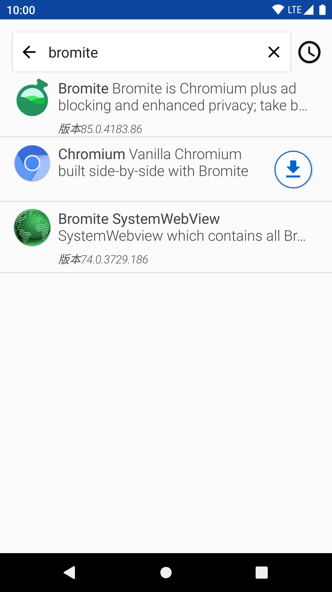
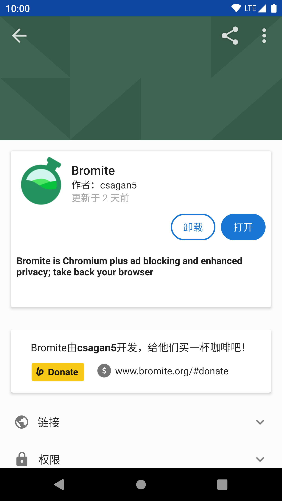

## 使用 Bromite

如果你之前在 Android 上使用过 Chrome, 那么当你打开 Bromite 的时候会感觉无比亲切：**它看起来和 Chrome 几乎一模一样！**

正因如此，这里不会赘述 Bromite (Chrome) 的基本使用，而是**着重描述一些 Bromite 和 Chrome 的区别**，以及一些隐私相关的注意事项。

> <i class="fa fa-info-circle" aria-hidden="true"></i> 因为 Bromite 的更新，本文可能不会随时保持最新。如果你有任何的疑惑，请参考 [Bromite Wiki](https://github.com/bromite/bromite/wiki).

### DNS over HTTPS

[中国联通](https://www.zhihu.com/question/23197534)、[Comcast](https://www.privateinternetaccess.com/blog/comcast-still-uses-mitm-javascript-injection-serve-unwanted-ads-messages/) 等网络运营商被证实进行过多种中间人攻击；使用运营商提供的 DNS 存在被 [DNS 污染](https://en.wikipedia.org/wiki/DNS_spoofing)的风险。根据政府要求，中国所有网络运营商提供的 DNS 都被污染以配合[防火长城](https://en.wikipedia.org/wiki/Great_Firewall)的运作。未来不排除网络运营商通过中间人攻击进行 DNS 劫持（即便使用了未被污染的 DNS 服务器，查询结果也因为中间人攻击而被污染）的可能。

[**DNS over HTTPS**](https://en.wikipedia.org/wiki/DNS_over_HTTPS) 是一个将 [DNS](https://en.wikipedia.org/wiki/Domain_Name_System) 请求进行加密的方案。其意义在于 **将 DNS 请求使用 [HTTPS](https://en.wikipedia.org/wiki/HTTPS) 协议加密，来防止可能的[中间人攻击](https://en.wikipedia.org/wiki/Man-in-the-middle_attack)** 污染 DNS 查询结果。通过在浏览器内使用 DNS over HTTPS, 你可以指定一个 DNS 服务器列表并且与它们进行加密的 DNS 查询。

> <i class="fa fa-info-circle" aria-hidden="true"></i> 下述 DoH 为 DNS over HTTPS 的简称。

Bromite 可以使用 DoH, 但这个功能默认关闭。要启用 DoH, 我们首先要选择一个 DoH 提供商。

网络上有很多 DoH 提供商。你可以基于个人喜好，地理位置和网络情况，以及他们的隐私条款来选择 DoH 提供商。下面是一个 DoH 提供商的简表，你可以根据下表来选择自己的 DoH 模板地址，也可以参照 [privacytools.io](https://www.privacytools.io/providers/dns/) 的列表来选择。

| 提供商 | DoH 模板链接 |
| -- | -- |
| [AdGuard](https://adguard.com/en/adguard-dns/overview.html#instruction) | [https://dns.adguard.com/dns-query](https://dns.adguard.com/dns-query) |
| [Cloudflare](https://support.mozilla.org/en-US/kb/firefox-dns-over-https) | [https://cloudflare-dns.com/dns-query](https://cloudflare-dns.com/dns-query) |
| [Cloudflare （与 Mozilla 合作，更严格的隐私条款）](https://developers.cloudflare.com/1.1.1.1/dns-over-https/request-structure/) | [https://mozilla.cloudflare-dns.com/dns-query](https://mozilla.cloudflare-dns.com/dns-query) |
| [Quad9](https://quad9.net/) | [https://dns.quad9.net/dns-query](https://dns.quad9.net/dns-query) |

> <i class="fa fa-info-circle" aria-hidden="true"></i> 下面的步骤将使用 Cloudflare 与 Mozilla 合作的 DoH 服务作为示例。如果你想要使用一个不同的 DoH 提供商，请将步骤中的 [https://mozilla.cloudflare-dns.com/dns-query](https://mozilla.cloudflare-dns.com/dns-query) 链接替换成你的 DoH 模板链接。

在上表长按然后复制你想要的 DoH 模板链接， 在这个例子中，[https://mozilla.cloudflare-dns.com/dns-query](https://mozilla.cloudflare-dns.com/dns-query). **在长按弹出的对话框中，点击“复制链接地址”**。

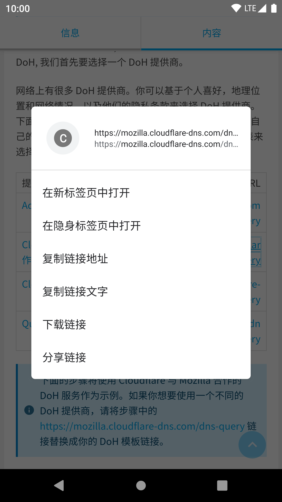

复制之后，**点击 Bromite 右上角的 <i class="fa fa-ellipsis-v" aria-hidden="true"></i> **，然后**点击“设置”**：

> <i class="fa fa-info-circle" aria-hidden="true"></i> 如果你看不到地址栏和 <i class="fa fa-ellipsis-v" aria-hidden="true"></i> ，请向上滚动（手指向下移动）一下页面。

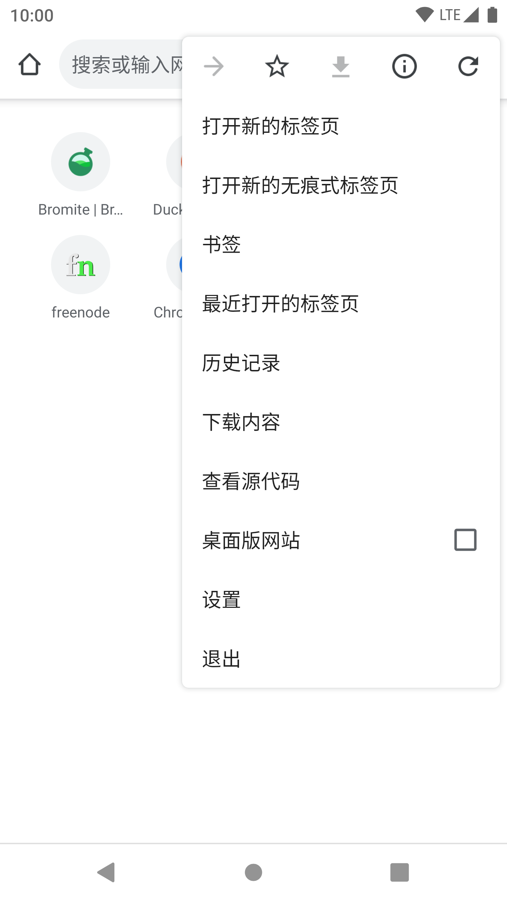
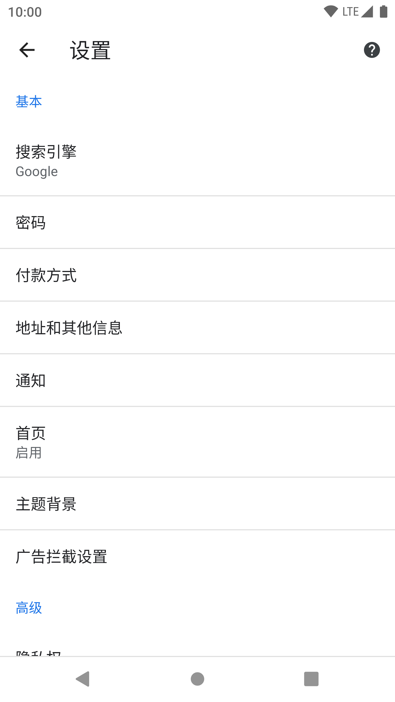

在“设置”界面，**向下滑动**直到你能看到“隐私权”，**点击“隐私权”**。在“隐私权”界面，**点击“安全 DNS”**：

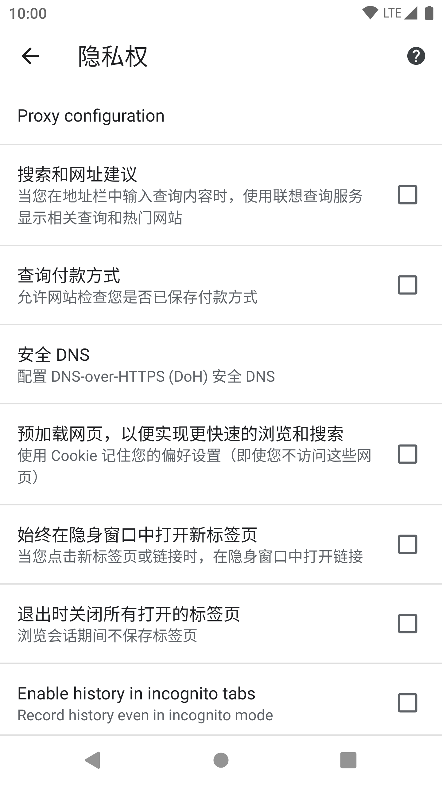
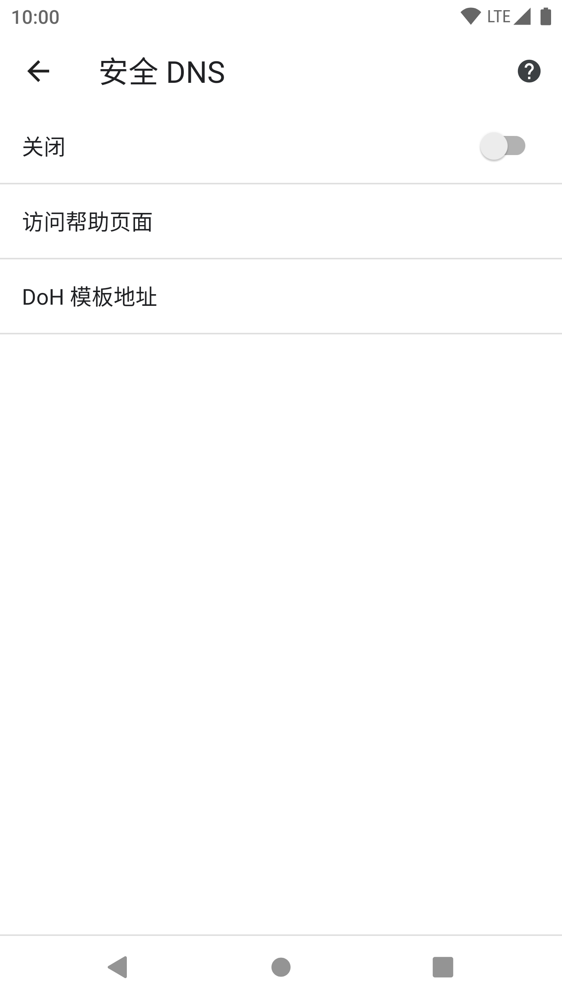

在“安全 DNS”界面，点击“关闭”右侧的开关来**打开安全 DNS**。现在你应该能看到一个“启用”以及一个打开的开关。

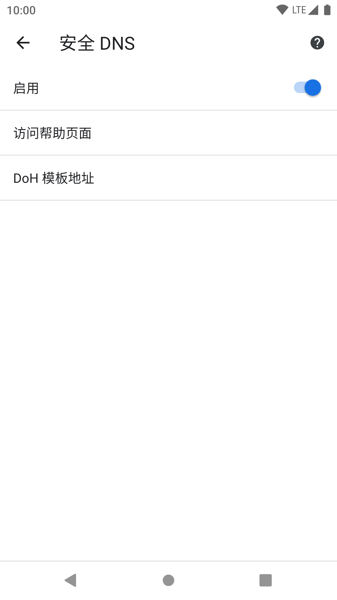

步骤到此还没结束，我们还需要**点击 "DoH 模板地址"** 并且 **输入刚才复制的地址** ：

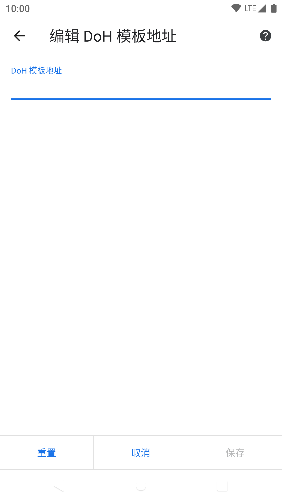
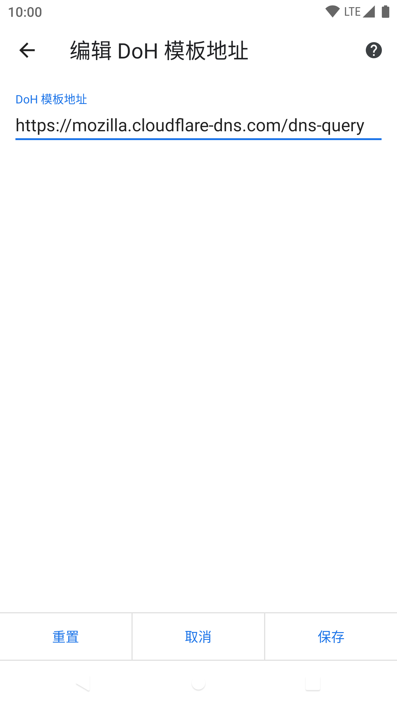

输入完成后**点击“保存”**。在此 DoH 配置完成，你可以点几次返回来回到浏览状态。

### 添加和设置搜索引擎

尽管 Bromite 是一个“反 Google”的项目，它的默认搜索引擎依然是 Google. 无可否认，Google 在某些标准上是目前“最好用”的搜索引擎。但从隐私角度出发，它也有着一些致命的缺陷。其中的例子有：[你的搜索请求被用于精准推广用途](https://policies.google.com/privacy)；[多次被内容农场污染搜索结果](https://www.v2ex.com/t/663593)...

你可能想把 Google 替换成例如 [DuckDuckGo](https://duckduckgo.com/) 等更尊重隐私的搜索引擎。

DuckDuckGo 的隐私条款请见[https://duckduckgo.com/privacy](https://duckduckgo.com/privacy)。

位于 **<i class="fa fa-ellipsis-v" aria-hidden="true"></i> -> 设置 -> 搜索引擎**，根据你设置的系统语言和地区，Bromite 预置了原版 Chrome 预置的所有搜索引擎：

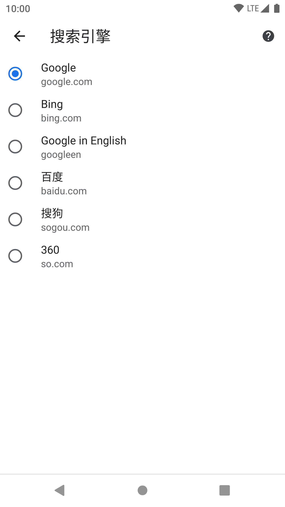
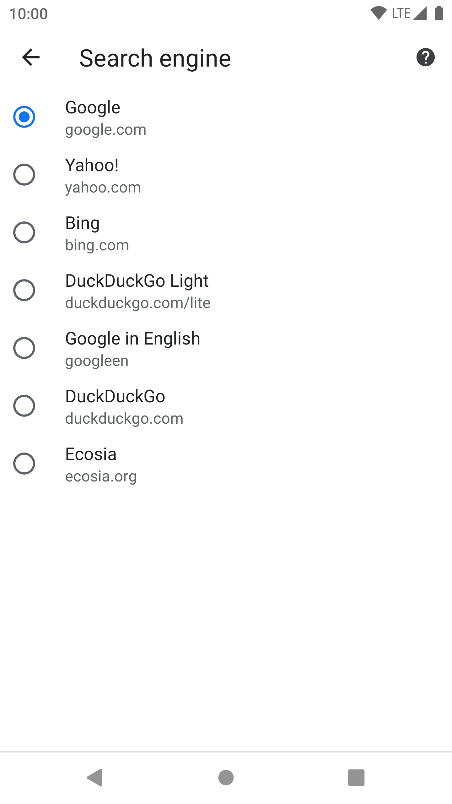

如果你是一个中文的 DuckDuckGo 用户，你可能会疑惑：*为什么我找不到 DuckDuckGo 作为我的搜索引擎？*

DuckDuckGo 确实没有被内置到中文的 Chrome 当中。有一个解决方法：**访问一下 [DuckDuckGo](https://duckduckgo.com/)** , 然后**再次访问“搜索引擎”菜单**，你就能在“最近用过的搜索引擎”下找到 DuckDuckGo 了。在“搜索引擎”菜单选中 DuckDuckGo, 现在 DuckDuckGo 就是你的默认搜索引擎了。

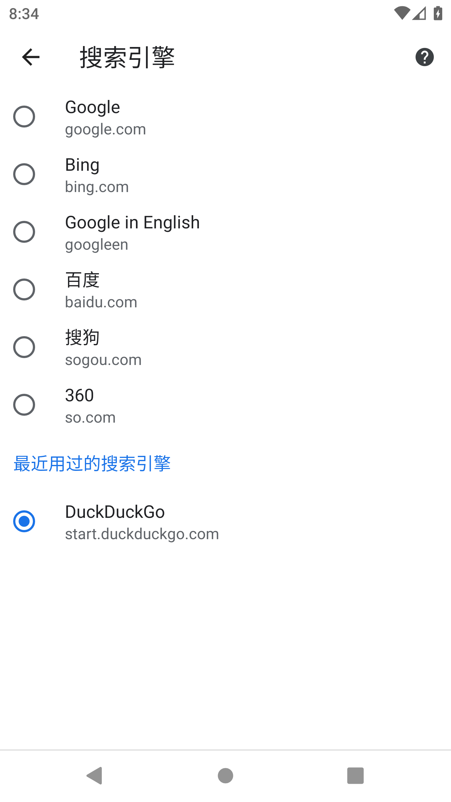

然而，在 *noarch* 的测试当中，这个方法并不 100% 有效... 下面的视频展示了另一个有效的方法。如果让 Bromite 自动添加 DuckDuckGo 的方法失败了，你可以尝试下面的方法。

下面的视频使用类原生 Android 作为示例。不同手机厂商系统的操作可能会有差别。

### 广告拦截

Bromite 自带广告拦截功能，并且**广告拦截功能默认开启。**

如果广告拦截破坏了某些网页的正常使用，你可以在**访问它们之前关闭广告拦截，然后在访问结束后打开**：

在 **<i class="fa fa-ellipsis-v" aria-hidden="true"></i> -> 设置 -> 广告拦截设置**，你可以开关广告拦截以及自定义广告拦截规则列表。**点击“启用”右侧的开关将其“关闭”**，就可以关闭广告拦截。

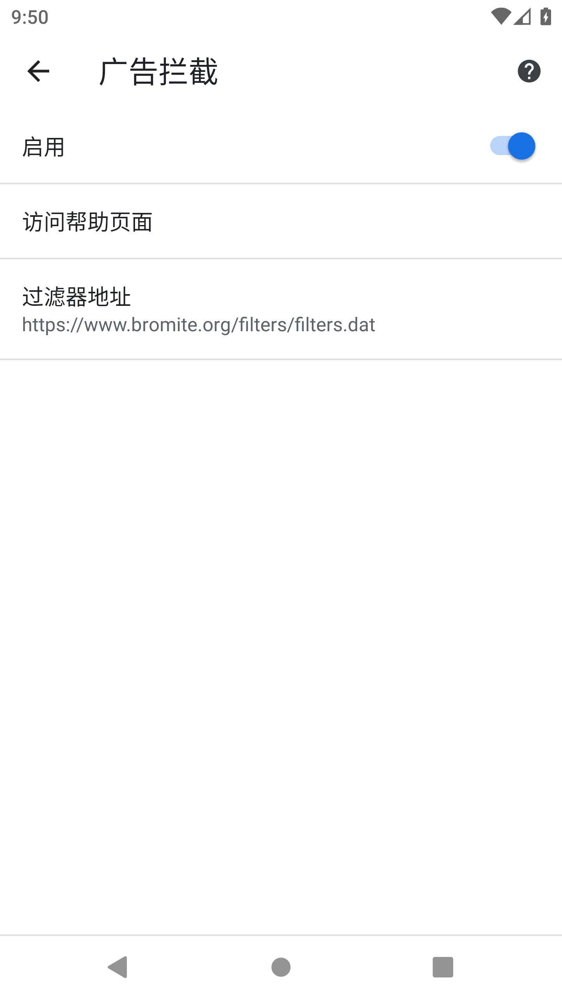
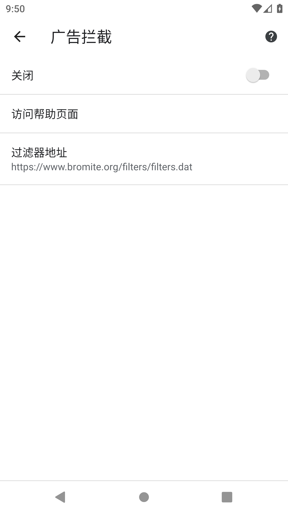

关于自定义广告拦截的指导，请见[https://www.bromite.org/custom-filters](https://www.bromite.org/custom-filters) .

### 不在退出后保留标签页

在 Bromite 和 Chrome 的默认设置中，打开 Bromite 的时候会自动恢复上一次浏览时的标签页（网页）。你可能不想让它恢复上一次的标签页，那么你可以进入 **<i class="fa fa-ellipsis-v" aria-hidden="true"></i> -> 设置 -> 隐私权**，并且**选中“退出时关闭所有打开的标签页”**。

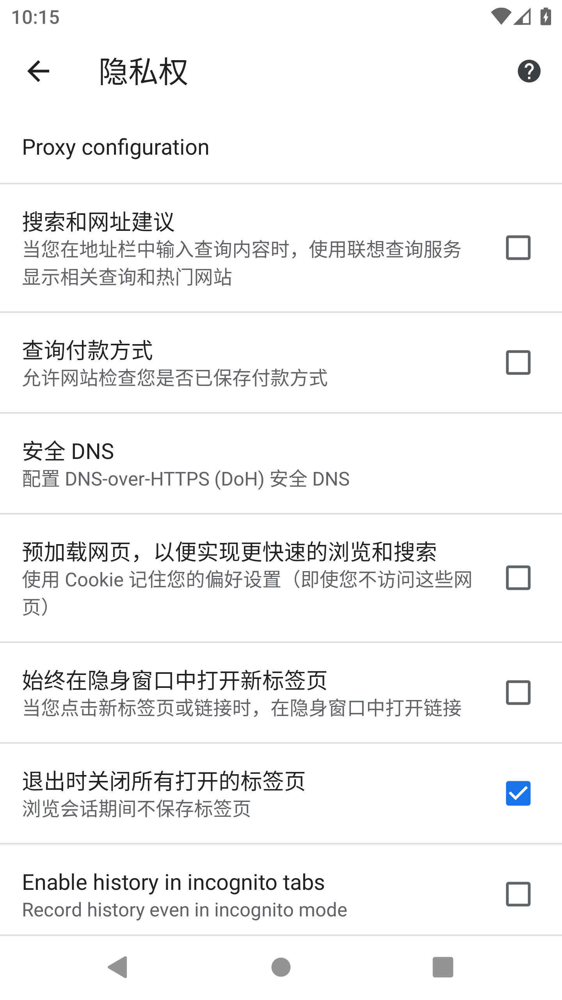

> <i class="fa fa-check-circle" aria-hidden="true"></i> 彩蛋：如果你在 Bromite 或 Chrome 打开了超过 99 个标签页，它依然会保持微笑！

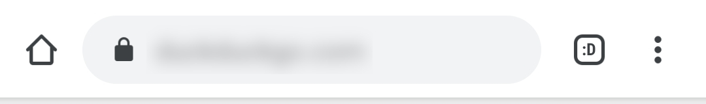
