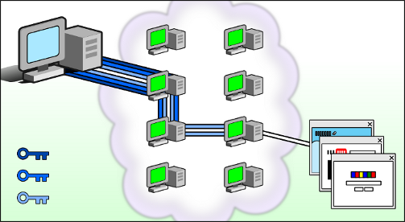

# Tor 浏览器

---

 [*来源*](https://gitweb.torproject.org/tor-browser.git/tree/browser/branding/official/firefox.svg?h=tor-browser-78.5.0esr-10.5-1)

Tor 浏览器 - *私密浏览，自由探索。*  
一个匿名、加密、抗追踪、反监视，最重要的是 - 零审查的浏览器。

开发者：[Tor Project](https://www.torproject.org/zh-CN/about/people/)  
[官方网站](https://www.torproject.org/zh-CN/) | 源代码 ([cgit](https://gitweb.torproject.org/tor-browser.git/) / [自托管 GitLab](https://gitlab.torproject.org/tpo/applications/tor-browser)) | [许可协议（主要为 MPL 2.0）](https://www.mozilla.org/en-US/MPL/2.0/) | [用户手册](https://tb-manual.torproject.org/zh-CN/)

---

## Tor 浏览器是什么，它和普通浏览器有什么区别？

部分引用 [Tor 浏览器用户手册](https://tb-manual.torproject.org/zh-CN/about/)

Tor 浏览器是经过修改的 [Firefox](https://www.mozilla.org/zh-CN/firefox/new/), 通过 Tor 网络来保护你的隐私和匿名性。使用 Tor 网络带来了两个主要好处：

- 你的网络运营商 (ISP) 或任何本地监控者（例如路由器家长控制）无法监控你使用 Tor 浏览器进行的网络活动，包括网站名称和地址。

- **除非你明确标识自己**（例如登录帐号，署名等），你访问的网站和服务的运营商，或任何监视他们的人不会知道你的真实身份。

此外，Tor 浏览器还抗指纹。“浏览器指纹”指网站通过收集你的电脑配置和硬件特殊的属性来识别你的行为。普通浏览器中的 JavaScript API 会向网站[泄露大量身份信息](https://browserleaks.com/)，而 Tor 浏览器通过禁用或欺骗这些请求来保护你的身份。

最后，默认情况下，Tor 浏览器不保留任何浏览历史。Cookies 和网站数据只在单一会话内有效，关闭 Tor 浏览器或点击“新身份”时清除。

简单来说：Tor 浏览器是一个永远处于“无痕模式”的浏览器，但它除了抵抗例如父母的浏览历史检查之外，还能应对路由器监控、运营商审查，以及网站身份识别等更高级的审查手段。

### Tor 如何工作

`privacy.noarch` 在 [Tor 使用教程]()中已经解释了 Tor 如何工作。不过 *noarch* 依然会在这回顾一下：

Tor 是由一个虚拟通道 (tunnel) 组成的网络，用于增强你在互联网上的隐私和安全性。

Tor 会将你的流量通过随机选择的三个服务器加密并转发；其加密和路线选择方式类似于将三层 VPN 像洋葱一般卷在一起。这也是 Tor (The Onion Router, 洋葱路由器) 名字的由来。线路中的最后一个节点，即“出口节点”，剥下这个加密“洋葱”的最后一层皮，将流量转发到公网。

 [*来源*](https://tb-manual.torproject.org/about/)

上图展示了一个用户如何经过 Tor 网络访问互联网。中间的绿色计算机表示 Tor 网络中的节点，三把钥匙则是 *noarch* 前面提到的“洋葱”的三层皮，这个洋葱从客户端出发，一个节点只能剥掉一层皮（解开一层加密），直到最后的出口节点将数据传输到明网服务器。

### Tor 在中国的现状

因为[防火长城](https://zh.wikipedia.org/wiki/防火长城)的审查，*noarch* 很抱歉你无法在中国“直接”连接到 Tor 网络。因为 Tor 网络的节点是[公开的](https://metrics.torproject.org/rs.html)，防火墙可以对它们进行批量封锁。同时，Tor 的“直接连接”也没有经过混淆处理，并且已经被防火长城检测。

为此，Tor Project 发布了[网桥](https://tb-manual.torproject.org/zh-CN/bridges/)：它们是“未公开”，需要单独请求的 Tor 节点。需要单独请求的特性使得防火墙无法一次性对它们进行全部封锁。目前大部分 Tor 网桥还采用了[传输插件](https://2019.www.torproject.org/docs/pluggable-transports.html.en)，或者叫[混淆](https://en.wikipedia.org/wiki/Obfuscation_(software))。混淆使得防火墙难以鉴别 Tor 流量，并因此难以封锁这些流量。

在中国，目前只有 Tor Project 提供的，使用 [meek](https://trac.torproject.org/projects/tor/wiki/doc/meek) 混淆的网桥可以工作。这种混淆方式将网桥部署到大型云服务上，例如 Microsoft Azure 或 Amazon CloudFront, 并将你的 Tor 流量伪装成，根据网桥部署的位置，向微软或亚马逊的连接。

然而，中国对网桥的需求巨大，但这些网桥都是由志愿者运行的、非营利性的代理。因此，meek 网桥供不应求，导致它们速度十分缓慢。“十分缓慢”指数分钟的线路建立，以及个位数 KB/s 的传输速度 (*noarch* 测试)。

综上所述，*noarch* 在下面的教程里将会搭配现有的“翻墙”方式使用 Tor. 取决于你使用的前置翻墙代理，通过这种方式连接 Tor 一般可以达到 Tor 的常见速度 (~200KB/s).
