# 公钥加密简介  

翻自 [*A Deep Dive on End-to-End Encryption: How Do Public Key Encryption Systems Work?*](https://ssd.eff.org/en/module/deep-dive-end-end-encryption-how-do-public-key-encryption-systems-work), EFF.

---

如果你会正确使用端到端加密，它可以防止你发送的消息、文本甚至文件被除了参与者之外的人查看。端到端加密同样也可以保证你收到的消息来自一个特定的人，而没有被篡改。

过去几年中，各类工具让使用端到端加密越发简单。比如 Signal 就是一个应用端到端加密的通讯工具 - 你可以通过 Signal 聊天，收发文件，或是打语音/视频电话。这些安全的通讯工具在发送人和接收人之间使用端到端加密来加密信息。加密使得网上的窃听者只能读到一堆无意义的垃圾。你用的网络提供商甚至就可能是窃听者之一。

尽管现在有很多方便使用的端到端加密工具，有一些端到端加密的实现还不是那么容易理解和使用。因此我们建议你在利用加密增强你的线上隐私之前，先了解公钥加密，或是非对称加密的一些基本知识。

本教程要讲解的加密类型，也是端到端加密所依赖的类型，叫做公钥加密。关于其它类型的加密，你可以阅读我们的另外一篇教程：[What Should I Know About Encryption?](https://ssd.eff.org/en/module/what-should-i-know-about-encryption)

在本文中，你会了解一些非常重要的信息，比如公钥加密的能力和限制。这些知识能让你在正确的时间用正确的方法使用公钥加密 - 总而言之，让你能更有效地使用公钥加密。

## 加密是什么？

我们来举个例子，比如你要加密发送一条消息：

1. 一条清晰可读的信息，比如（“嗨，妈妈”）， 被加密编码成一个没人看得懂的信息 ("OhsieW5ge+osh1aehah6").

2. 加密后的信息经由互联网传输。如果有人尝试阅读这条信息，他们只能读到看不懂的 ("OhsieW5ge+osh1aehah6").

3. 当这条信息到达目的地，我们预期的收件人有某种办法将信息解密回原始信息（“嗨，妈妈”）。

## 对称加密：用单个密钥传小纸条的故事

Julia 想给 César 传一个小纸条，告诉他 "Meet me in the garden"（课后在花园见面），但她不想让纸条经手的同学读到其中的内容。

Julia 在传纸条到 César 的过程中需要经手一堆爱管闲事的同学，它们都会把纸条瞄一眼再传递到下一个人。并且他们也会在传下去之前把信息记下来，同时写上 Julia 给 César 传纸条的时间。

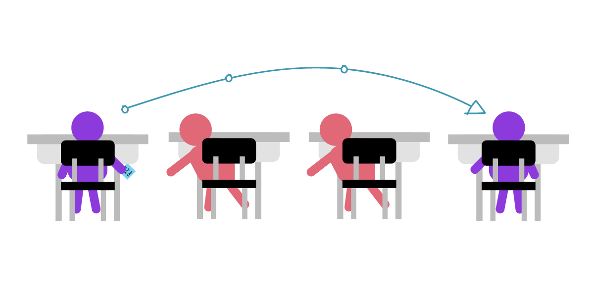

为了应对这个问题，Julia 打算把她的信息用数值为 3 的密钥加密，将每个字母在字母表中向下移动三位。这样 A 会变成 D, B 会变成 E, etc. 不过这么简单的密钥加密后的文本很容易被“暴力破解”。暴力破解，意思是攻击者不断尝试所有可能的密钥组合，直到信息能被正确解密为止。

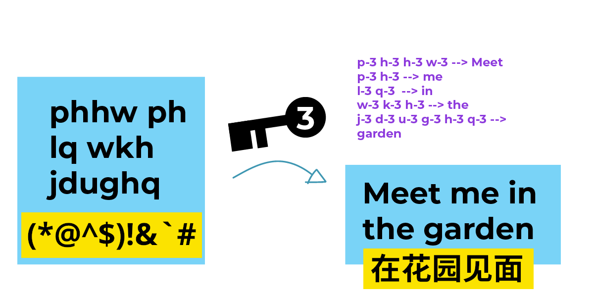

这种将信息从字母表上偏移三位的古老方法曾被“罗马共和国的独裁者” *尤利乌斯·凯撒* 使用，称之为凯撒密码。凯撒密码是对称加密的一个代表：它将信息在字母表上偏移三位来加密，同时也在字母表上反向偏移三位来解密。

从上面的例子你也可以看到，凯撒密码在密码学上是一种非常弱的加密方式。幸运的是，凯撒密码起，加密已经走了很长一段路。得益于各种数学算法和计算机的帮助，当下的密钥可以比这长得多，而且要远远难以猜测。对称加密经历了非常长的发展，并且在许多领域都有实际应用。

然而，对称加密有一个致命的问题：如果有人直接等 Julia 和 César 交换密钥并从中窃听，然后偷走这个密钥并用其解密信息呢？如果 Julia 和 César 在世界两端，并且没有计划见面呢？

我们假设 Julia 和 César 得知了公钥加密的存在。公钥加密让窃听者很难窃取解密密钥 - 因为他们根本不需要分享解密密钥。在公钥加密中，加密和解密使用不同的密钥。

## 公钥加密：两把钥匙的故事

我们来更深入地看下这个问题：发送者到底如何安全地将解密密钥发送到接收者手里？这个问题在长距离传输中尤其致命，因为交流的两方无法面对面私密地交换密钥。

对于这个问题，公钥加密有一套优雅的解决方案。在公钥加密聊天中，每个人建立两个密钥 - 私钥和公钥。它们都是两个非常大的数字，并且由一些数学性质相关联。如果你用一个人的公钥加密消息，那么他就可以用对应的私钥解密这个消息。

Julia 和 César 现在不传纸条了，而是在两台电脑上使用公钥加密聊天。帮他们传纸条的同学，现在变成了在他们加密通讯中的计算机。下面是 Julia 和 César 的中间人：他们的 Wi-Fi 路由器，互联网运营商，还有他们的邮箱服务。在现实中，他们之间可能有数百台计算机在复制并且存储他们发送的消息。

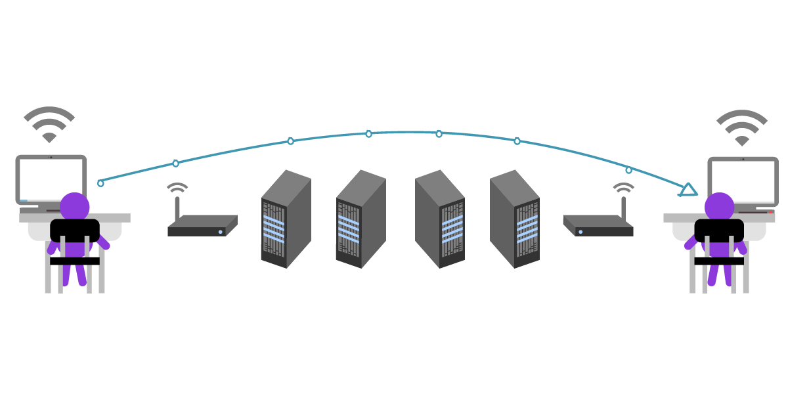

Julia 和 César 对于中间人知道他们在聊天这件事并不关心，不过他们希望消息本身是私密的。

首先，Julia 需要 César 的公钥。César 可以把他的公钥通过一个不安全的方式，比如未加密的 email 传输。因为公钥是可以随意分享的，所以 César 根本不用管中间人能不能看到他的公钥。注意，在公钥身上，“密钥”的比喻其实不太恰当：公钥其实不太像现实中的钥匙，而更像一把很难被逆向破解的锁。为了防止中间人在密钥交换过程中将 César 的密钥调包成中间人的，César 同时通过多种渠道与 Julia 交换和验证密钥。

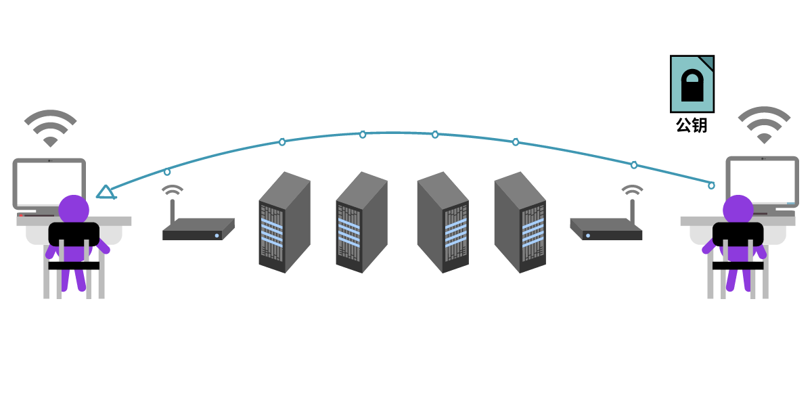

Julia 收到了 César 的密钥，现在她可以给 César 发一条加密的消息了！她现在用 César 的公钥写道："Meet me in the garden."

然后她将这个只为 César 加密的信息发了出去。

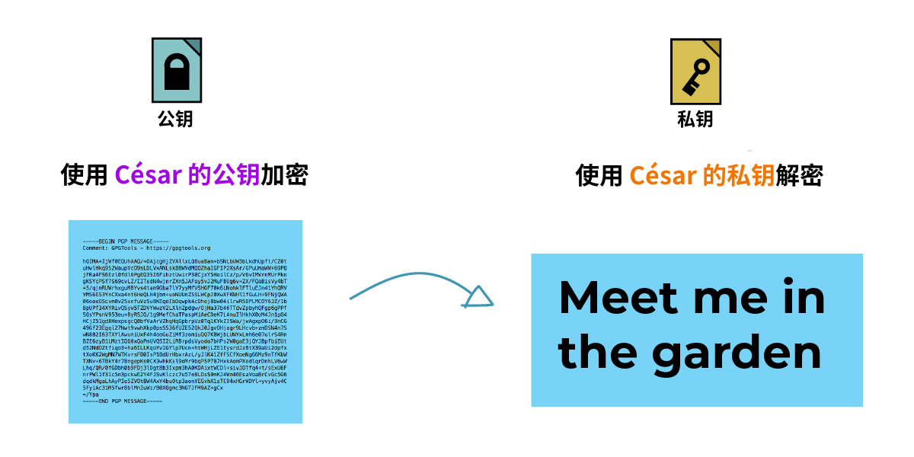

现在除了 Julia 和 César 之外没人能理解这条消息，因为这个消息在他人眼里就是一团乱麻。不过中间人依然可以看到未加密的元数据，比如标题、日期，以及发件和收件人。

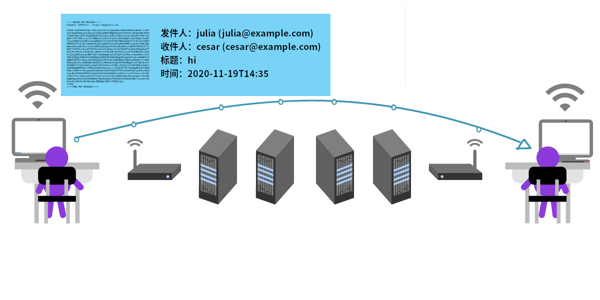

因为这条信息使用了 César 的公钥加密，理论上只有 César 和发件者 (Julia) 可以读取。Julia 有着未加密的原文，而 César 则可以用他的私钥解密消息。

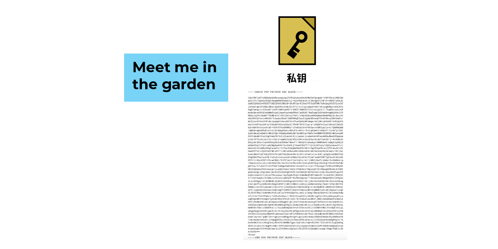

我们来回顾一下。在公钥加密里：

- 公钥加密让用于加密的公钥能在开放，不安全的环境下传输
- 要给好友发加密的消息，你需要有他们的公钥
- 你的私钥用于解密发给你的加密消息
- 中间人 - 比如邮件提供商，网络运营商，还有网络上的计算机 - 依然全程可以看到未加密的元数据。这些元数据包括谁在和谁聊天，信息在什么时候被接收，标题是什么，信息是加密的... 等等。

## 还有一个问题：冒名顶替

在 Julia 和 César 的例子里，中间人能全程看到消息的元数据。

我们假设中间人里面有一个坏蛋。坏蛋的意思也不用多解释：一个尝试窃取你的信息并伤害你的人。这个坏蛋因为某些原因想要偷窥 Julia 和 César 的通讯。

我们再假设这个坏蛋成功地骗过了 Julia, 使她拿走了坏蛋的公钥而不是 César 的公钥。Julia 没有意识到这点，让这个坏蛋能接到她的消息，偷看一眼，然后再把信息转给 César.

这个坏蛋甚至可以在把信息转给 César 之前修改其中的内容。

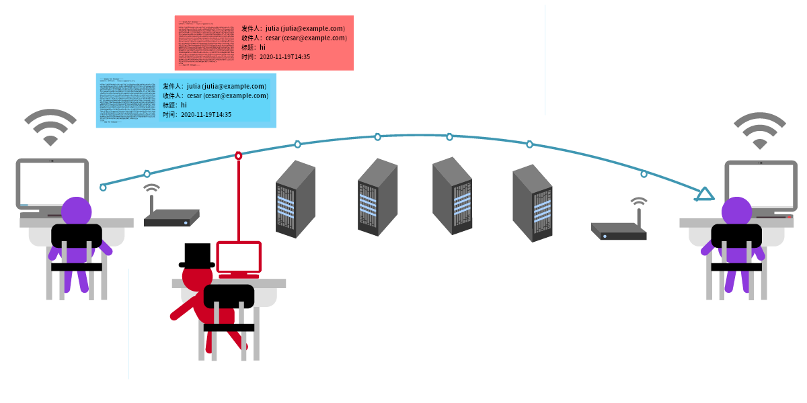

不过大部分时候这个坏蛋还是会把信息原封不动地转达给 César. 这样他就能让 Julia 和 César 都不知道他的存在，César 如约前往花园和 Julia 见面 - 草，坏蛋怎么也在这？

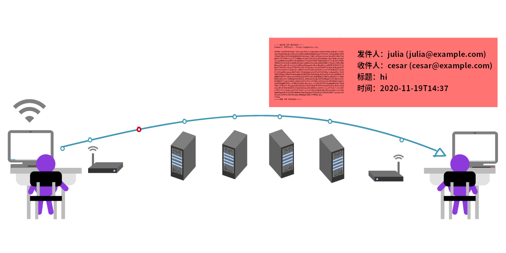

这种行为也被称为中间人攻击。幸运的是，公钥加密有办法阻止这种攻击。

公钥加密有一个验证机制，叫做“指纹”。通过比对密钥指纹，你可以搞清楚一个密钥的真实归属。这个比对的过程最好在现实中完成 - 你将两台包含同一个公钥的设备放在一起，并且比较两台设备上指纹的每一个字符。这样做有点烦，不过为了保证通讯安全，它是绝对值得的。

对于一些非对称加密实现，你也可以通过设备上显示的二维码来比对指纹。在这种情况下，你只需要让设备互相扫码就可以验证指纹。

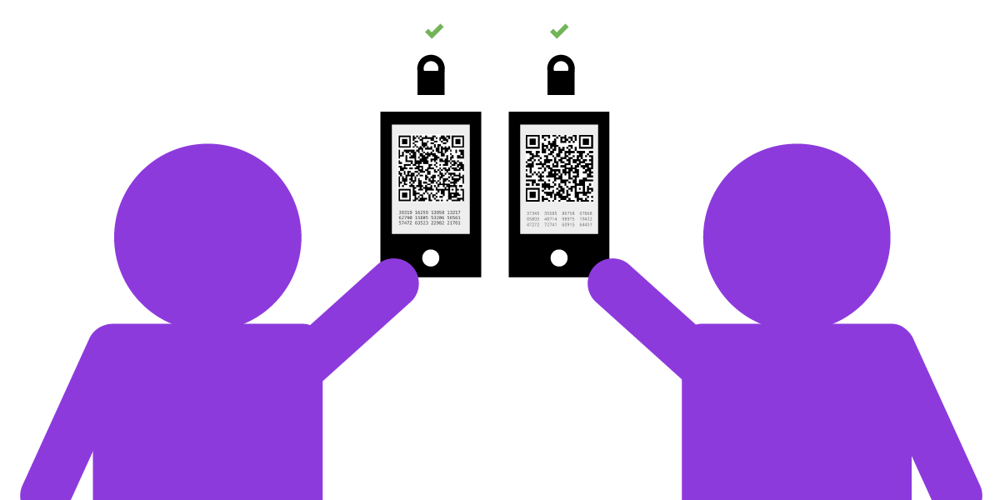

如果你无法面对面交换密钥，你也可以将指纹通过一个相对安全的通道传输，比如一个本身就端到端加密的及时通讯或是一个 HTTPS 的站点。

下面的例子里，César 用另一个端到端加密的及时通讯和 Julia 交换密钥指纹：

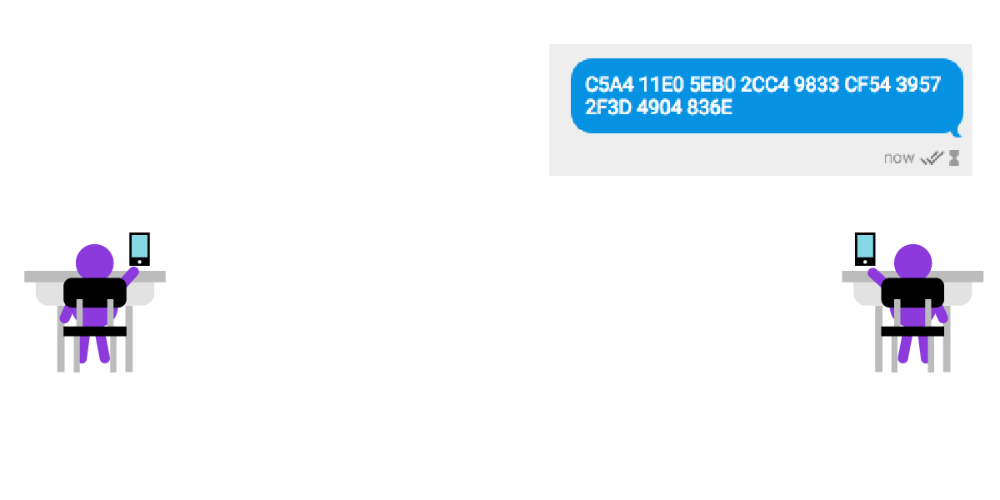

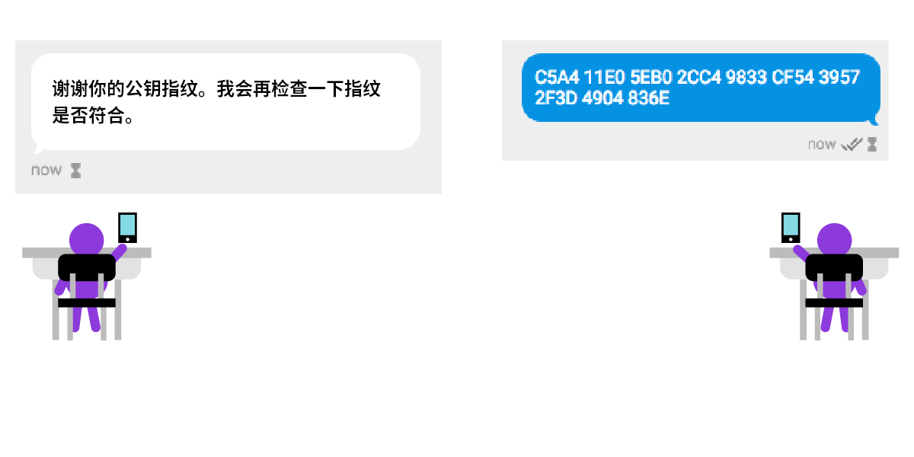

回顾：

- 中间人攻击，指你的信息被与聊天无关的攻击者读取。这个攻击者可以选择篡改信息，或是简单地窃听。
- 公钥加密可以通过指纹验证来确认发送和接收者的身份，进而有效对抗中间人攻击。
- 你好友的公钥除了用来加密信息以外，还包含一个公钥指纹。你可以通过这个指纹来确定你好友的身份。
- 私钥也可以拿来加密信息，或是给信息签名 - 我们接下来会讲这个。

## 签名恒久远，一块永流传

公钥加密让你不需要拥有接收者的解密密钥就可以加密信息。因为公钥只能用于加密信息，你用这个可以和任何人分享的公钥加密，对方则用只有自己知道的私钥解密。

等等，还~有~一~件~事！

我们知道，使用公钥加密的信息可以用私钥解密，但你知道它反过来也成立吗？如果你用私钥加密一个信息，那么这个信息可以也只可以用你的公钥解密。

你可能会想，这不是没卵用吗？因为你的公钥是公开的，你用私钥加密的信息可以被任何人读取。但请假设一个情况。你写了一个信息，内容是“我承诺付给张三一百块钱”，然后你用你的私钥加密了这个信息。任何人都可以解密 - 但只可能是你写了这条信息，因为只有你有解密公钥的对应私钥。换句话来说，你做的事情就相当于在现实中给信息签名，保证这个信息只可能来自你。

签名还能保证没人能篡改你的信息。如果有人想把你的“我承诺付给张三一百块钱”改成“我承诺付给李四一百块钱”，因为这个人没有你的私钥，他也没法重新将信息签名。所以，给信息签名能保证信息的来源真实，而没有被篡改。

## 回顾：使用公钥加密

我们来回顾一下。公钥加密让你能跟任何你拥有公钥的人发送加密信息。

如果别人知道你的公钥：

- 他们也可以给你发只有你能解密的信息

- 你可以用你的私钥给信息签名，保证这个信息来自于你并且没有被篡改

如果你知道一个人的公钥：

- 你也可以通过他们的公钥验证一个信息来自他们。

现在你应该清楚，知道你公钥的人越多，公钥加密对于你而言就更有用。~~公钥是可以像电话号码一样随意分享的，你可以把它随意分享给想和你加密聊天的人，而不用担心中间有谁看到了你的公钥。~~

> <i class="fa fa-exclamation-triangle" aria-hidden="true"></i> noarch 注0：如果端到端加密在你所在的地区非法，或是有人禁止你使用加密通讯，那么你最好不要“公开”有关你真实身份的公钥；否则敌人可能只因为你在使用加密通讯这件事就可以逮捕你。

在一对密钥中，公钥对应其私钥。私钥才是你要真正好好保管的“钥匙”。它可以用来解密，或加密（签名）消息。

> <i class="fa fa-exclamation-triangle" aria-hidden="true"></i> 私钥一定要安全保管。如果你不小心删除了你的私钥，或是丢失了保存它的设备，你将无法解密消息。如果有人通过投放病毒或是通过偷走你设备的方式获取了私钥，他们也可以解密你的信息。同样地，他们也能假装你签名信息。

> <i class="fa fa-exclamation-triangle" aria-hidden="true"></i> 政府窃取人们私钥的行为并不新鲜。他们可以勒索人们的电脑，利用后门或是钓鱼等方式投放病毒来窃取目标的私钥。一旦你的私钥被窃取，所有公钥加密给你提供的安全和隐私保护就消失了。这就好比你在家门上安装了一把撬不开的锁，但有人偷走并复制了你的钥匙。在这种情况下，他们无需撬锁就可以畅通无阻地闯入你家。

说到底，公钥加密的安全性取决于你在对抗谁的监控，这叫做威胁建模：知道你的敌人是谁，并且针对性地防御他们。比如如果你想让你的私钥在黑客面前难以获取，你就不应该使用浏览器插件来进行端到端加密，而是改用隔离、断网的存储。这样你的私钥就真正存储在自己的设备上，而不是存在一些“云存储”上。

## 公钥加密的实际应用：PGP

我们刚刚用两个不同的概念介绍了公钥加密和对称加密。然而，其实公钥加密背后也使用对称加密！公钥加密中的私钥使用对称加密，然后这个加密后的私钥可以被用于解密实际的消息。

PGP 则是一例同时使用对称加密和公钥（非对称）加密的协议。功能上，如果你使用 PGP, 你应该对公钥加密的使用非常熟悉了。

## “密钥”到底是什么？公钥和私钥的关系是什么？

要进行公钥加密，前提得有两个密钥：一个用于加密，一个用于解密。

~~我们说到了，用于加密的公钥可以随意分享：你可以把它随意散播，例如放在一个密钥服务器上，这样人们才能给你发加密消息。随意散播公钥不会破坏你加密信息的安全。~~

> <i class="fa fa-exclamation-triangle" aria-hidden="true"></i> noarch 注1：见[回顾：使用公钥加密](#回顾使用公钥加密)

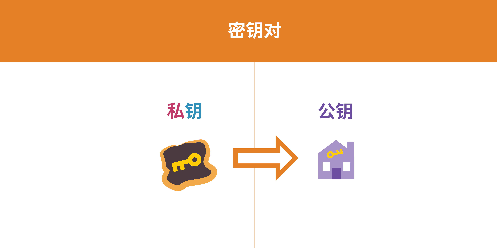

与公钥对应的是另一个文件，私钥。与公钥相比，私钥才是一把真正需要保护的“钥匙”，它同时可以用来签名（加密）和解密信息。

我们来详细看看一个公钥加密算法：RSA (Rivest-Shamir-Adleman). PGP 一般使用 RSA 生成密钥对。

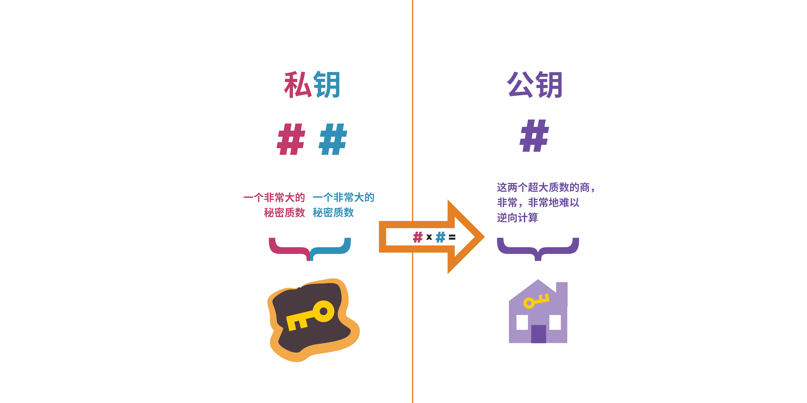

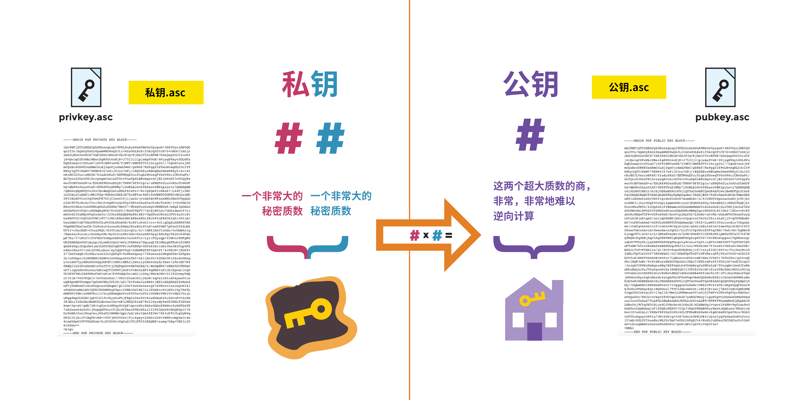

在密钥生成时，公钥和私钥是一起生成的，并且紧密联系：它们都依赖一组非常大的质数。私钥代表其中两个质数；而你可以想象公钥是这两个质数的商，它可以轻易由私钥中的这两个质数得出，而攻击者很难通过公钥的这个数反推出私钥原有的两个质数。

这个问题叫做质数分解，一些公钥加密的实现通过质数分解的难度来保证安全性。现代加密技术使用随机生成的质数，并且这个质数大到可怕，人类和计算机都很难猜出来。

最重要的是，公钥加密让人们能够通过不安全的方式交换公钥，并从此开始加密通讯！在这个过程中，用于解密的私钥从来不会出现在互联网上，因为加密只需要专门用于加密的公钥。

记住：要在两个人之间使用公钥加密，你们需要互相拥有对方的公钥。

当然你也可以用另一种方法来想象公钥加密：它们之间的关系就像阴和阳的关系，但纠缠得清。

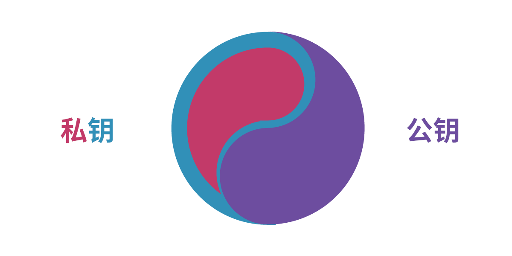

~~公钥可以随意散播。你可以把它给任何人 - 如果你不怕公钥包含自己的邮箱地址，你可以把它放在个人博客上，你甚至可以把它放在社交媒体上...~~

> <i class="fa fa-exclamation-triangle" aria-hidden="true"></i> noarch 注2：根据各地区的法律法规不同，在散播之前请检查这样做的风险。以中国为例，因为公钥包含你的邮箱地址（你使用的邮箱可能是翻墙获取的，这是一个“我在翻墙”的信号），noarch 不建议将公钥放在密钥服务器上，或是在微博 / 微信朋友圈等地传播。请仅在必要时单独发给需要加密通讯的人，至少让你的加密通讯不那么显眼。
>
>原文这么说是因为笔者假设你居住在美国，而美国及其各州法律目前允许端到端加密通讯。

你需要安全地存储私钥。你只有一个私钥，所以绝对不要意外丢失它，或者随意复制；绝对不要分享它，或者以任何方式将其在互联网上传输，因为这样做会伤害这个密钥对的安全性。

> noarch 注3：原文“你只有一个私钥”意为一个密钥对中只能有一个私钥。你可以拥有不同的身份，而这些不同的，隔离的身份之间需要有不同的密钥对，这样敌人无法将这些身份简单地连接起来。

## PGP 如何工作

说了这么多，我们来以 PGP 为例子，具体看看公钥加密如何工作。我们假设你要给张三发一个加密消息：

1. 张三生成了一堆密钥并拥有其私钥，他把公钥放在了它应用了 HTTPS 加密的个人网站上。

2. 你从张三的网站上下载并导入了张三的公钥。

3. 你用张三的公钥加密了消息，然后将加密后的消息发给了他。

4. 因为只有张三有他自己的私钥，除了他之外没人能看到你给他的加密消息。

PGP (Pretty Good Privacy) 最具标志性的功能就是其生成密钥对的过程。你用它生成一个密钥对，然后用密码保护这个密钥对中的私钥。你可以用你的私钥来签名，或是用你的公钥来加密消息。

## 元数据：公钥加密的限制

PGP 的主要功能就是保护信息的内容私密，真实且未被篡改。不过你要考虑的隐私问题远不止这些。综上所述，元数据泄露的隐私可能和加密后内容本身泄露的隐私一样多。

比如，如果你和你所在地区已知的异议分子交谈，光是与它们通讯，即使信息未被解密，就可能将你置于危险之中。在某些国家和地区，光是拒绝解密消息这点你就可能被判处监禁。

实际上，保持匿名（“谁与谁通讯”）比保持隐私（“内容是什么”）要难得多。在 PGP 的例子里，一个保持匿名的方法就是让双方都使用 Tor, 并搭配一个匿名注册的邮箱。这种情况下，在 Tor 的匿名保护之上，PGP 依然能保持信息的隐秘性和真实性。

> noarch 注4：如果你在中国，你无法直接使用 Tor. `privacy.noarch` 讲解了绕过审查访问 Tor 的方法。

现在你熟悉了公钥加密的基础，你可以试试一些公钥加密工具了！

试试 [[Android/iOS] Signal](), 
[[Android] OpenKeychain](../OpenKeychain/OpenKeychain.md), 或是 [[Desktop/All] Thunderbird]().

---

[原文](https://ssd.eff.org/en/module/deep-dive-end-end-encryption-how-do-public-key-encryption-systems-work)使用 [CC BY 3.0 US](https://creativecommons.org/licenses/by/3.0/us/) 许可协议授权；本译文使用 [CC BY-SA 4.0](https://creativecommons.org/licenses/by-sa/4.0/) 许可协议授权。

本译文部分参考现有（过时）的译文：[公開金鑰加密和 PGP 簡介](https://ocftw.github.io/ssd.eff.org/zh_TW/module/introduction-public-key-cryptography-and-pgp.html)，由台湾开放文化基金会及其志工翻译。

`privacy.noarch` 与原文发布者*电子前哨基金会*无隶属关系；转载本译文请同时注明本文和原文。
