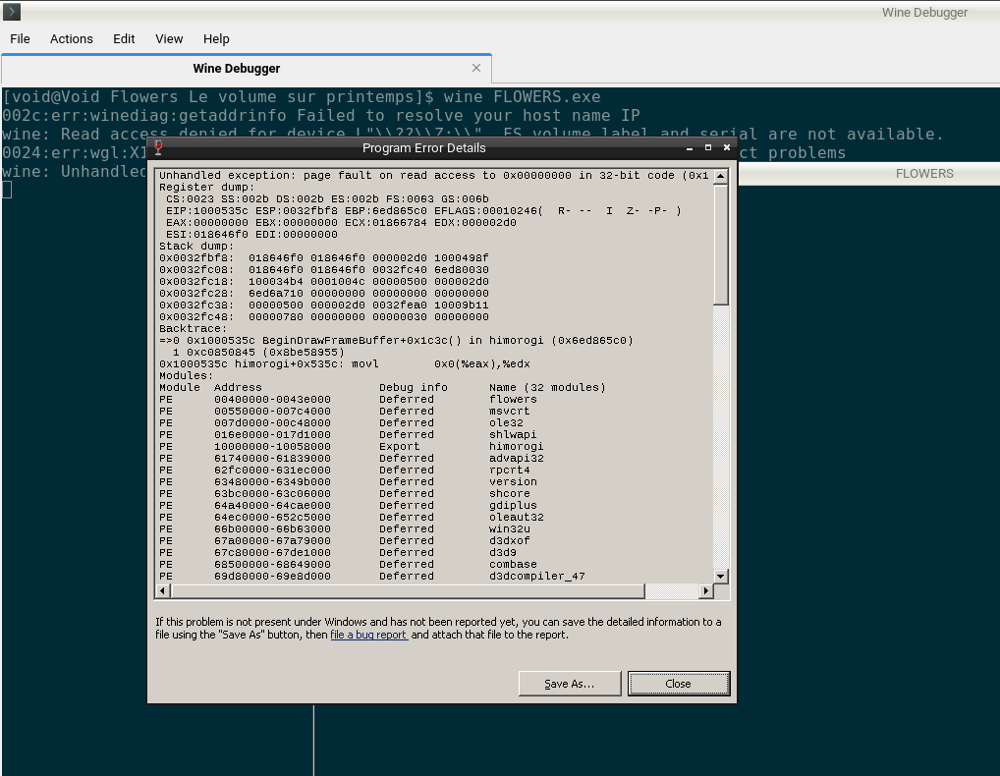
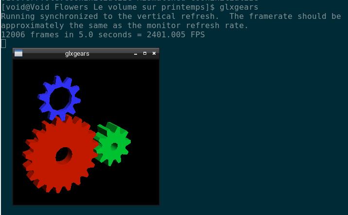
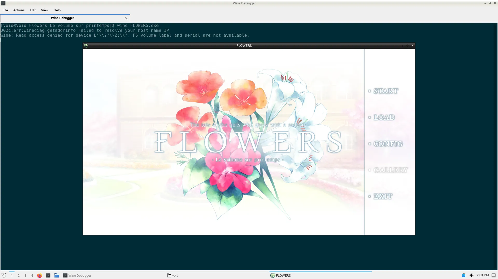
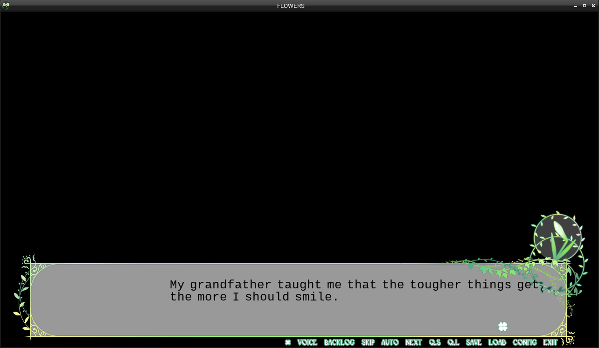

# 在虚空中与 amitié 相遇。上篇

> 接下来上演的，是 Void Linux 和 FLOWERS 四季的邂逅。

<script type="text/javascript">
function showIframe() {
    let frame = document.getElementById("sc_frame")
    frame.height = 166
    frame.src = "https://w.soundcloud.com/player/?url=https%3A//api.soundcloud.com/tracks/307308303&color=%23ff5500&auto_play=true&hide_related=true&show_comments=false&show_user=false&show_reposts=false&show_teaser=false"
}
</script>
<a href="#" onclick="showIframe()">夏空の光 - 考崎千鳥&八重垣えりか on Soundcloud</a>
<iframe id="sc_frame" width="100%" height="0" scrolling="no" frameborder="no" allow="autoplay" src="about:blank" sandbox="allow-scripts allow-same-origin" referrerpolicy="no-referrer"></iframe>


## 序章

noarch 也喜欢百合呢。2021 年某个时候，我在翻看萌娘百科的时候发现了 FLOWERS，本来以为是个番剧...

点开链接，好家伙，是个分成四篇的视觉小说，分别讲述了九个少女在天主教寄宿学校（啊，传统艺能）的百合故事。工作室 Innocent Grey，本业是猎奇解谜游戏，而 FLOWERS 是他们为数不多的全年龄作品之一。

所以问题出现了：noarch 的笔记本绝大多数时间都在运行 Void Linux，为了 FLOWERS 经常重启进 Windows 显然不现实，虚拟机又没有硬件加速，所以一直避而不及的 Wine 现在看上去变得不可避了。

能否借助 Steam 和 Proton 呢？答案是肯定的，但 noarch 不想在笔记本上装 Steam，以及尝试 KISS 的方法把 Wine 配起来听着挺诱人的。

noarch 不在此提供 FLOWERS 资源下载，请自行购买支持正版或去 BT 站及论坛获取 FLOWERS 游戏本体。FLOWERS 前三篇（[春](https://store.steampowered.com/app/452440/Flowers_Le_volume_sur_printemps/)，[夏](https://store.steampowered.com/app/858940/Flowers_Le_volume_sur_ete/)，[秋](https://store.steampowered.com/app/1238730/Flowers_Le_volume_sur_automne/)）都在 Steam 有售，并且没有 DRM，在 Steam 内安装后可以直接复制到其它电脑上运行。冬篇汉化预计在 2022 年内 Steam 发布，但下面 noarch 会跟你一起体验啃生肉的乐趣！

我们一起来跳进 Void Linux + Wine + Gallium Nine + Textractor + FLOWERS 这个兔子窝吧（是夏篇剧透哦。）


## First things first: Wine (multilib)

既然已经在用 Void Linux，安装 Wine 应该已经轻车熟路了吧。`# xbps-install wine` 就行了吗？好像不是，还有几个额外的注意事项。

首先，FLOWERS 是个 32 位的游戏，需要利用 32 位 Wine 以及配套的 `multilib` 库来运行。Void 默认不启用 32 位支持，如果你用的是 musl 版则完全没有 multilib，需要用到 glib chroot 等奇技淫巧。noarch 的 Void Linux 是 `glibc` 风味的，所以只需要安装 `void-repo-multilib` 包即可。

新添加了源，你多半要改掉镜像：根据 [Void Handbook](https://docs.voidlinux.org/xbps/repositories/mirrors/changing.html)，复制 `/usr/share/xbps.d/10-repository-multilib.conf` 到 `/etc/xbps.d/` 然后编辑。

现在再 `# xbps-install -S` 然后 `xbps-query -Rs wine`:

```
$ xbps-query -Rs wine
[*] libwine-7.7_1          Run Microsoft Windows applications - Runtime library
[-] protontricks-1.8.1_1   Simple wrapper that does winetricks things for Proton enabled games
[*] wine-7.7_1             Run Microsoft Windows applications
[*] wine-common-7.7_1      Run Microsoft Windows applications - common files
[-] wine-devel-7.7_1       Run Microsoft Windows applications - development files
[*] wine-gecko-2.47.2_1    Mozilla Gecko Layout Engine for WINE (32bit)
[*] wine-mono-7.2.0_1      Mono built for running .NET applications with WINE
[-] wine-tools-7.7_1       Run Microsoft Windows applications - development tools
[*] winetricks-20210825_1  Script to install various redistributable runtime libraries in Wine
[*] libwine-32bit-7.7_1    Run Microsoft Windows applications - Runtime library (32bit)
[*] wine-32bit-7.7_1       Run Microsoft Windows applications (32bit)
[-] wine-devel-32bit-7.7_1 Run Microsoft Windows applications - development files (32bit)
```

多出来的，带 `-32bit` 后缀的包就是我们想要的。

然后安装 `wine wine-32bit winetricks`。`wine-gecko` 和 `wine-mono` 也可选，但 FLOWERS 用不到。接下来，`xbps` 会安装大量的依赖，但只要你选对了源，它快得让你坐和放宽的机会都没有。


## 首次运行

你可能注意到了我们缺点什么。尝试在游戏目录运行 `wine FLOWERS.exe`，果然，游戏崩溃，Wine 抛出错误：



但是，我们能在终端看到 Wine 给我们的线索：

```
0024:err:wgl:X11DRV_WineGL_InitOpenglInfo  couldn't initialize OpenGL, expect problems
```

不应该啊！这混成器跑得好好的，怎么就没有 OpenGL 了呢？



```
$ xbps-query -Rs mesa
...
[*] mesa-21.3.5_1                            Graphics library similar to SGI's OpenGL
[-] mesa-XvMC-21.3.5_1                       Mesa XvMC drivers
[-] mesa-ati-dri-21.3.5_1                    Mesa DRI drivers for ATI GPUs (transitional dummy package)
[*] mesa-demos-8.4.0_3                       Mesa 3D demos and tools
[*] mesa-dri-21.3.5_1                        Mesa DRI drivers
...
[-] mesa-32bit-21.3.5_1                      Graphics library similar to SGI's OpenGL (32bit)
[-] mesa-XvMC-32bit-21.3.5_1                 Mesa XvMC drivers (32bit)
[-] mesa-ati-dri-32bit-21.3.5_1              Mesa DRI drivers for ATI GPUs (transitional dummy package) (32bit)
[-] mesa-dri-32bit-21.3.5_1                  Mesa DRI drivers (32bit)
...
```

还记得之前 noarch 说的，这是个 32 位游戏吗？因此，Wine 需要对应的 32 位 Mesa 来运行 OpenGL。

安装 `mesa-32bit mesa-dri-32bit`，然后再次运行游戏：



> 游戏启动后，请暂离现实，开始享受少女们甜美的百合世界。

... 吗？


## 更多故障排除

要命的是，这才是我们 debug 旅途的开始。

### 字体缺失

首先， ~~根据 Wine 老传统，~~ 字体缺失是要有的：



不过这也不是 Wine 的锅，是因为游戏用了一个 Windows 都没预装的，叫做 Overlock 的字体，还魔改加入了一些字符。

从[这里](misc/Overlock-Mod.ttf)下载之后放进 WINEPREFIX 里的 `C:\windows\Fonts` 里就行了。
比如 noarch 用 `winetricks` 创建了一个 WINEPREFIX 叫 Games，那么我应该先运行 `export WINEPREFIX=$HOME/.local/share/wineprefixes/Games`，对应的字体目录就是 `$WINEPREFIX/drive_c/windows/Fonts`。

对于中文版和日文版，字体缺失会直接不显示，这里照例在同一个 WINEPREFIX 下 `winetricks cjkfonts` 即可。

### OP/ED 白屏

序章看完后，游戏可能会白屏，并伴随终端输出：

```
winegstreamer error: decodebin0: Your GStreamer installation is missing a plug-in.
winegstreamer error: decodebin0: ../gst/playback/gstdecodebin2.c(4701): gst_decode_bin_expose (): /GstBin:bin0/GstDecodeBin:decodebin0:
no suitable plugins found:
Missing decoder: MPEG-1 System Stream (video/mpeg, systemstream=(boolean)true, mpegversion=(int)1)
```

> Ah, proprietary codecs, here we go again.

缺失的这个 MPEG-1 插件在 `gst-plugins-bad1` 里面，安装它的 32 位版本 `gst-plugins-bad1-32bit` 即可。


## 可选：使用 Gallium Nine

虽然这个文字游戏基本上只要有个显卡就能玩，没显卡也能用软件渲染，但如果你想要省点电，或者提升一些性能，Gallium Nine 是一个高性能的 DirectX 9 实现。

与 wined3d 将 DX9 渲染指令转换成 OpenGL 不同，它能直接将 DX9 渲染指令交给任何支持 Gallium 的图形驱动（Mesa，nouveau...），以达到接近原生的性能。

在 WINEPREFIX 里运行 `winetricks galliumnine` 即可安装 Gallium Nine。

之后，你启动游戏就会看到：

```
$ wine FLOWERS.exe
Native Direct3D 9 v0.8.0.385-release is active.
For more information visit https://github.com/iXit/wine-nine-standalone
fixme:d3d9nine:DRIPresentGroup_GetMultiheadCount (0x270f78), stub!
fixme:d3d9nine:DRIPresentGroup_GetMultiheadCount (0x270f78), stub!
```

代表 Gallium Nine 正常运行。


## 旅途还未结束

noarch 从 2022 年初就有了写这篇文章的想法，并断断续续写了不多。因为其实 noarch 只在 Void 上玩了英文版春篇，一开始并没有测试中文版，续作是在 Windows 上玩的。

写完第一小节之后，一在 Wine 上测试，好家伙，直接黑屏卡死。试了种种方法，也采集了日志，都看不到任何问题的影子。再看了看 Wine bug tracker，面对里面多年未解决，甚至开发者完全不搭理的 bug，再想想 FLOWERS 这个系列的小众程度，直接绝望（这也是为什么我一直不想碰 Wine 的原因之一啊！）

直到某次 Wine 更新（7.5?），noarch 又尝试启动了一下游戏，这次可以了，后续运行看上去也没问题。可能是 Wine 修复其它游戏的过程中受益了吧。
