# 在虚空中与 amitié 相遇。下篇

<a href="#" onclick="showIframe()">FLOWERS 三重唱 - 名塚佳織, 岡本理絵, 明島ゆうり on Soundcloud</a>
<iframe id="sc_frame" width="100%" height="0" scrolling="no" frameborder="no" allow="autoplay" src="about:blank" sandbox="allow-scripts allow-same-origin" referrerpolicy="no-referrer"></iframe>

你在读到本文时 FLOWERS 冬篇的官方汉化版可能已经出了，但 noarch 在 2022 年初就啃完冬篇生肉了。完全不会日语的 noarch 是怎么做到的呢...

很抱歉这篇文章从年初一直咕到现在才写完，希望下面的操作能为你看其它生肉 gal 提供一些参考。

## Textractor 简介

这次探索生肉 gal 自动翻译的旅程着实让 noarch 敬佩阿宅们为了能玩上游戏做出的努力。

noarch 在中文圈搜了一圈，发现教程最多的是“Visual Novel Reader”，而进一步调查 noarch 发现这个软件处于一个被社区疯狂魔改的状态，原开发者疑似已经跑路了。

看到这，noarch 想着，总有比这更优雅的解决方案吧；于是我在 GitHub 找到了 Textractor。它设计看起来明显比上述的 VNR 看起来简单，并且是 GPL 协议的自由软件。

从用户角度来看，Textractor 做的事情非常简单：从游戏内提取文本，将文本送入插件管线做翻译等处理，并将处理后的文本输出。

下面我们开始吧。别被吓到，本文简短的长度就是 Textractor 易用性的最好证明。

## 安装

[Textractor](https://github.com/Artikash/Textractor) 发布在 GitHub 上，能开始读本文的你应该也熟悉反直觉的 GitHub 下载二进制 Releases 的方法了。

Textractor 作者在 Releases 里提供了两种安装方式，exe 和 zip，而其实 exe 安装器做的只是将 Textractor 解压到目标位置然后安装作者改的 Arial Unicode MS 字体。

如果你选择 exe，请注意选择 "Install for all users" 即“全局”安装。这样能保证字体被安装到 `%WINDIR%/Fonts` 而不是用户的字体文件夹。

如果你选择了 zip，请在解压后自行按照[前面的](#字体缺失)方法安装附带的字体。当然，你也可以自己安装和使用别的字体。

## 排错

安装过程一切顺利，但 noarch 在打开 Textractor 本体之后整个人都不好了：sway 将它的多个悬浮窗口全部水平排列，非常喜感；而且 Textractor 的翻译悬浮窗无法移动。

最生草的是，在 Wine 7.4 之后默认启用的 "Light" 主题下，Textractor UI 元素崩坏。好在 `wine winecfg` -> “桌面集成” -> “（无主题）” 即可恢复正常，不过你就要忍受一下 Windows 经典样式了。

如果你遇到了窗口管理问题，你还需要在 `winecfg` -> “显示”里面打开一个大小合适的“虚拟桌面”。这样，窗口管理器就不会影响任何在这个 WINEPREFIX 里运行的程序窗口。

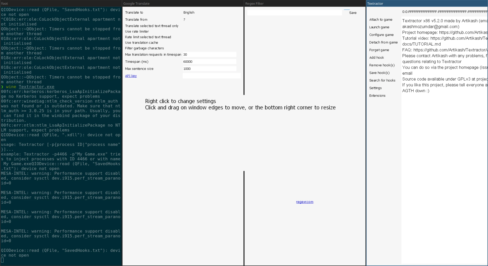

按照上面的步骤修正之后：

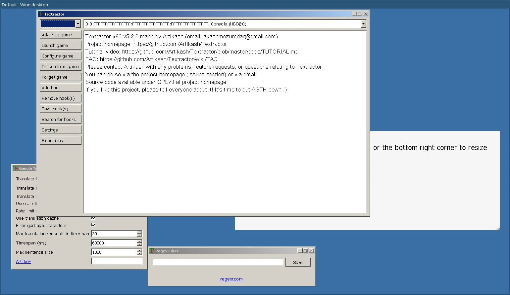

> 不过... noarch 后来发现，可能是因为虚拟桌面里没有混成，Textractor 翻译悬浮窗无法置顶。如果你遇到了这个问题，解决方案可能只有换回 X11 并禁用 Wine 虚拟桌面。noarch 确认在 X 下面没有这个问题，并且窗口管理器也可以将悬浮窗置顶。如果你用的是 i3 之类的平铺式窗口管理器，你可能需要手动悬浮一些窗口。

## 启动/勾住游戏

Textractor 分为两个独立版本，`x86` 和 `x64`，分别对应 32 位和 64 位 x86 程序。FLOWERS 是 32 位的，所以我们选择 `x86`。

有了 Textractor 后，你可以在 Textractor 里面启动（Launch）冬篇，也可以启动完游戏再加载（Attach）Textractor。这样，Textractor 就勾（Hook）住了游戏。

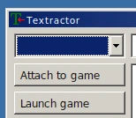

> 即使你熟悉 VNR 或其他翻译姬，也大可不必马上开始找钩子，FLOWERS 可以被 Textractor 自动勾住，开箱即用。

"Launch game":

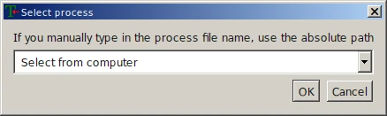

> Wine 从来不是一个沙盒；别忘了你可以在 `Z:` 盘访问整个 Unix 文件系统。

Textractor 会记住你以前启动的程序。下一次你就不用手动选择文件了。

因为 Textractor 集成了 Locale Emulator，接下来它会问你要不要模拟日语编码。FLOWERS 所有版本都使用 Unicode，因此不需要模拟。

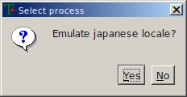

## 选择钩子

启动冬篇之后点开始。真由理和文字框出现之后，展开 Textractor 的钩子列表。

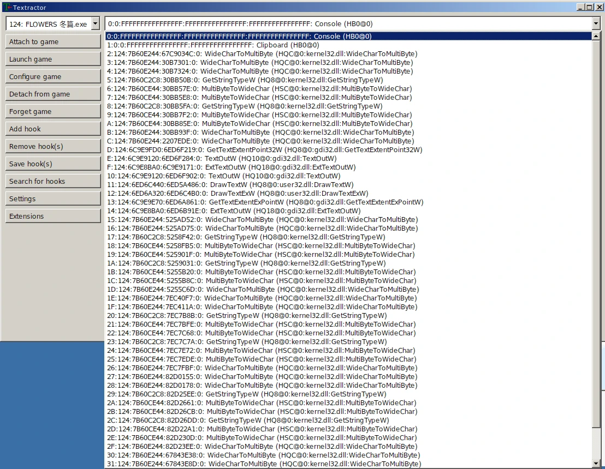

翻过这些钩子，你会发现绝大多数内容都是垃圾。

以 FLOWERS 冬篇为例，正确的文字钩子是 `GetGlyphOutlineW@6c9eb090`（如果你的 FLOWERS 游戏程序跟 noarch 不同，内存地址可能不同，但函数都是 `GetGlyphOutlineW`），因此你需要在“Remove hook(s)”里面双击删掉除了它之外的所有钩子。

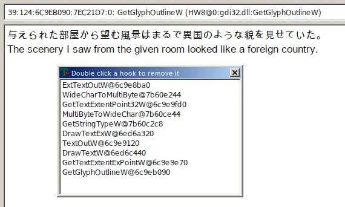

## 关于文字滚动和延迟

很多视觉小说都有文字滚动出现的效果，FLOWERS 也不例外。然而，这个效果会影响 Textractor 的文字提取，所以你需要把这个效果尽可能关掉：在 FLOWERS 游戏设置里把“message speed”调到最大即可。

虽然抓帧看它并没有完全禁用文字滚动，但接下来 noarch 告诉你为啥这不成问题。

提升文字滚动速度之后，我们可以通过减少文本输入等待时间来提升 Textractor 的响应速度，即 Textractor 收到第一个字 -> 将文本送入插件管线的延迟。

之所以需要这个延迟，是因为在游戏的文字滚动下，文本框里的文本并不是一次性就输出到屏幕上的。因此，Textractor 会分次收到文本，它必须等待一段时间，等文本框的文字输出完，才能送进管线。如果这个延迟太短，则会使文本没提取完就被翻译；太长则会增加翻译延迟，影响使用体验。

总而言之，在“禁用”文字滚动之后你可以在 Textractor 主窗口 -> "Settings" 里调低默认 500 毫秒的“Flush delay”。noarch 在这里给了它一帧 (60 fps, ~16 ms) 的等待时间，并在测试中发现长段文本也不会有分开的问题。

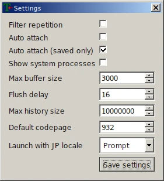

## 配置插件管线

接下来我们要进入 Textractor 的核心：插件/扩展系统。

根据 Textractor 作者的说法，Textractor 本身只是一个文字提取工具。让 Textractor 能翻译视觉小说的，是和它一起发布和编写的种种插件。插件的输入和输出都是文本，而且 Textractor 的插件管线把多个插件串联在一起，形成最终的翻译结果。

FLOWERS 算是一个比较安分的游戏，我们不需要特意去重或过滤。因此，noarch 用的插件管线很简单：

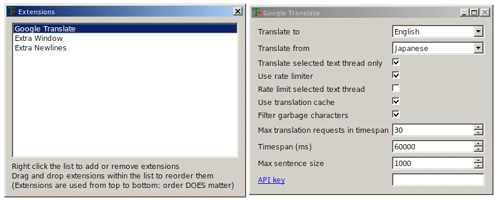

插件的作用也显而易见：

1. Google Translate 将抓取的日文翻译
2. Extra Window 不对管线里的文本做任何更改，只是将原文和翻译后的文本显示在一个悬浮窗里，可以置顶并叠在游戏文本框之上。
3. Extra Newlines 在 Textractor 主窗口的日志里换行分开每一次翻译请求

如果你更喜欢 DeepL，可以删除 Google Translate 插件然后右键添加 DeepL 插件替代：

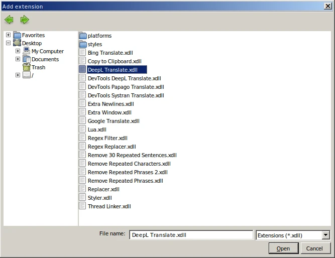

你应该还记得前面提到的，这个插件列表是一个管线，一个插件的输入是上一个插件的输出吧。因此 DeepL Translate 跟 Google Translate 一样应该放在插件列表的最顶端。

noarch 的个人体验证明，DeepL 的日译英结果相比 Google Translate 相对更通顺（准确度未知），但如果你要用 DeepL 你需要注册一个 DeepL API 帐号，并将 API 密钥填入 *API key* 一栏，否则插件会默认使用测试 API Key，而它的限流严格到根本没法用。

## 添加词典

机翻在整个游戏间总会出现翻译错误。如如果你想学日语，或者只是验证翻译的正确性，可以使用 Textractor 悬浮窗插件提供的一个实用功能：把鼠标悬浮在原文即可显示词典。

限于版权，体积问题以及用户语言繁多，Textractor 并没有内置词典，你需要自己下载或转换词典，不过作者为英语使用者提供了[转换好的 JMDict 下载](https://github.com/Artikash/Textractor-Dictionaries)。

下载完后将压缩包里唯一一个文件解压到 Textractor 安装目录，然后在悬浮窗右键打开“Dictionary” 即可。

noarch 没有自定义词典的需求，但如果你要自定义词典，你可以用上面链接里提供的脚本将 FreeDict 或 JMDict 格式的词典转换成 Textractor 的词典格式并用相同的方法丢进 Textractor。

## 最终效果

最后 noarch 放个朴素但“just works”的效果图：

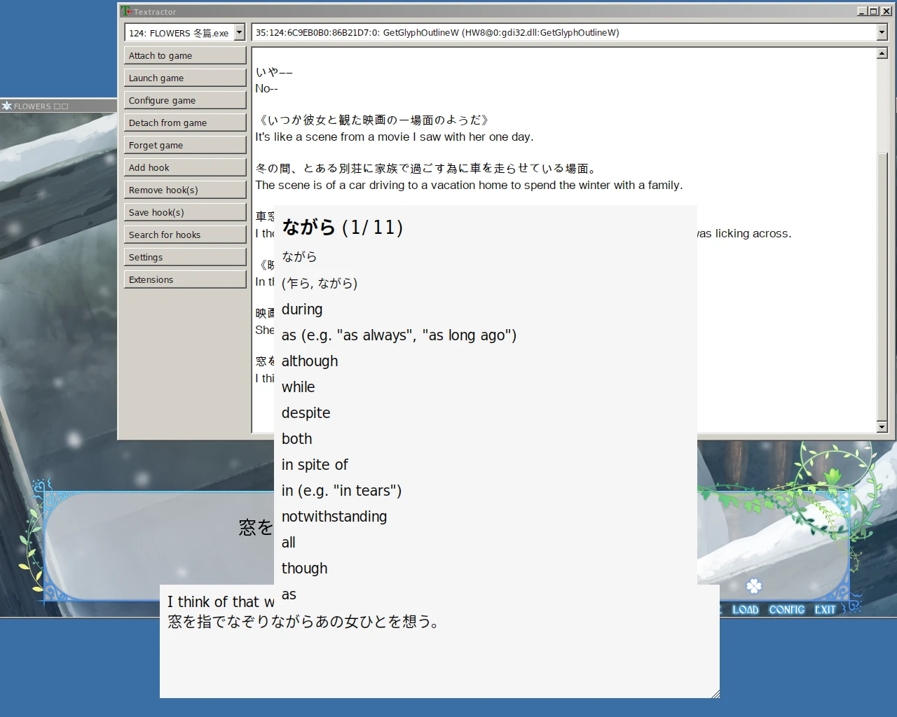

## 遗留问题和总结

作为总结，noarch 依然要列出我遇到并且没有完全解决的问题：

- Google 和 DeepL 对游戏里人名的翻译都很玄学，正确翻译的例子不到一半，DeepL API 的“词汇表”功能也没有支持日译英的打算。这个问题你可以用 Regex Replacer 部分解决，思路是穷举所有可能的错误翻译结果并替换成正确的人名，用法可以在 Textractor 文档里查看。但这个方法也不是万能的，总有你不能替换到的例子。
- 出现选择支时选项文本会全部糊在一起，没有换行，并造成翻译结果错误。因此解谜部分还得麻烦你自动复制翻译了。
- 过场动画，尤其是游戏结尾和真由理重逢的表演完全没有翻译，可能是屏幕上的文本都以图片形式存储和显示吧... 这一点挺烦并且会打破沉浸感。变通的解法则是在过场动画放完之后打开里面有过场动画文本的 log，然后 Textractor 会翻译日志页面的文本。

这些问题其实 noarch 从一开始就预料到了，是机翻和文字提取不可避免的麻烦。不过如果你抱着学日语的态度或对故事的痴迷玩生肉 Gal，略低的翻译质量和小麻烦估计也不会劝退你吧。毕竟这就是为什么 Textractor 存在嘛。

到这里，分成两部分姗姗来迟的 Wine FLOWERS 旅程就结束了。对于一些读者，这两篇文章可能信息量极大，涉及到了 multilib，Wine 运行库替换，字体配置，文字编码，Wayland 和 X 等深度使用 GNU/Linux 一段时间才会掌握的知识点。如果你还对这些知识点一知半解，[Arch Wiki](https://wiki.archlinux.org/) 永远是你最好的 ~~葵花宝典~~；上述内容在 Arch Wiki 都有详细描述，并请将本文作为你对这些概念的引导吧。
