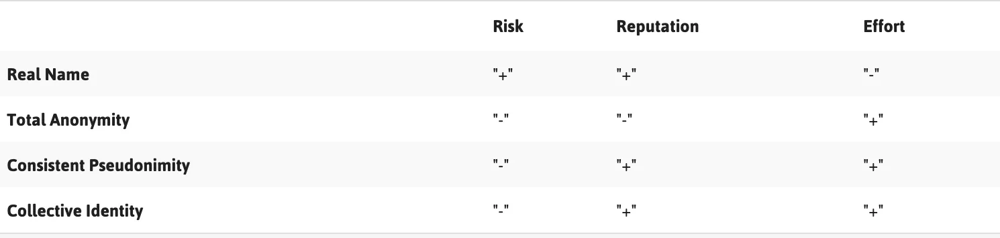
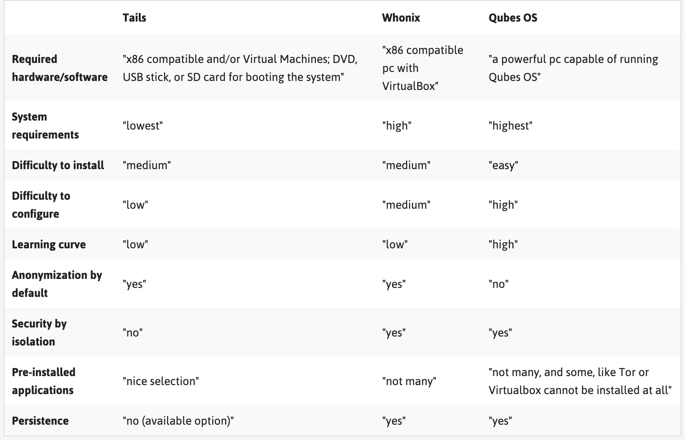

# 分身术完整指南：妥善管理您的在线身份并获得安全的方法

转自 [iYouPort](https://www.iyouport.org/%e5%88%86%e8%a3%82%e4%ba%ba%e6%a0%bc%e7%9a%84%e9%ad%85%e5%8a%9b/); 原文似乎翻译或引用了一些外部信息，但没有注明来源。

> *noarch* 注：原文格式非常乱 - “英文与全角齐飞，括号共链接一色。” *noarch* 尽可能修复了原文中的死链和对符号的错误使用，但没有时间使其完全遵守 `privacy.noarch` 的[格式规范](/CONTRIBUTING.md#文本格式)。
>
> 同时，iYouPort 的文章风格与 `privacy.noarch` 大相径庭：`privacy.noarch` 主要以线性的，易于跟随的新手教程为主；iYouPort 则因为贡献者众多，风格各异，大多结构松散。虽然不是非常好读，但这个文章确实能帮你为多重身份做准备。

> 在阅读之前，*noarch* 还请你注意这篇文章似乎不太清楚“威胁模型”和你的实际情况；例如它可能会叫你删除你的 Facebook 帐号，而很可能你本来就没有 Facebook 帐号，或你目前的 Facebook 帐号就足够匿名。它还假设你有一定的 IT 技术，例如叫你使用 Qubes OS. 这个话题在 `privacy.noarch` 的背景下比较复杂，但 *noarch* 考虑在完成 `privacy.noarch` 的主要目标后写一些 Qubes OS 的注意事项。

---

*欢迎来到知识点栏目！今天的主题是数字阴影，尤其是避免的方式（零基础版）。希望这些内容能给您带来帮助 - - 对于所有人，只要您在互联网上，而不仅仅是敏感人士 - - 关于什么是数据？什么是数字阴影？如何避免被追踪迫害？如何变成另一个人？尤其是如何\*分裂\*为多个不同的人？这个游戏会很有趣 Enjoy!*

互联网是探索、学习、说话、倾听和与世界各地人们交流的绝佳场所。不幸的是，互联网也成为一个挑战主流语话的独立思考者经常发现自己受到攻击的空间。这些攻击可能非常个人化、具有强烈的针对性 — — 因为互联网上经常会有很多关于我们的个人信息。

为了加强你对这些攻击的防御，从评估自己的**数字阴影**开始是个好主意。这些阴影 — — 可以讲述一个关于我们的故事：我们是谁、我们生活和闲逛的地方、我们感兴趣的东西，以及我们的朋友和同事都是谁。这可能会让我们面临几种威胁。特别是，**你留下的公开可用数字足迹会导致你面临各种骚扰和操纵**。

不过，你还可以使用许多策略和工具来塑造或控制自己的数字阴影，增加自己的隐私，并最终在线和离线时更加安全 — — 并不会减少您的声音或在线活动。

**这些例子包括通过有意识地从内容和元数据中剥离有价值的信息来控制自己被暴露的数据量；尝试“自我毁灭”的艺术；并思考如何操弄和拆散自己的在线身份。**

*尤其是中国读者。如果您关心如何抵制社会信用评分的危害 ——这篇文章中介绍的内容就是您唯一能做的事。*

*当局的惩治手段非常具有目的性：通过对使用交通工具的限制作为惩罚，将极大地阻碍分数低”的人的行动参与和联合能力。*

*换句话说，如果某人在线表现出抵抗和反对，当局要确保此人无法直接行动。*

*于是，您能懂得这篇文章的意思。*

*关于如何能够做到畅所欲言、成功组织，而不会导致被捕的详细指南 —— 这里是最全版。*

*任何希望保护安全的人都适用。*

## 数字阴影都是什么？

数字阴影可以定义为数据说出的关于你的故事。这些数字阴影是由数万亿比特的数据创建的，当我们连接到互联网时，每天都会留下数字痕迹。你的数字阴影拥有自己的生命，受到他人的影响，并以不可预测的方式发生变化。这些痕迹是我们过去和现在活动的幽灵，它们以永久的和不断变化的形象融合在一起。

这些万亿比特的数据是如何创建的？我们用于浏览互联网、访问网站、连接到 Facebook 和 Twitter 等社交网络平台、发布博客帖子、接听电话、发送短信或电子邮件、使用聊天或在线购物的设备和软件，都创建了特定的位关于我们的数据。

这些数据可以包括我们的名字、位置、联系人、图片、消息、推文和点赞，还包括我们的计算机品牌、打电话时间和访问的网站的信息。**这些数据痕迹可以由我们自己和其他人一起提供。**

如何共享数据？在某些情况下，人们会积极分享数据 — — 例如，当我们在 Facebook 上分享照片、在线预订机票或发帖子时。其他人也可以通过在图片中标记我们、在推文中提及我们、或仅仅通过与我们沟通来积极地分享关于我们的数据。

在其他情况下，我们每个人都在不知不觉中提供了大量的数据，而没有考虑是否“同意”。当你通过“cookies”和其他在后台活动的跟踪技术访问网站时，你的浏览习惯和IP地址是共享的。这些技术就嵌入在我们访问的网站中，并且从网站分析到广告，被收集的共享信息可用于广泛的目的。

手机应用程序也在你不知情或未经同意的情况下收集数据 — — 例如，我们拍摄的照片通常会在其中嵌入位置数据。当从一种服务转移到另一种服务时，这些跟踪技术使 Web 服务能够识别和关注你。

什么是数据？数据可以分为三个部分：内容、元数据和噪音。

- 内容是我们的消息、博客、推文和电话的内容，包括照片和视频。元数据是关于数据的数据，是技术基础设施工作所需的信息。

- 元数据使我们的电子邮件能够交付，帮助在我们的计算机上查找文件并允许移动通信。元数据可以是我们的电子邮件地址，电话号码，位置，发送或存储消息的时间和日期。

- 噪声是由制造过程或基础设施的工作所产生的数据。例如，每台相机都有一张SD卡来记录和存储图片。每张SD卡都有独特的划痕，这些划痕是由生产SD卡的机器创建的。这些划痕会对眼睛看不到但可被计算机识别的数据进行微小的更改。

**谁在收集我们的数据，为什么？**

数据收集和数据分析已变得非常复杂。您遗漏的数据痕迹将由各方收集、分析和分类，以创建数字阴影或配置文件。每次收集新数据时，都可以识别并添加到您的个人资料中。这些配置文件不断扩展，为创建它们或有权访问它们的人提供了对您本人的真实洞察力。

公司、政府和个人为各种目的收集这些数据。它可以买卖；可以用来操纵和控制；或者可以用来制定骚扰策略。

数字阴影或配置文件可用于深入了解我们是谁、我们做什么、以及我们去过哪里。然后，可以使用这些数据来预测我们可能会做什么或将来可能会去哪里。例如，如果有人知道我们是x国家中关于性别问题的直言不讳的博主，他们就会知道我们可能会参加一个关于该国博客和女权主义的会议。配置文件还可以使潜在的骚扰者能够在不同平台上骚扰我们。

**任何人都有可能访问你的数字阴影 — — 包括通信服务提供商、执法机构和商业公司，以及运行自己的服务器的团体和个人。**我们无法准确知道自己的数字阴影究竟发生了什么，而这本身就是一个问题。

但是，我们可以使用工具和策略来管理数字阴影、并限制其在剖析和监视方面的影响。后面就是用来讨论这一问题的。

## 探索你自己的数字阴影

正如之前提到的，任何人都可以访问你的数字阴影 — — 包括通信服务提供商、执法机构和公司，以及运行自己的服务器的团体和个人。那么怎么办？建议从下面开始：

- 使用 Trace My Shadow 探索自己的个人数字阴影 — [https://myshadow.org/trace-my-shadow](https://myshadow.org/trace-my-shadow) — 这是由 Tactical Tech 推出的工具；

- 通过安装名为 [openpaths.cc](https://openpaths.cc) 的工具来检查手机。一些应用可以看到相同的东西。请仔细阅读服务条款，并了解您是否可以更改手机中的访问权限设置。在 iPhone 上，可以在其隐私设置下更改每个应用的权限。更多详见《[您真的理解应用权限都授予了什么吗？这里是保护您安全的重要知识](https://www.iyouport.org/%e6%82%a8%e7%9c%9f%e7%9a%84%e7%90%86%e8%a7%a3%e5%ba%94%e7%94%a8%e6%9d%83%e9%99%90%e9%83%bd%e6%8e%88%e4%ba%88%e4%ba%86%e4%bb%80%e4%b9%88%e5%90%97%ef%bc%9f%e8%bf%99%e9%87%8c%e6%98%af%e4%bf%9d%e6%8a%a4/)》

**控制您共享的内容和元数据**

好消息是我们可以部分控制我们提供的内容和元数据。

当在网络上发布内容之前，最好自问一下，你发布的内容是公开的还是个人的，以及谁可以访问它。即使这些信息与公共活动有关而不是与我们的个人生活有关，提到的名字或上传的图片也可能会让人联想到我们是谁、我们在做什么、在哪里做等等。希望定位你的人就可以使用它。

这并不意味着你应该保持沉默 — — 只需采取一些基本措施，你可以通过提高攻击难度来减弱风险：

- **在必需分享有关自己生活的个人详细信息时**，务必设置为仅仅所选的联系人可访问私人资料。在商业社交媒体上使用私人资料时，应该了解该平台隐私政策的定期更改，这可能会影响我们的个人资料的“私密性”。

- **在网上和公共可访问的社交网络资料上撰写或发布有关公共活动的图像时**，应该首先问自己，你传播的有关单个人、地点和其他细节的信息是否可用于识别和/或攻击某人。或者只在公共活动结束后才公布有关公共活动的信息。

- 可以使用名为 ObscuraCam 的工具**匿名化图片中的面部**，ObscuraCam 是 Android 设备的免费相机应用程序。 https://guardianproject.info/apps/obscuracam

- **在向Web服务提供个人信息时**，最好使用 HTTPS 以使通信通道安全。

- **使用强密码**，并为您使用的每个 Web 服务使用不同的密码 — — 如果您为多个服务使用相同的密码，并且有人拦截了其中一个服务的密码，就可以使用它来访问您的其他帐户。

- 注册 Microsoft Office，Libre Office，Adobe Acrobat 等设备或软件时，**不要使用真实姓名**有助于防止在使用此设备或软件时创建的元数据与您的身份连接。您也可以**关闭手机或相机中的GPS追踪器**。

- 某些文件类型包含的元数据多于其他文件类型，因此**在线发布内容时**，您可以将文件从包含大量元数据的文件格式（例如.doc和.jpeg）更改为不包含元数据的文件格式（例如.txt和.png） ，或者我们可以使用纯文本。

- 使用 Metanull for Windows 从图像文件中**删除元数据**：https://securityinabox.org/en/lgbti-africa/metanull/windows

- **编辑或删除 PDF 文件中的隐藏数据**，Windows 或 MAC OS 用户可以使用 Adobe Acrobat XI Pro 等程序（可以使用试用版）。 GNU / Linux 用户可以使用 PDF MOD，这是一个免费的开源工具。但是，它不会删除创建或修改时间戳，也不会删除有关用于创建 PDF 的设备类型的信息。

- 有关从不同文件格式中删除元数据的更多信息，请参阅我们上一次同栏目中的介绍《[大清洗：反侦察的第一步](https://www.iyouport.org/?p=3164)》

- 您可以通过安装 Privacy Badger 或 Adblock Plus 等附加组件，以及**监控自己的隐私设置、定期删除 Cookie 来阻止通过浏览器的跟踪和收集元数据**。

- **使用 Tor** 将隐藏特定的元数据，如我们的 IP 地址，从而增加在线匿名性。

## 社交领域

正如安全专家 Bruce Schneier 所解释的那样，“安全是一个链条，任何一个薄弱的环节都可以打破整个系统”。

我们每个人都属于多个社交领域 — — 我们的工作或倡导网络，我们的家庭网络，朋友和团队。其中一些网络可能需要比其他网络更多的安全。

例如，我们可能倾向于为我们的工作或倡导活动提供更安全的沟通实践，但在社交网络上与朋友交互的安全性就会相对较低。这些领域相交可能会对我们的安全构成威胁。

**如果你在所有领域中使用单一身份，则可以更轻松地收集到有关你的一切信息并识别出你的漏洞。**

例如，如果你在社交网络中透露自己喜欢某种特定类型的游戏，并且使用了像 Emule 这样的 p2p 程序下载文件，那么想要调查你的工作或倡导活动的攻击者，就可能会通过欺骗你下载游戏而令你感染间谍软件。这是所有社交工程伎俩中最最简单的一种。也是为什么说很多失败都源于你说得太多了。

**这个攻击者对你的倡导活动和政治立场很感兴趣，但他知道你在这部分生活中增加了隐私和安全措施。同时攻击者也知道你对游戏的热爱（或任何一种偏好都一样）是数字弱点，因为这个网络没有加密。**因此，攻击者就可以利用你生活中无法加密的这一部分来获得入侵其他加密部分的入口。

很简单，这就是因为你的工作 — 敏感部分 和 生活 — 不敏感部分，没能彻底分开的原因；也是为什么要一直**强调分离你的社交领域，为不同领域选取完全不同的身份 — — 彼此之间不要发生任何联系。**这就是身份管理。详细内容请参见[《抗议须知》](https://www.iyouport.org/?p=3316)和[《角色扮演》](https://www.iyouport.org/?p=3336)

## 自我人肉

几乎所有人都知道人肉搜索是什么意思。Doxing（也称为“doxxing”或“D0xing”）描述了使用互联网上免费提供的来源追踪或收集有关某人的信息的方法。此方法的成功取决于攻击者识别有关其目标的有价值信息的能力，并将此信息用于他们自己的恶意目的。

Doxing 的前提是“你越了解你的目标，就越容易找到他或她的缺陷”。反过来看，对你来说就是：**最了解的你的人是最危险的人**。你应该努力让仅仅经过验证的极少部分亲密人了解你，并且你选择的对方必须是和你具有同样高层次的保护意识的个人。

就如 IYP 在社交工程演示中所强调的那样，骚扰者和潜行者会使用多种工具和技术来收集有关其目标的信息，但由于这些工具和技术大多是公开的且易于使用的，你也可以自己使用它们。参见[《侦查和欺骗：这里是社交工程攻击必备的技术工具》](https://www.iyouport.org/%E4%BE%A6%E6%9F%A5%E5%92%8C%E6%AC%BA%E9%AA%97%EF%BC%9A%E8%BF%99%E9%87%8C%E6%98%AF%E7%A4%BE%E4%BA%A4%E5%B7%A5%E7%A8%8B%E6%94%BB%E5%87%BB%E5%BF%85%E5%A4%87%E7%9A%84%E6%8A%80%E6%9C%AF%E5%B7%A5%E5%85%B7/)[《信息收集：决胜的根基 》](https://www.iyouport.org/%E4%BF%A1%E6%81%AF%E6%94%B6%E9%9B%86%EF%BC%9A%E5%86%B3%E8%83%9C%E7%9A%84%E6%A0%B9%E5%9F%BA%e2%80%8a-%e2%80%8a-%E6%8A%80%E6%9C%AF%E5%92%8C%E6%8A%80%E5%B7%A7%E4%BE%9D%E6%97%A7%E6%98%AF/)

**很有必要推荐这一工作，因为你很可能完全不知道自己在他人眼中是什么样，尤其是不知道自己在监视者和所有恶意行为者眼中是什么样。“自我人肉”工作就是让你看清自己的必要工作 — — 它可以帮助你就在线共享内容和方式做出明智的决定。**

当然，这项工作也可用于识别他人，在你决定给予对方*完全信任*的权限之前，上述相同的工具可以帮助你判断是否值得给出这样的信任。

用于 doxing 的方法包括浏览档案、黄页、电话簿、和其他公开信息；查询 Google 或 DuckDuckGo 等常用搜索引擎；在特定服务中寻找一个人的个人资料；在公共论坛和邮件列表中搜索信息；或寻找目标已共享的图像（例如，可能还发布在另一个更个人的帐户中）；也可以简单地通过“whois搜索”查找网站所有者的公共信息。

您自己就可以使用这些相同的工具来探索其他人可以轻松找到的关于你的信息。

在开始探索这些 Web 服务并寻找你的数字自我之前，一个好主意是使用像 Torbrowser 这样的匿名工具。

我们将在本栏目的下一篇文章中介绍**更多自我人肉工具和技巧**。

## 删除你的过去，创建新身份

“一旦有什么东西在互联网上，它将保留在互联网上，因为互联网不会忘记”。这句话如今已经家喻户晓。

你可能认为从社交网络和 Web 服务中删除某些敏感数据可能足以保护自己，但你不能轻易删除元数据。**在我们的整个生活中 — — 在我们所有的工作和个人领域 — — 如果只使用一个身份 — — 就已经创建了大量可用于描述或攻击我们的信息。**

**要避免这种情况的一个选择是：留下旧身份，并创建一个或多个新身份 — — 给每个社交域一个完全不同的身份角色。**你也可能选择在其中某些领域使用自己的真实身份，在其他领域使用创建的新替代身份。

我们在[《抗议须知》](https://www.iyouport.org/?p=3316)和[《角色扮演》](https://www.iyouport.org/?p=3336)中已经介绍了一些基本方法。

以下是当你开始做这件事时的**基本注意事项**：

- 当你开始创建新身份时，应该仔细选择每个身份的联系人，并避免与你用于不同活动的其他身份共享联系人。这样才能有效地创建单独的社交域，包括单独的帐户、邮件地址、浏览器配置文件、应用程序，甚至可能是设备。

- 重要的是：要确保你持有的各种身份不以任何方式相互关联、更不能与你的真实身份相关联。请记住，其中一些相关性可能很脆弱而你没有发现：例如，你是否使用真实的电话号码注册了一个新的假名 Gmail 帐户？这是在自己挖坑。

- 将你的每个额外身份视为潜在的一次性身份可能很有用，因为如果它们受到了损害，你就可以很容易地丢弃它们。

- 在适当的情况下，可以为新认识的熟人创建关于你的一次性身份 — — 你可以使用介绍性配置文件在将其包含在更受信任的网络中之前，了解某人。

别急，后面还有更多具体介绍。

## 删除身份

如果你决定通过创建多个身份来区分自己的不同领域，那么你应该做出的第一个决定就是删除或保留你已经拥有的身份或特性。

要做到这一点，就必须从调查你的现有身份或特性的痕迹开始。也就是上面介绍的自我人肉。

以下是在你在删除的时候需要知道的：

- 自杀机器 [(https://suicidemachine.org)](https://suicidemachine.org/) 是一个便于删除社交网络配置文件的工具。自杀机器已经被迫停止删除 Facebook 帐户，但有关如何执行此操作的说明如下：[(https://www.facebook.com/help/224562897555674)](https://www.facebook.com/help/224562897555674)

- AccountKiller [(https://www.accountkiller.com)](https://www.accountkiller.com)提供了有关如何删除大多数热门网站上的帐户或公开个人资料的说明。

- JustDelete Me [(https://justdelete.me)](https://justdelete.me)是一个直接链接目录，用于从Web服务中删除帐户。

## 映射你的社交域

为了区分你自己的不同社交域，就要首先将它们映射出来，并确定哪些可能使你最容易受到跨域攻击，这是很有帮助的。

你可以通过考虑自己不同的活动和网络来做到这一点，并反映每个活动和网络的敏感程度。这将使你能够更好地区分敏感域和非敏感域。

将一个人的数字生活划分为单独的普通社交域（或“机密安全”域）需要一些思考。

波兰计算机安全研究员 Joanna Rutkowska 就此进行了广泛的工作，是她开发的基于“隔离安全”概念（Qubes OS）的 Linux 发行版。

在此系统中，每个社交域都在一个单独的虚拟机中隔离。虽然 Rutkowska 的计划非常复杂并且专注于她的操作系统，但它可以为我们提供有关如何开始考虑分离不同域的有趣见解。

Rutkowska 为自己确定的三个基本领域是：“工作”，“个人”和“红色”（也就是不受信任的、不安全的区域）。

- **工作域**包括她的工作电子邮件，在那里她保留她的工作 PGP 密钥，在那里她准备报告、幻灯片、论文等。她还有一个不太受信任的“work-pub”域，比如接受 LinkedIn 邀请或下载她的演示文稿的图片。为了增强这一点，她有一个“工作管理员”和一个“工作博客”域，以便进一步提高管理公司服务器的安全性并在她的博客上写作。

- **个人域**包括所有与工作无关的内容 — — 例如个人电子邮件和日历、假日照片、视频等。她为此增加了一个名为“非常个人化”的特殊区域，当她离家时，就用这个域与她的伴侣进行交流。这对夫妇使用加密邮件进行通信，为此目的，她有单独的PGP密钥。

- **红色域**完全不受信任。这是她的一次性身份或简介所属的地方。Rutkowska 使用此域来执行不适合其他域的所有内容，并且不提供任何敏感信息。

- 除了这三个主要领域外，Rutkowska 还有其他几个**独立的域**。一个致力于购物，用于访问电子商务网站；定义此域的是访问她的信用卡号码和她的个人地址（用于运送）。然后是保险库域，她最终信任的地方，她生成并保留所有密码（使用 KeePassX）和主 GPG 密钥。最后，她拥有一个独立域为所有 Qubes development ("qubes-dev").

当然，你可能不必以如此复杂的方式分离自己的域，并且使用 Qubes Os 将它们分开只是一个解决方案 — — 而且需要一个强大的机器来运行。

然而，**Rutkowska 对域映射的思考方式完全可以成为分析我们自己的活动的启发性起点，并将我们的社交域分割开以增强安全性。**

下图显示了不同域之间的数据流动：

你可以看到很多数据流都是从更受信任的域到不太受信任的域 — — 例如，复制和粘贴在工作域中通过电子邮件收到的 URL ，以便可以在不受信任的红色中打开它，或者将通过电子邮件收到的发票从工作域发送到会计域。

但遗憾的是，还有一些数据流从不太受信任的域转移到更受信任的域。一个例子是复制和粘贴一个有趣的 URL，是刚刚在红色域中浏览时偶然发现的，你想与工作域中的同事或朋友分享，所以你需要将其复制并粘贴到工作（同事）或个人（朋友）域的电子邮件中。

现在，将数据从不太受信任的域复制到更受信任的域，是一个重大问题。虽然人们可以认为将 URL 粘贴到 Thunderbird 电子邮件编辑器是一个无害的操作，但它仍然是一个不受信任的输入 ；将更酷的图形文件从 Web 复制到工作域中的例子可能更可怕，只是为了在演示幻灯片中使用，通过恶意 JPEG 或其他图形格式发起的攻击，以及利用渲染代码中的漏洞已经存在有十多年了。

但是不幸的是，这个问题 — — 如何处理从不太受信任的系统到更可信赖的系统的数据流 — — 在实践中不容易解决。

不过，**设计和构建供军方和政府使用的高安全性系统的一些人采取了一种相反的方式** — — 他们说他们并不关心信任度较低的域向信任度较高的域的数据传输，只要他们能确保没有办法以相反的方向进行转移就行了。

因此，如果我们可以构建一个系统来保证更可靠的域永远不会将数据传输到不太受信任的域（即使这两个域都被泄露了！），那么他们很乐意允许单向“向上传输”。在实践中，**这意味着我们需要消除两个合作域之间的所有隐蔽通道。合作这个词在这里是一个关键词，这使得整个想法根本不实用，恕我直言。**

在该方案中确实需要消除合作域之间的隐蔽信道，因为假设来自较不可信域的数据传输确实可能危及更可信的域。

但至少，这不应该导致任何数据泄漏回原始域，不太受信任的域可能与之相联。这里的假设之一是这种系统的用户连接到多个孤立的网络。即使在那种情况下，消除域之间的所有隐蔽通道也是一个巨大的挑战，可能只有在我们准备好大大牺牲系统性能时才能完成。

可以肯定的是，不可能在不久的将来消除 Qubes 域之间的合作隐蔽通道。我只是不相信这种方法，也不喜欢这种方法无法保护更受信任的域的完整性 — **它只关注隔离方面**。因此，攻击者可能无法将秘密泄露回较不受信任的域，但他或她可以在此更受信任的域中执行其他操作。**如果我们不保持诚信，隔离有什么用呢？**

这种传输的替代解决方案是拥有可以处理特定文件类型（如 JPEG）的可信“转换器”或“验证器”，并确保我们在目标域中获得非恶意文件。虽然这可能会让你想到旧的 A / V 技术，但它有所不同。

在这里，可信转换器可能是一些用安全语言编写的程序，运行在另一个受信任的域中，而不是一个丑陋的 A / V，其中包含一个巨大的数据库，包含可能出现在 JPEG 文件中的“坏”模式的签名。

这种方法的明显问题是有人必须编写这些转换器，并为我们希望允许转移到更可信域的所有文件类型编写。目前暂时忽略这个问题。或者说，根据使用者的个人风险评估（威胁模型）来决定该怎么做。

## 评估风险和潜力：如何选择适合我们目的的在线身份

**“真实”还是虚拟身份？**

一旦确定了不同的社交域以及与之相关的数字活动和联系人，你需要做的是决定是否要相应地区分自己的身份，或者是否愿意坚持自己的正式身份和真实面貌对他们每个人。

你可能希望将自己的工作与法律层面上的“真实”身份联系起来，或者认为行动主义应该是匿名的，这些是需要仔细考虑和衡量的决定。

例如，一名记者发现使用真实身份进行写作比较方便，那么就可能决定通过昵称与自己的个人域保持联系。另一方面，如果活动家一直在被政府追踪，决定使用化名进行在线活动，那么就应该考虑自己将在现实世界中所有相关活动中展示的身份，例如在会议上发言或参加示威游行。因此，她的在线笔名将与她的脸相关联；但她的脸也可能与她在社交网络上的真实姓名有关联，她的在线活动家身份也就被揭露了。

在评估在给定环境中使用哪种身份时，问自己以下这些问题会很有帮助：

- 如果我的真实身份在这种背景下被人知道，我的工作、生计或安全是否会受到威胁？

- 如果我被人知道参与了X活动，我的心理健康或稳定会受到影响吗？

- 如果我的真实身份在这种情况下被人知晓，我的家人或其他亲人是否会受到任何伤害？

- 我能够并且愿意安全地保持各领域不同的单独身份吗？

一旦我们评估了风险，就可以考虑在线分离自己的身份的不同策略。评估风险很简单，需要问自己：我要防御的人是谁？他们有什么技术能力？我最脆弱的地方在哪？我愿意为保护自己的资产和人身安全付出多少努力？

## 在线分离身份的策略

维护单独身份的策略范围可以从完全透明到完全匿名，不同等级。

作者 Kate Harding 谈到她决定以她的真实姓名开始写作，驳回了博主们通常会采取的建议，例如“以化名写作，如果你是一位女士，那就采用男性化或中性化”的博客……掩盖一个人的个人信息，谨慎地发布可识别性细节，不要写任何可能激怒疯子的东西“……

Harding 说，骚扰问题应该由包括男性在内的整个社会来处理，而不是让女性负责。这就好像部分中国的异议人士所说的：“政府不应该监视和骚扰我，而不是我应该为避免骚扰做什么”。**这显然是不可能的。**好在 Harding 也承认，实名的决定[是非常危险的](https://web.archive.org/web/20190505134311/https://kateharding.net/2007/04/14/on-being-a-no-name-blogger-using-her-real-name/)。

因此，我们有几种选择：可以尝试匿名在线参与，可以使用“持久假名”。或者只在有些时候使用真名，并在其他时间使用假名。以下将谈论每种方式的优缺点，以便您可以选择合适自己的方法。

**匿名**

完全匿名既可以是孤立的，也可能是较难维护的，但是在我们不需要获得其他人更多的信任时、当我们可以信任的人很少甚至完全没有时，或者我们不希望自己暴露给其他人的情况下，它非常有用。

在某些特定情况下，匿名可能是一个不错的选择，例如研究或参与有关健康问题的留言板，或者在共享任何一种敏感信息时，尤其是政治。我们可能希望使用假名设置一次性帐户来评论博客或新闻网站，或者一次性电子邮件帐户或聊天会话以与他人讨论敏感信息。

不愿透露姓名的人权活动家写道：“我是一名普通的社交网络用户。我就一系列主题发表意见。**我谈论的话题并不需要我暴露面孔和名字**”。

匿名与“持久假名”并不同。当我们采用匿名作为策略时可能会使用假名，但这些假名不会在不同的网络或社交域中被使用，有些只能使用一次然后丢弃。

**持久的假名**

持久性假名涉及在一段时间内持续使用假名。

牛津英语词典将化名定义为“虚构的名称，尤其是作者使用的名称”。在互联网时代，假名也可以被称为“昵称”或“称号”，尽管后者也可以与个人的合法身份产生关联。

Jillian C. York 在电子前沿基金会的[博客文章](https://www.eff.org/deeplinks/2011/07/case-pseudonyms)中写道：“为什么个人可能希望使用他们出生时的名字以外的其他名字有很多原因。可能是担心对他们的生活或生计的威胁，或者可能冒着政治或经济报复的风险。可能希望防止歧视，或者可能会使用在特定文化中更容易发音或拼写的名称。“

假名可以是人名形式的（例如，“Jane Doe”）也可以不是。在撰写本文时，某些网站（包括 Facebook）要求用户使用其“真实身份”，这通常意味着使用您的法定名称或您熟悉的名称。该政策的推出令一些用户的账户被封锁。如果我们选择在社交网络上使用假名，重要的是要了解这样做的风险：**避免这种情况的策略是使用看起来像真人名字的假名。**

不必担心，**持久性假名也可以提供可见性。可见性使我们能够与他人建立联系，通过将我们的声音固定到特定名称上，同样可以建立在线声誉。**在线声誉允许其他人决定我们是否值得信任，因此是基于信任的在线社区的关键方面。

当然你也可以通过始终使用与自己的合法身份相关联的昵称或假名来开发声誉。但要知道，将在线声誉与“真实”名称联系起来的选择应根据需要和具体背景酌情而定。

为了不同的目的，也可以保留多个假名、和多个领域的声誉。

**集体身份**

另一种匿名方式是通过集体参与。这可能意味着许多事，从发布集体声明的私人团体或邮件列表、到共享的 Twitter 帐户。就如 IYP，我们并不是一个人，但我们所有人都称为 IYP。

虽然同样的安全问题在这里也适用，但在集体身份背后工作意味着你拥有人群的力量，如果您不想透露自己的身份，这可能是一个不错的选择。

**比较策略**

无论我们做出什么样的选择，重要的是我们保持自己的不同空间域有效分离。

无论你在数字生活中存在多少不同的领域、以及创造了多少相应的身份，在互联网上，每个身份 — — 即使是带有真实姓名的身份 — — 都会变成“虚拟”角色，应该谨慎管理它们每一个。

各种身份选择的利弊：

## 创建新的在线身份

**1、起个名字**

起名因文化而异。虽然名称以某种形式可以存在于不同的文化之间，但是“法定名称”的概念是一个相当新的概念。

不同的国家以不同的方式规范命名的做法。例如，在摩洛哥，名字必须从政府批准的名单中选择，而在德国，名字必须明确反映婴儿的性别。

在互联网上，具有“实名”政策的平台倾向于据此判断基于个人的法定名称，而不是允许他们根据自己的选择进行识别。这可能是有问题的，不仅对于试图保持匿名的个人来说，而且对于变性个人、具有别名的个人和其他人来说都很麻烦。

由于这些限制，在选择假名时选择那些看起来像真人的名字可能是有益的。尤其是使用商业社交网络时，最好使用可靠的名和姓，而不是更富有想象力的名和姓。

一旦决定了虚拟角色的名字、姓氏和用户名，就应该**进行彻底的研究** — — 也许还要使用自我 doxing 的工具和技术（参见前面） — 找出其他人是否已经在使用该名称。毕竟，如果我们希望发展自己的声誉，不希望与别人混淆，特别是如果他们不同意我们对世界的看法的话。

**2、写自己的故事**

“故事讲述”（以及为此创建社交面具）的做法是很有传统的，并且创建一个带有故事的新角色使得维护角色变得容易得多。

重点是，当我们创造一个身份时，应该设想一个完整的虚拟角色，一个需要培养和发展的化身，才能变得可信。

关于创建故事的具体技巧请详见[《抗议须知》](https://www.iyouport.org/?p=3316)和[《角色扮演》](https://www.iyouport.org/?p=3336)。

**3、创建在线资料**

一旦创建了几个角色，重要的是让它们将你的现实生活和数字生活中分开。虽然记录身份可能有助于确保你记住自己的故事，但也可以采取技术措施来确保我们的个人资料保持独立。

一个好的开始是**为自己的每个身份创建不同的浏览器配置文件、邮箱和社交网络帐户。**一个好的经验法则是始终为每个帐户/身份使用不同的应用程序，如果可能的话，为每个身份分配不同的设备或操作系统。

**4、创建单独的浏览器配置文件和邮箱**

浏览器配置文件：使用 Firefox 创建多个配置文件：[https://developer.mozilla.org/en-US/docs/Mozilla/Multiple_Firefox_Profiles](https://developer.mozilla.org/en-US/docs/Mozilla/Multiple_Firefox_Profiles)

邮箱：创建新邮箱时，最好使用 Torbrowser 连接到服务器的网站，如果需要联系电子邮件地址，请考虑使用一次性电子邮件地址。具体工具详见[《抗议须知》](https://www.iyouport.org/?p=3316)和[《角色扮演》](https://www.iyouport.org/?p=3336)。

**5、在社交网络上管理身份**

建议始终使用安全的 HTTPS 连接。

- **在社交网络平台上为新角色创建帐户时**，请使用您为该角色创建的浏览器配置文件。务必检查隐私设置，以便了解您公开了什么、谁可以查看您发布的内容、谁可以与您联系、谁可以查找您、以及您的联系人可以做什么（他们可以在图片中标记您吗？等等）

- **同时要非常小心您提供的个人资料信息**，以及您使用的个人资料照片和封面照片，因为无论隐私设置如何，这些信息通常都会公开给在该社交网络中查找你的任何人。IYP 的社交工程演示中曾多次使用过头像和封面照片作为线索。

- **确保您的虚假身份联系人不与其他身份重叠**，并确保您的不同身份间不会彼此关注。切勿使用您的真实身份账户关注您的假名账户。如果有人想要揭开这些人物角色中的一个角色的真实身份，他们首先要寻找的就是该帐户所关注的人以及谁关注该帐户。出于同样的原因，我们应该避免将一个帐户发布的帖子或其他内容在另一个帐户重新发布，更不要互相转发。

- 大多数社交网络平台都会尽可能地显示**您的位置**。当你使用支持GPS的手机与平台进行交互时，通常会提供此功能，但如果你从其他设备连接也会发生这种情况 — — 例如，计算机所连接的网络也可能提供位置数据。**请仔细检查您的设置** — — 特别是在照片和视频共享网站上。

- **照片和视频也可以在您没有意识到的情况下显示大量信息**。许多相机会将元数据嵌入到您的照片中，其中可能包括照片的日期、时间和位置、相机类型等。当我们将内容上传到他们的网站时，这些信息就会被暴露。

- 如果通过移动应用程序访问社交网络平台，**最好为每个单独的帐户使用不同的应用程序**，以免错误地将内容发布到错误的帐户。有几个应用程序可用于管理您的社交网络平台 — 但是，为每个身份使用不同的应用程序始终是一个好主意，以降低泄露您的真实身份的风险。

- **在一天中的不同时间使用您的不同身份发布**。一些社交网络平台，如 Facebook，允许用户安排帖子的发布时间。[Postcron](https://postcron.com)也可以帮助您在 Twitter 和其他平台上安排定时发布帖子。

- 为了进一步将你的真实身份与你的假名身份保持距离，你还可以在假名配置文件中写下（并在 Twitter 上发布相关主题标签）关于你从来没有参加过的事，特别是如果这些事发生在远离你所在地的地方。发布它们然后删除那些看似已经暴露了“真实身份”的帖子，也会很有趣，这样可能会让任何试图揭露你真身的人感到困惑。

- 无论决定使用哪种社交网络平台，您都应该仔细阅读其服务条款，以检查它们是否适合您的目的。

**6、另类社交网络**

如果你的目标是尽可能广泛地宣传自己正在组织的活动或正在推出的项目，那么主流商业社交网络平台（如 Facebook 或 Twitter）有可能比较有用。

但是，如果您正在使用其中一个主流平台，请务必注意：

- 这些平台有非常严格的审查条款，如果他们发现你的内容“违反”了他们的规则，他们可以随意封锁你的帐户；

- 它们会对用户进行概要分析，并将信息出售给广告商。这使得很难清楚地了解你的数据实际发生了什么，最好的解决方案是将商业社交网络平台的使用限制为特定的、仅希望向广大受众宣传的内容。也就是，此外别的话不要说。

当然，你还有**其他可用的选择** — — 为用户提供更多自由的平台。
- Ello 在其宣言中明确指出“你不是产品”。它也不需要你的“真实姓名” — — 在商业社交网络中很少见。然而，重要的是要注意 Ello 仍然是一个商业项目。

- 基于免费开源软件以及对隐私友好的分布式而非集中式的替代方案，是更重要的。其中，[Diaspora](https://joindiaspora.com), [Friendica](https://friendi.ca) 和 [Crabgrass](https://we.riseup.net) 特别值得一提。

- 还有其他类似的网站可能在不同的地区很受欢迎，所以希望您探索其他选择。

在选择使用社交网络平台之前，你应该问以下问题：

- 它是否为网站的所有用途提供了基于 SSL（如 HTTPS）的连接，而不仅仅是在登录期间？是否存在与加密相关的问题（例如与加密证书相关）？
 
- 根据平台的最终用户许可协议、隐私政策和/或数据使用政策，您的内容和个人数据将被如何处理？与谁分享？

- 为用户提供了哪些隐私选项？例如，我们可以选择仅与少数人安全地分享视频吗，还是默认情况下都是公开的？

- 服务器的地理位置是否已知？属于哪个属地管辖权？公司在哪里注册？这些信息如何与我们的活动和信息的隐私和安全相关？

更多详见[《使用社交媒体时你必须注意什么？ — — 🔐 更安全的抵抗》](https://www.iyouport.org/%e4%bd%bf%e7%94%a8%e7%a4%be%e4%ba%a4%e5%aa%92%e4%bd%93%e6%97%b6%e4%bd%a0%e5%bf%85%e9%a1%bb%e6%b3%a8%e6%84%8f%e4%bb%80%e4%b9%88%ef%bc%9f%e2%80%8a/)

**7、创建博客或网站**

你可能需要一个更独立的平台来传播想法、计划或创作。为此，可以创建一个网站或博客。

- 创建博客就像注册博客平台并选择名称和“主题”或可视化模板一样简单。有几个博客平台既方便用户又免费，包括开源 [WordPress](WordPress.com)。

- 另外面向安全的平台还有：[**Noblogs**](https://noblogs.org/) and [Nadir's **BlackBlogs**] - (https://blackblogs.org/). 要在这些平台中的任何一个上创建博客，只需在服务器上托管电子邮件帐户即可。

- 如果想要复杂的图形布局、或需要安装 WordPress 及其插件不提供的特定工具，可以创建自己的网站。A / I 是个选择，默认情况下不会将其服务的用户与真实身份相关联。要了解有关 Autistici / Inventati 的虚拟主机服务的更多信息，请访问：[https://www.autistici.org/en/services/website.html](https://www.autistici.org/en/services/website.html)

- 如果想使用自己的域名，除非使用比特币或其他匿名支付系统，否则绕过支付的身份识别可能会很困难。我们将提供的个人数据不仅存储在注册商的内部档案中，而且默认情况下任何人都可以通过搜索引擎（whois）或 Gandi. net 中的简单命令轻松查询这些数据。这时候也许你需要挂名一个组织并使用他们的信息，或者可以使用像 Gandi.net这样的注册商，它可以尽可能为个人提供私人域名注册。

## 管理集体在线身份

**1、集体虚拟角色**

General Ludd, Captain Swing, the Guerrilla Girls, Luther Blissett, Anonymous — — 几个世纪以来有很多志趣相投的人们组建团体匿名参加了历史性的抗议活动，或者以集体笔名创造了突破性和挑衅性的艺术品或恶作剧。除了隐藏所涉及的个人的身份之外，这些集体角色已经在近乎神奇的光环中笼罩了他们所有的壮举。

如果我们想采用集体身份，可以采用已存在的身份，如 Anonymous / Anonymiss，也可以创建一个我们可以共享的新身份。

- 关于集体认同的一项非常有趣的研究是人类学家 Gabriella Coleman 的书《Hacker，Hoaxer，Whistleblower，Spy. The Many Faces of Anonymous》IYP 介绍给这本书，基于对匿名者如何成为具有多种面孔和态度的众所周知且强大的集体认同的人类学研究。

- 在 《Networked Disruption. Rethinking Oppositions in Art, Hacktivism and the Business of Social Networking (2011)》 中，Tatiana Bazzichelli 描述了多重身份是如何被用来破坏权力和霸权的基本概念，以及它如何在今天的网络中发挥重要作用。

**2、管理集体身份……或简单的集体账户**

虽然许多人的合作可以帮助创建一个丰富的集体身份，但管理一个集体项目可能会有一些你应该记住的安全和技术挑战。

由于安全链中的单个弱连接都可能会破坏整个系统，因此**我们的安全性和匿名性取决于我们小组的每个成员所采取的预防措施**。安全是一种集体思维。我们的团队能获得的安全程度取决于我们可能面临的威胁、以及我们对手的力量和技能。

尽管如此，你肯定不希望丢失一些重要的东西，例如你的集体邮箱或集体使用的社交网络帐户的密码。如果你决定与整个团体共享这些密码，则需要对每个成员进行如何安全存储密码的培训。

为了最大限度地降低此类风险，应尽量使用提供不同帐户和密码的服务。例如，可以创建一个所有成员都订阅的邮件列表，而不是使用单个邮箱。如果允许未订阅的人员写入，则每个组成员都能够在他们自己的邮箱中读取该电子邮件，而不是在具有危险共享密码的集体邮箱中。

同样，如果真的需要通过 Facebook 进行协调，那么在专门的小组中共享信息要好得多，而不是在集体账户中做所有的事。

## 每个身份的不同设备

如果你对自己的几个身份使用相同的操作系统，无论如何谨慎地分离配置文件，仍然会犯下人为性的错误，例如，连错了账户，或者被恶意软件感染，允许攻击者使用我们的所有身份监控我们在线做的所有事。

通过为每个域使用不同的虚拟机，以及通过保留另一个虚拟机来打开不受信任的附件以避免恶意软件感染，可以限制这两种风险。

出于匿名化的目的，最好的选择是安装 Virtualbox，一个开源的跨平台虚拟机监视器[https://www.virtualbox.org](https://www.virtualbox.org)。使用 Virtualbox，您可以创建一个虚拟机，然后在其上运行一个名为 Whonix 的操作系统。

我们介绍过 Whonix，详见[《匿名工具：小白级指南》](https://www.iyouport.org/%E5%A6%88%E5%A6%88%E8%AF%B4%EF%BC%8C%E6%93%8D%E4%BD%9C%E5%AE%89%E5%85%A8%E6%B0%B8%E8%BF%9C%E4%B8%8D%E8%83%BD%E8%A2%AB%E5%BF%BD%E8%A7%86%e2%80%8a-%e2%80%8a%E5%8C%BF%E5%90%8D%E5%B7%A5%E5%85%B7%EF%BC%9A/)

**Tails**

如果拥有自己的计算机，可以自由安装任何我们想要的东西，特别是如果它是一台功能强大的机器，那么使用虚拟机，特别是 Whonix 是一个好主意。但是，如果我们使用较旧的机器或只是从网吧连接到互联网，安装虚拟机就不行了。在这种情况下可能会转向一个安装了 Linux 操作系统的 USB 记忆棒，只要打开它就会在正在使用的计算机上运行。

这种情况下推荐 Tails，或 Amnesic Incognito Live System，这是一个基于 Debian 的免费开源 Linux 发行版，几乎可以在任何计算机上通过 DVD，USB记忆棒或SD卡启动。**强制所有传出连接通过Tor，阻止直接的非匿名连接。**

这是一个完整的操作系统，就像 Whonix 一样，配备了几个内置应用程序：Web浏览器，即时消息客户端，电子邮件客户端，办公套件，图像和声音编辑器，等等。使用 Tails，可以访问互联网，进行通信，并完成所有我们需要的匿名和安全操作，并且在**计算机关闭后，系统将不会在机器上留下任何痕迹**，除非我们要求它这样做。

使用不同的身份时，不建议使用相同的 Tails 会话执行两个任务或认可两个身份。第一个原因是Tor倾向于重复使用相同的线路，例如在相同的浏览会话中，使得强大的对手更容易将多个浏览请求关联为同一线路的一部分并且可能来自同一用户。其次，如果在使用 Tails 或其中一个应用程序时出现安全漏洞或误用，可能会泄露有关我们会话的信息。

这两种威胁的解决方案很简单，就是**每次使用新身份时关闭并重新启动 Tails**。

**隔离安全性：Qubes OS**

数字安全有三种方法：第一种是模糊的安全性，它基于加密、强密码和类似的措施，并作为第一道防线；然后是正确的安全性，软件开发人员试图摆脱使他们的代码易受攻击的 bug。但现代软件非常复杂，几乎不可能完美地完成这项工作。因此，最现实的方法是**隔离安全**，理所当然地认为安全措施可能是脆弱的，并通过阻止可能的攻击者访问我们想要保护的整个系统来减少伤害。

例如，为了通过隔离实现安全性，Whonix 分为两部分：Whonix-Workstation，以及 Whonix-Gateway，它通过 Tor 路由所有互联网流量，并通过与前者分开，避免恶意软件、行为不当的应用程序和用户错误带来的许多威胁。

如果你不想要 Whonix 呢？**有一个操作系统通过以隔离作为其主要目的而具有安全性，并且可以使管理多个社交域和/或身份的人的生活变得更加容易。**

它被称为 [Qubes OS](https://www.qubes-os.org) — 由计算机安全研究员 Joanna Rutkowska 开发，Qubes 是一个免费的开源安全导向操作系统，基于 Fedora，Linux 发行版和 Xen，它允许我们将数字生活的各个部分分离为安全隔离的虚拟机。

Qubes 将我们在计算机上执行的操作安全地隔离在这些不同的VM中，这样，如果一台虚拟机受到攻击，另一台虚拟机也不会受到影响。

**通过这种方式，我们可以在一台物理计算机上完成所有工作，而不必担心一次成功的网络攻击会损害我们整个系统，也不会有人能够揭示我们几个身份之间的所有联系。**

用于多个身份管理的 Qubes OS 的优势在于其用户友好的窗口管理器，它为每个域分配不同的颜色。因此，框架的颜色使得每个窗口清晰可识别为属于对应于该颜色的域，并防止你在身份管理中潜在的人为错误。

**那么 Tails，Whonix，Qubes OS：应该如何选择**

Wonix，Tails 和 Qubes OS — 都允许我们使用完全独立的操作系统来管理我们的替代身份，并且可以非常有用。当然，选择取决于您可以用来保护数字生活资源和切实的威胁模型，尤其是您期望面对的对手：如果你面对的是国家政权，那么绝对要肯定自己的数据都没有泄露。所以请先评估自己的资源和需求，以便确定最佳解决方案。

Tails，Whonix 和 Qubes OS 之间的比较如下：

好了，现在您知道哪一个最适合自己了。

最重要的是，不应将它们看作是一种万能神药，最重要的依旧是人 — — 操作安全重于一切，而不是软件安全。但可以肯定的是，根据您的需求和资源，通过使用它们中的任何一个，都可以减少被攻击的可能性。

安全应该进入习惯，就像您使用右手签名还是左手那样自如。祝好运。⚪️

---

[原文](https://www.iyouport.org/%e5%88%86%e8%a3%82%e4%ba%ba%e6%a0%bc%e7%9a%84%e9%ad%85%e5%8a%9b/) 使用 [CC BY 4.0](https://creativecommons.org/licenses/by/4.0/) 许可协议发布。

`privacy.noarch` 与 [iYouPort](https://www.iyouport.org/) 并无隶属关系。
