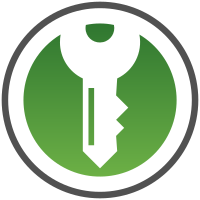
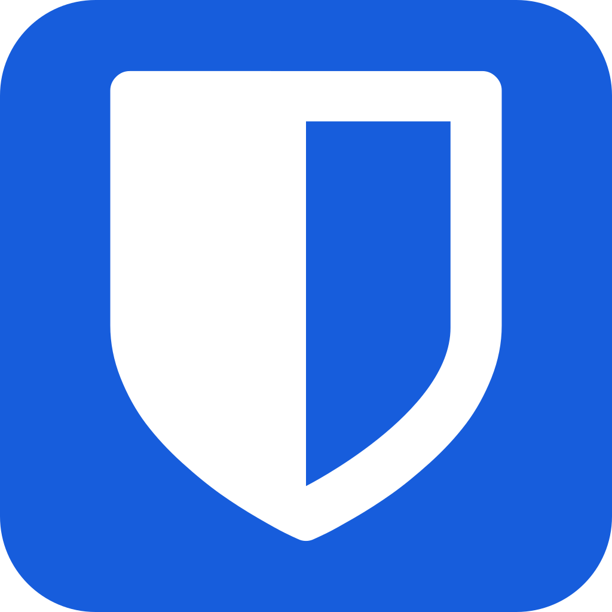

# 让密码管理器帮你记住密码

---

noarch 在[帐号安全：保护，隔离，整理](Passwords.md)中提到了，**绝对不要**在两个不同服务中使用相同的密码。

同时，noarch 也解释了原因：如果你在多个服务使用相同密码，而其中一个被骇或是被搜查，那么你所有使用相同密码的服务都将受威胁。

你可能会想，

> *这根本不可能啊！我在这么多服务上有账户，记住几百上千个强密码，你是要把我训练成最强大脑么？*

你还可能会遇到一些要求刁钻的服务，它们为了“保证账户安全”，要求特定的密码强度：

例如要求*数字、大小写字母、特殊符号必须全有，长度不低于 15...*

这时，你可能就犯难了，因为你平时使用的密码不满足这个要求。于是你临时想了一个密码，并把它用纸笔记录起来，或用手机的备忘录保存。而你用手机备忘录保存的密码被同步到手机厂商的“云端”，安全性未知...

**密码本不应这么麻烦。**

你可能想过把你用来写密码的记事本转换成自动同步、端到端加密、自动填写的“电子密码保险箱”，这样你就不用为丢失记事本、记事本被偷看、或是忘记密码的问题了...

**密码管理器**就是你想要的。它们专门用来存储登录信息，就是你的“电子密码保险箱”。

## 密码管理器做什么

### 基本结构

前面 noarch 提到了，密码管理器可以自动同步、使用端到端加密、支持自动填写（或复制密码）...

如果你还是对“密码管理器”的概念发懵，noarch 进一步解释一下：

想象密码管理器是一个专门用来存放钥匙的保险箱。

在这个数据库或电子表格中，每个帐号是一把钥匙，包含该帐号的服务、用户名和密码。

如果你想要存储更多东西，比如用于安全验证的问题或恢复邮箱，你也可以为每项添加笔记，也就是把一个牌子拴在钥匙上。

你还可以进一步为帐号分类，例如这些帐号属于一个身份，另外一些帐号属于另一个身份... 你不用担心把你所有身份都放在一个密码管理器里，因为它的加密足够安全。

### 生成密码

当你在某个服务建立帐号，或是为帐号改密码时，密码管理器可以帮你生成一个随机的密码，就像这样：

```
QKZiZF3r34!m%@HHGMTe
```

然后你可以将它自动填写，或是复制粘贴到对应的服务中。

### 读取密码

当你要登录一个帐号时，你可以进入密码管理器，然后一键复制这个帐号的密码，并粘贴进登录框。

### 密码管理器的加密

在使用密码管理器后，你只需要记住一个密码：它就是密码管理器的“主密码”。

就像你将**一圈**钥匙存放在保险箱，你依然需要随身带着**一把**钥匙。显然，带着一把钥匙比一圈钥匙容易。

不过这一把钥匙一定要足够强：无论保险箱的锁芯多么难以击破，如果你使用完全没有打磨过的模板钥匙（弱密码），那么窃贼可以轻易造出同样的钥匙。

## <i class="fa fa-bomb" aria-hidden="true"></i> 什么绝对不是“密码管理器”

你可能之前认为把密码记在纸质记事本上就是“密码管理”了。不过你有没有想过如下的问题：

- 如果记事本丢失，你将如何找回密码？

- 如果你被搜查，你将如何隐藏这个记事本？

- 如果输入密码的设备有硬件级别的[键盘记录器](https://en.wikipedia.org/wiki/Keystroke_logging)，它是否能抓取你的密码？

- 你真的能保证密码之间没有关联吗？例如一个服务上用 `Password` 另外一个用 `Pa5svv0Rd`, 抛开它们都是弱密码之外，这些都是容易被猜测的联系

看了如上，你可能会想，*我用电子记事本就没关系了嘛*。更多的问题来了：

- 这个记事本是否加密？如果你用于存储该记事本的设备被偷，里面的内容会不会全盘暴露？

- 这个记事本是否云端同步？如果云端同步，“云端”如何处理你的数据？

- 你依然没有可靠的方法**生成高强度密码**。

同样，一些自称为“安全”的“密码管理”方式其实不安全。

## <i class="fa fa-exclamation-triangle" aria-hidden="true"></i> 它们伪装成“密码管理器”，但不安全

### Chrome / Chromium / Firefox 保存密码

理由：它们云端同步，并且不使用零访问的[端到端加密](https://en.wikipedia.org/wiki/End-to-end_encryption)。

如果云端同步不使用零访问端到端加密，那么政府 - 有可能是你的敌人 - 将有机会向“云端”请求你的数据。

### iCloud Keychain

理由：它云端同步，并且不使用零访问的[端到端加密](https://en.wikipedia.org/wiki/End-to-end_encryption)；在中国境内服务器存储数据。

除了不使用零访问端到端加密之外，iCloud 从 2018 年起将中国区的数据交由[云上贵州](https://www.gzdata.com.cn/)存储。中国政府将能够随意访问你存储在那的密码。

## <i class="fa fa-check-circle" aria-hidden="true"></i> 真正的密码管理器

noarch 认为一个真正的密码管理器应当**不云端同步**，如果云端同步，应当**零访问**。同时，加密方式也应经受密码学考验。同时，它应该是[**自由软件**](https://en.wikipedia.org/wiki/Free_software)。

### [[Desktop/All] KeepassXC]()



它是 [Keepass](https://keepass.info/) 的 [C++](https://en.wikipedia.org/wiki/C%2B%2B) & [Qt](https://en.wikipedia.org/wiki/Qt_%28software%29) 重写，使用 [AES-256](https://en.wikipedia.org/wiki/Advanced_Encryption_Standard) 或 [Twofish](https://en.wikipedia.org/wiki/Twofish) 加密密码数据库。

KeepassXC 还可以生成二步验证码，使你不需要分别使用二步验证器。

它不自带云端同步，但你可以手动将密码数据库放在例如 Dropbox 或 Onedrive 的云存储中，而不用担心数据库被访问。

### [[Android] KeepassDX]()


它是 Keepass 的 Android 实现，使用和 KeepassXC 一样强的加密，兼容 KeepassXC 的数据库，同样不具备云端同步集成。

和 KeepassXC 一样，它也可以生成二步验证码。

### [[Web] Bitwarden](BitwardenWeb/BitwardenWeb.md)



自带云端同步，使用 AES-256 加密的密码管理器；密码数据库仅在客户端解密。

Bitwarden 官方提供云存储，但 Bitwarden 服务端同样是自由的，因此你可以自己搭建 Bitwarden 服务器。

Bitwarden 免费版拥有无限量密码存储，但需要付费使用二步验证码功能。
