# [Android] Signal

---

 [来源](https://en.wikipedia.org/wiki/File:Signal-Logo.svg)

Signal - *畅所欲言。*

一款强制端到端加密，以手机号作为识别码的**非匿名**即时通讯。

开发者：[Signal Foundation](https://en.wikipedia.org/wiki/Signal_Foundation) | [官方网站](https://signal.org) | [源代码](https://github.com/signalapp)  
客户端 [GPLv3](https://github.com/signalapp/Signal-Android/blob/master/LICENSE), 服务端 [AGPLv3](https://www.gnu.org/licenses/agpl-3.0.html) | [服务条款与隐私政策](https://signal.org/legal/)

---

## 简介

你用过苹果设备吗？

如果用过，你应该熟悉苹果的 [iMessage](https://support.apple.com/explore/messages). 或者如果你没听说过 iMessage, 你应该注意到了，在给同样使用苹果设备的朋友发短信时，能使用一些有趣的功能。

不过 noarch 要介绍的不是 iMessage, 而是想与 iMessage 竞争，并且使用体验可以和 iMessage 很像的 **Signal**.

与 iMessage 不同的是，Signal 不需要一台苹果设备，并且[端到端加密](/Encryption/Pubkey/Pubkey.md)。

除此之外，它的客户端和服务端都完全自由，没有广告和追踪器，最重要的是 - 它永久免费，并且全靠捐款运作。

### 手机号即是帐号

如果你在手机流行之前用过 QQ, 那么你应该对“交换 QQ 号”这件事印象深刻。在那时，QQ 只是一个独立的网上身份，在技术上不与你的任何其他身份相关联。

虽然 QQ 现在注册需要实名手机号，但它的背后工作原理依然需要一个独立的 QQ 号。noarch 认为这是大多数中国人对“即时通讯”概念的认识。

如果你是 noarch 上述的“大多数”，在使用 Signal 前，你需要完全抛弃以前对即时通讯的认识。

Signal 致力于提供一个像短信一样的使用体验，这也意味着**你的手机号是唯一识别码**：除非你专门屏蔽，否则任何知道你手机号的人都可给你发消息；你也无法在更换手机号时迁移你的帐号。

### 威胁模型

noarch 在最上方的一览中提到了 Signal 目前不提供匿名功能，任何与你聊天的人将能看到你的手机号。

这也注定了 Signal 无法被当作 Telegram 或 Matrix 等更加匿名的即时通讯使用 - 在中国，你需要更多的是匿名性；而 Signal 完全没有提供匿名性。看到你的中国手机号意味着能直接看到你的真实身份：警察可以直接通过手机号查出你的户籍，而其他人则可以通过贿赂警察或使用泄露的数据库达到此效果。

所以，为什么还使用 Signal 呢？

- 首先，虽然 Signal 不匿名，但你依然可以用它和**已经认识**且非常亲密的人通讯。
	- 家人，以及现实中的朋友已经知道你的真实身份，所以你也不需要在线上为他们隐藏你的身份。

- 其次，如果你不在中国大陆或其它限制匿名上网的国家，那么 Signal 不匿名这点应该对你没啥影响。
	- 这是因为你的手机号实名性不强 - 敌人通过你的手机号找出你真实身份将没有那么容易。

- 最后，Signal 的易用性无法比拟。
	- noarch 认为 Signal 的设计目标是**取代传统短信**，没有复杂功能，这使得它非常简单易用。
	- 包括以手机号识别身份这点，Signal 的诸多操作逻辑都与传统短彩信一样。

<!-- 从 2021 年 3 月开始，Signal 已在中国被墙。
### 关于 Signal 中国直连

你在阅读本章之前可能听说了 Signal 没有被防火长城屏蔽，并将此看作一个 Signal 的优点。

虽然 Signal 可以直连，但 noarch 不推荐这么做，因为防火长城会记录所有向墙外的连接，连接 Signal **可能**会使你成为“重点监控对象”。

因此，noarch 依然建议[使用代理](/WallBreak/WallBreak.md)连接 Signal, 并只在绝对必要的情况下（例如代理失效）直连。
-->

### Signal 与 Google 服务

noarch 注意到了 Signal 的 Android 版依赖 Google 服务框架进行推送通知。

Signal 在其开发初期需要 Google 服务框架才能运行。这是因为严格上 Android 应用需要 Google 框架来推送通知，及时送达消息。没有了 Google 服务框架提供的[推送通知服务](https://en.wikipedia.org/wiki/Google_Cloud_Messaging)，Signal 需要长期保持后台运行并维持一个 [WebSocket](https://en.wikipedia.org/wiki/WebSocket) 开放以推送消息，而 Android 是禁止这么做的。

[从2017年2月起](https://github.com/signalapp/Signal-Android/commit/1669731329bcc32c84e33035a67a2fc22444c24b)，Signal 不再要求 Google 服务框架才能启动；在此之后，如果你没有 Google 服务框架，Signal 会向你发送通知，告诉你如果没有 Google 服务框架 Signal 可能会被杀死后台而无法及时接收消息。

关于 Google 服务框架及其替代，[请看这里]()。

### 准备好了吗？

除了上述弊端，Signal 在 noarch 看来是目前最容易上手的端到端加密通讯工具。

了解了上面的弊端和威胁模型，并将其牢记在心后，你就可以和 noarch 一起开始使用 Signal 了！

## 安装

Signal 和其它 Android 应用的安装没啥区别：Signal 官方提供了两个渠道，其中一个是 Google Play, 另一个则是直接通过 `apk` 安装。

如果你有 Google Play, 你可以直接去那里安装，然后跳到[下一步](#注册帐号)；下面 noarch 将假设你没有 Google Play, 并且使用 `apk` 安装。

首先，在浏览器内打开 Signal 的 `apk` 下载页 [https://signal.org/android/apk/](https://signal.org/android/apk/).

滑动到下方，你可以看到 *Danger Zone* 以及一个 "Download" 按钮。

> <i class="fas fa-exclamation-triangle"></i> 与从 Google Play 安装应用不同，直接从 Signal 官网下载 `apk` 虽然经过 HTTPS 传输，但没有签名验证；这也是 Signal 不建议你直接安装 `apk` 的原因。
>
> noarch 在此为了简洁，不验证 Signal `apk` 签名。如果你觉得基础设施攻击是你的威胁之一，你可以选择从 Google Play 安装或手动验证签名。
>
> 更多关于签名验证的知识，请看[这篇来自 Qubes OS 的文章](https://www.qubes-os.org/security/verifying-signatures/)。

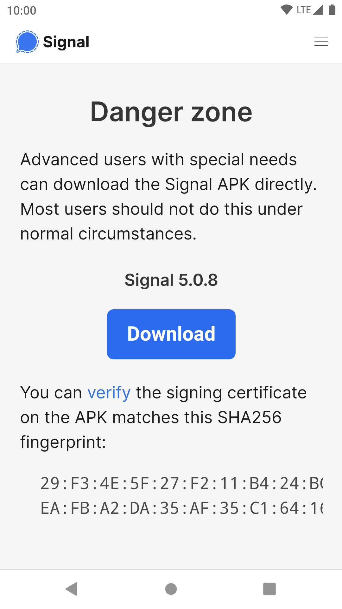

点击 "Download", 浏览器提示你下载或直接开始下载 Signal `apk`. 下载完成之后安装：

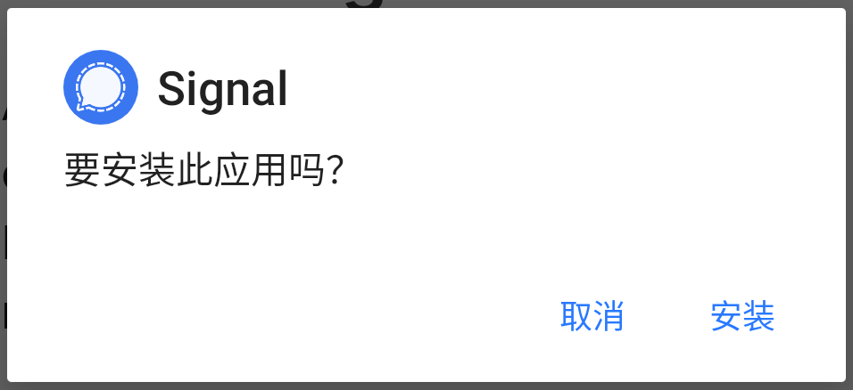

> <i class="fas fa-info-circle"></i> 如果你的设备提示“出于安全考虑，已禁止您的设备安装来自此来源的未知应用”，请点击“设置”并允许来自你浏览器的未知来源应用安装。
>
> 请在允许未知来源之前确认要安装的应用是否的确是你要的！在 noarch 的例子里，请确认来源是 *Bromite*（浏览器），并且要安装的应用是 *Signal*.
>
> 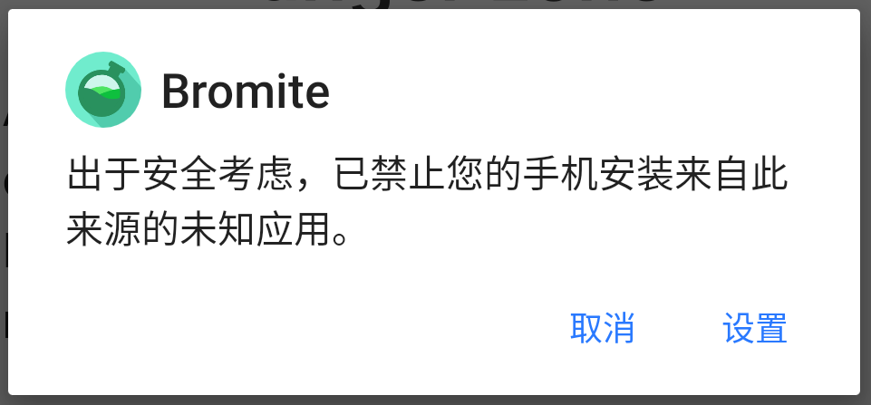
>
> 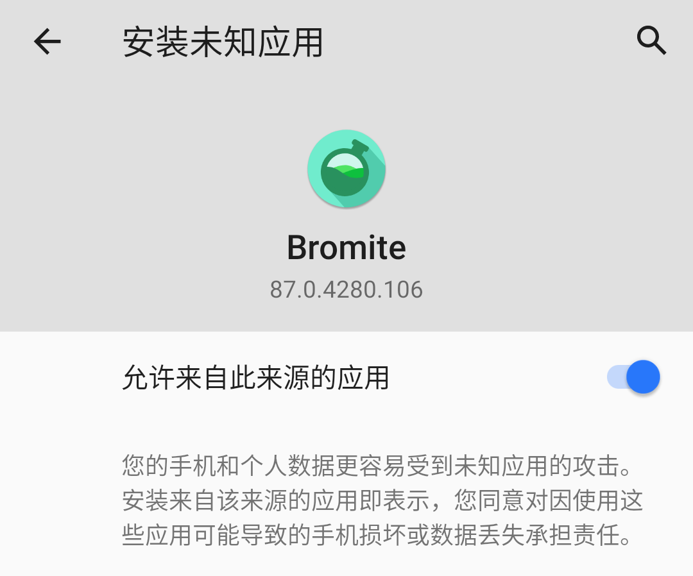

等待片刻，安装完成后“打开”。

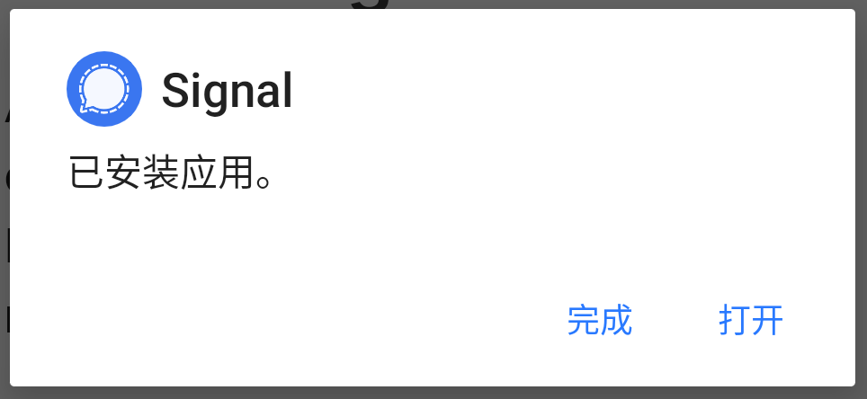

## 注册帐号

你现在进入了 Signal 的欢迎页：

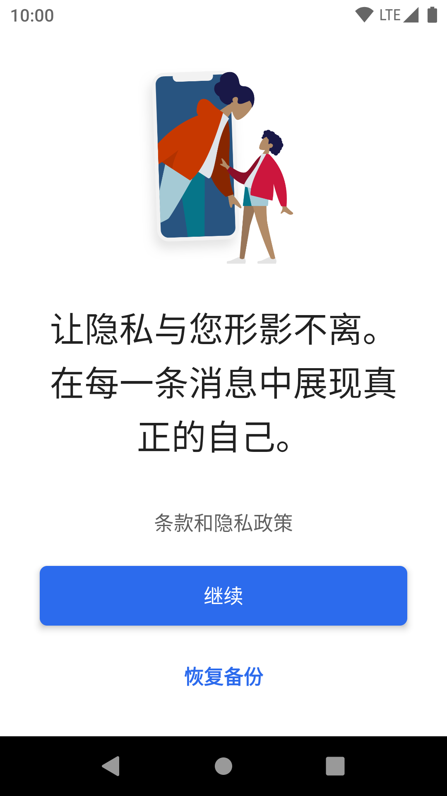

点击“继续”，Signal 会向你请求 <i class="fas fa-address-book"></i> 通讯录权限。

> <i class="fas fa-info-circle"></i> Signal 不会以任何形式上传你的通讯录，但会使用它在本地识别联系人；允许 Signal 读取通讯录与否，取决于你要不要将 Signal 替代设备自带短信应用。

noarch 在本章里不将 Signal 替换设备自带短信应用，因此 noarch 点击“稍后再说”拒绝了 Signal 的通讯录请求。

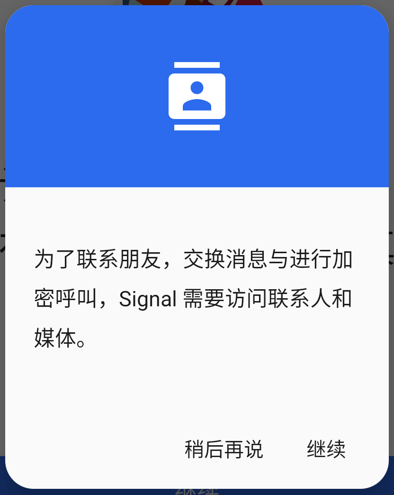

现在 Signal 需要你的手机号以注册帐号。noarch 在这里使用的是虚拟手机号，但你也可以使用真实手机号。

> <i class="fas fa-exclamation-triangle"></i> 如果你使用真实的 +86 手机号，请绝对只和最亲密的人使用 Signal.

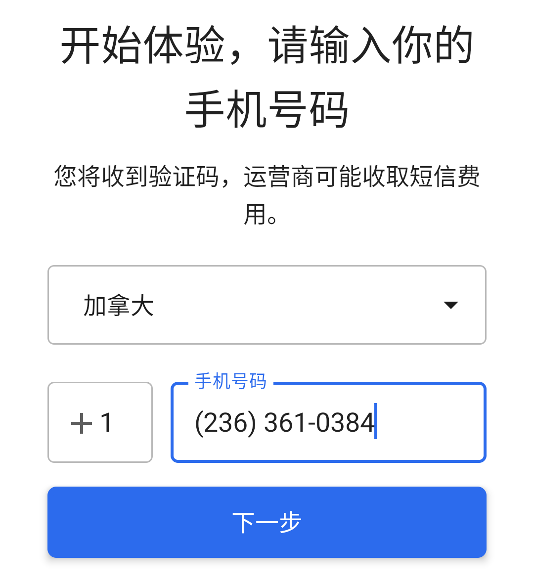

下一步，Signal 会向你发送一条短信验证码。

> <i class="fas fa-info-circle"></i> 如果你收不到短信验证码，你可以等一段时间，然后向 Signal 请求电话验证码。

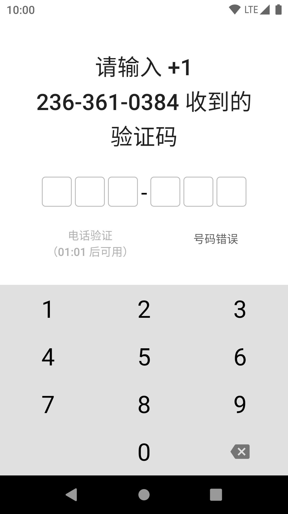

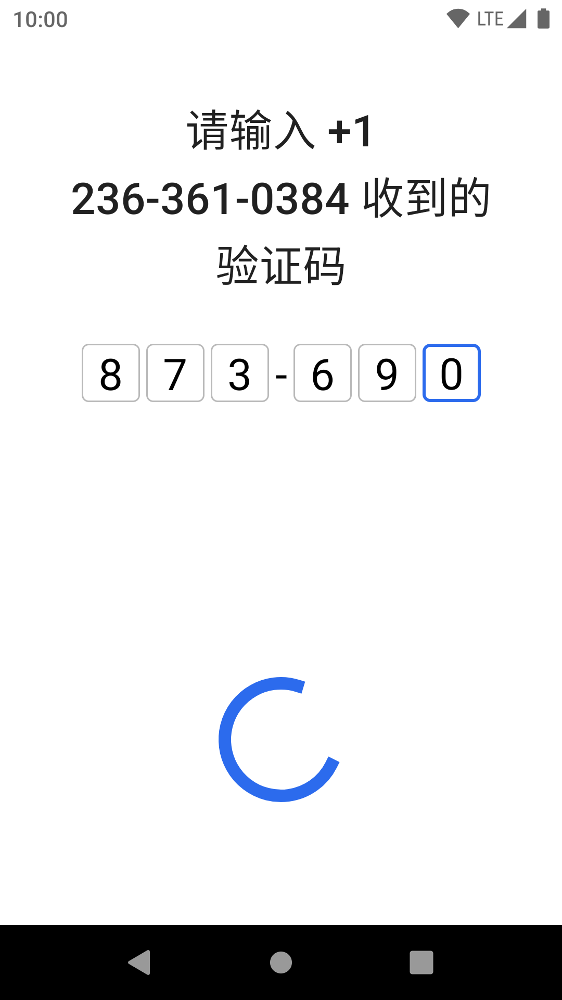

验证完成后，就是填写个人信息的时间了。必填项只有“名字”，但你也可以选个头像和“姓氏”。

> <i class="fas fa-exclamation-triangle"></i> noarch 注意到众多中国用户在墙内及时通讯使用假名，却在墙外使用真名；这和例如 Signal 的墙外及时通讯在输入框内指示“名字”和“姓氏”不无关系。
>
> 尽管 Signal 叫你这么填，但你依然可以只填写一个假名。noarch 也建议你使用**墙内从未使用过的**假名，并且不用自己的脸做头像。

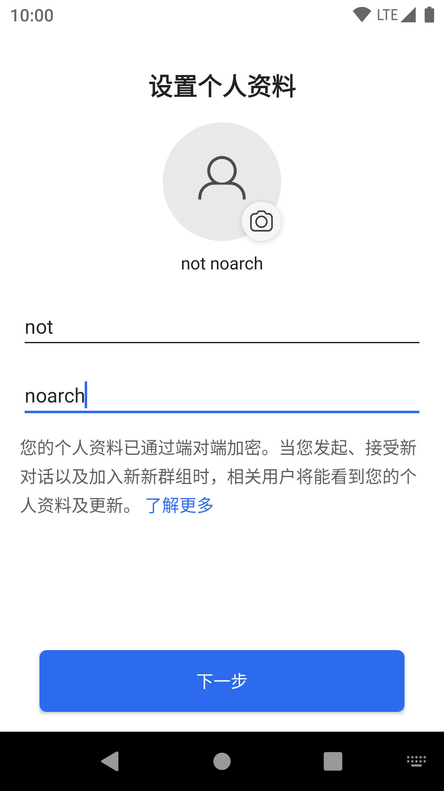

配置 Signal 的最后一步是设一个 PIN. 它用来加密 Signal 的本地存储，防止设备落入窃贼或警察手中时 Signal 消息被轻易读取。

> <i class="fas fa-exclamation-triangle"></i> 绝对不要忘记这个 PIN! 如果你忘了它，所有历史消息将无法找回。

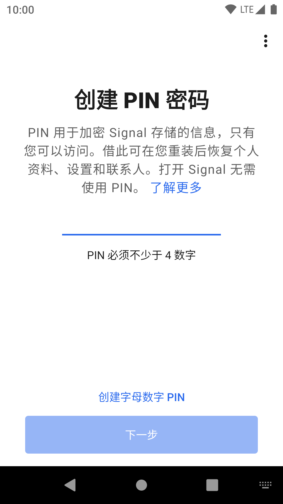

> <i class="fas fa-exclamation-triangle"></i> 如果你：
>- 获取了设备 `root` 权限
>- 被迫使用华为，或任何具有 `/data` 访问后门的设备
>- 大概率会被取证工具检查设备
>
> **请“创建字母数字 PIN”**，并结合密码管理器生成的强密码使用 Signal. 这能更有效防止存储在本地的 Signal 消息被暴力破解。

创建完 PIN, 点击“下一步”，一个全新的聊天体验在等着你。

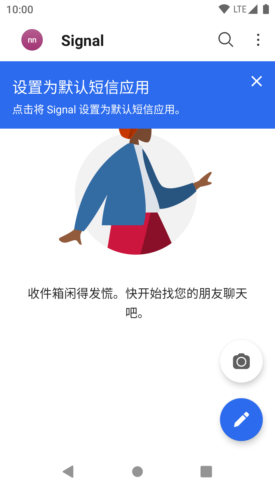

## 额外配置

Signal 主要为传统的短信使用习惯而设计，然而这些设计可能不符合你的使用习惯。

因此，noarch 总结了一些你可以在进入 Signal 后进行的隐私和使用习惯配置：

### 不将 Signal 设置为默认短信应用

点 <i class="fas fa-times"></i> 关掉主界面“设置为默认短信应用”横幅即可。

### 禁用 PIN 码提醒

Signal 会定期提醒你输入 PIN 码以防你忘记。

如果你使用了密码管理器 + 混合密码，“提醒”你输入密码就完全没意义了；因此你可以将 PIN 提醒关掉。

从主界面开始，进入 <code><i class="fas fa-ellipsis-v"></i> -> 设置 -> 隐私</code>，在底部取消选择 "PIN 提醒"，再确认一次 PIN 就可以关掉这个提醒。

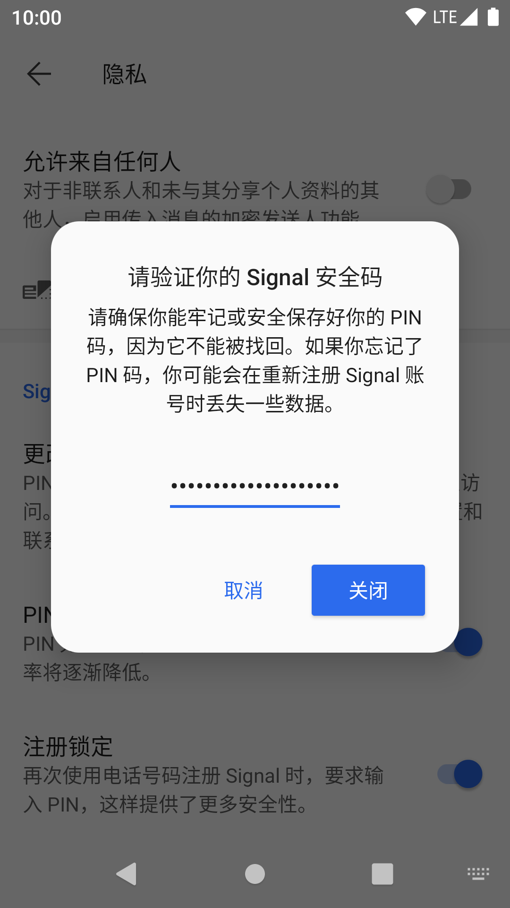

### 其它隐私设置

在 Signal <code><i class="fas fa-ellipsis-v"></i> -> 设置 -> 隐私</code> 里，还有一些选项你可能想要修改：

- 锁屏：开

	类似诸多“应用锁”，用于在手机解锁时都锁定 Signal

- 隐身键盘：开

	禁用键盘“云输入”以及自动学习，类似密码输入模式

- 总是转发通话：开

	防止在通话时泄露真实 IP 地址

- 已读回执：关

	关闭后，对方的消息只会在你回消息时被标记为“已读”，类似大多数中国即时通讯

- 注册锁定：开

	如果你的设备被没收或被盗，打开这个选项可以给你更多时间通知朋友“不要再往该帐号发消息”

当你 ~~将 Signal 变成你的形状~~ 后，就来找一个朋友换到 Signal 聊天吧！

## 邀请第一个朋友上 Signal

现在，你可以把本章节转发给你的朋友，让他们也开始使用 Signal 了。当他们也开始使用 Signal, 下面 noarch 将教你如何开始一个聊天。

noarch 前面提到了 Signal 的操作逻辑和短信类似；这点从开始聊天时就能体验到。

例如，如果你要和一个人开始聊天，你只需要输入它们的手机号，然后发送消息即可；对方在收到你第一条消息后可以选择是否屏蔽你，但全程没有独立的“好友验证”过程。

要找一个朋友开始聊天，在主界面点击右下角的 <i class="fas fa-pencil"></i>，你会进入像短信一样的“选择收件人”界面。

> <i class="fas fa-info-circle"></i> Signal 在这里又会向你请求通讯录权限；noarch 在这里选择拒绝。
>
> 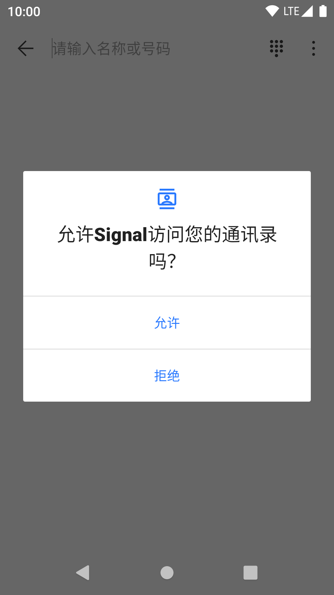

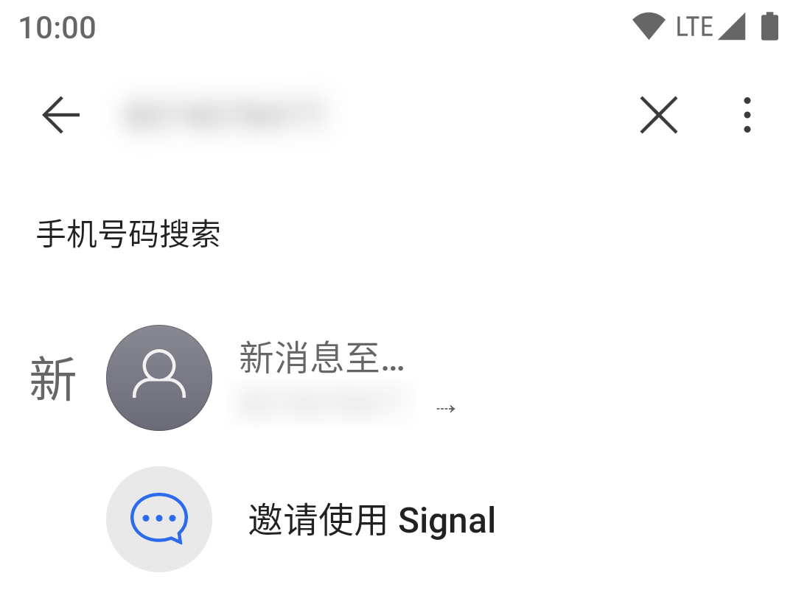

如果你没有允许 Signal 读取联系人，你需要输入对方的完整手机号。在你输入的同时，输入框下方的列表中会出现“新消息至...”，点击它即可进入聊天界面。

> <i class="fas fa-info-circle"></i> 如果对方的手机号不属于美国或加拿大，你还需要手动加上区号，例如 `+86 17727378899`

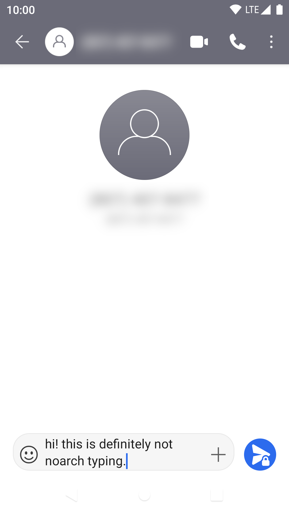

现在这个聊天界面是灰色的，代表你们以前没有用 Signal 通讯过；当你发出第一条消息，它会变成彩色。在 noarch 的例子里，当我发出第一条消息，聊天界面变成了粉色 (yay!)

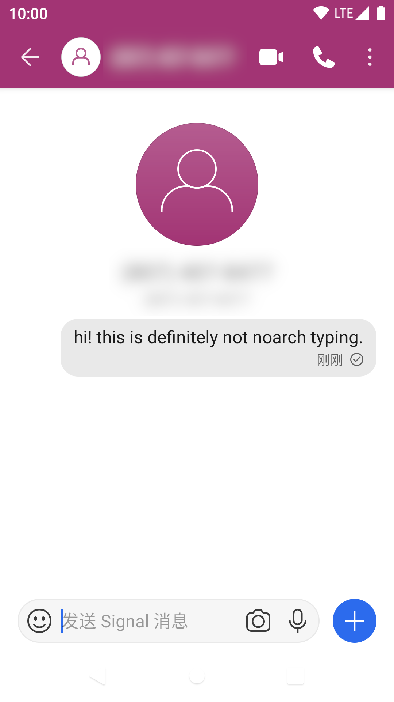

作为一个模仿短信体验的即时通讯，你发出的第一条消息就是“好友请求”。对方在收到你的第一条消息之后，可以像其它及时通讯的好友请求一样允许，忽略（删除）和拒绝（拉黑）：

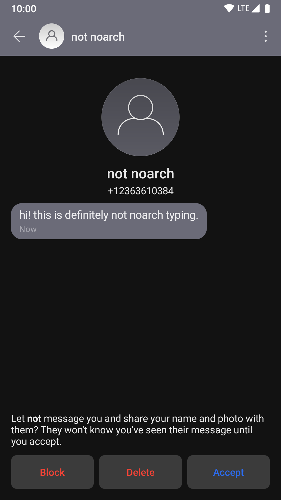

在对方点击“接受”之后，你们就可以像其它及时通讯一样聊天了！

如果你在理解图标上有困难，下面是 Signal 聊天界面各种图标的解释：

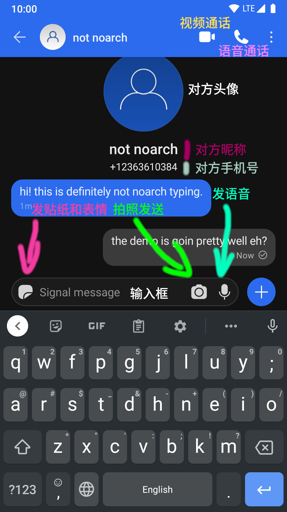

### 发语音

在 Signal 聊天界面，按住 <i class="fas fa-microphone"></i> 可以发语音。

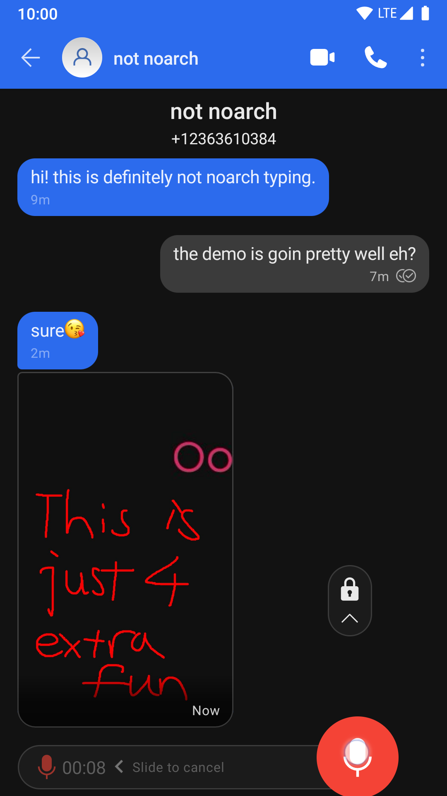

如果你口误了，可以原地向左滑动取消语音录制；

如果你想录一首钢琴曲，原地上划可以锁定语音录制状态，然后把手机放到钢琴上即可，不用一直按着录制键；

录完之后，松手即可发送；或者如果你在锁定模式，点击 <i class="fas fa-paper-plane"></i> 来发送。

### 发送媒体文件

Signal 作为一个及时通讯，同样可以发送视频和图片。

你可以点击消息框右侧的 <i class="fas fa-plus"></i> 来打开媒体选择菜单：

> <i class="fas fa-info-circle"></i> 第一次打开时，Signal 会请求存储权限；点击“给予权限”并在弹出的权限请求中允许即可。

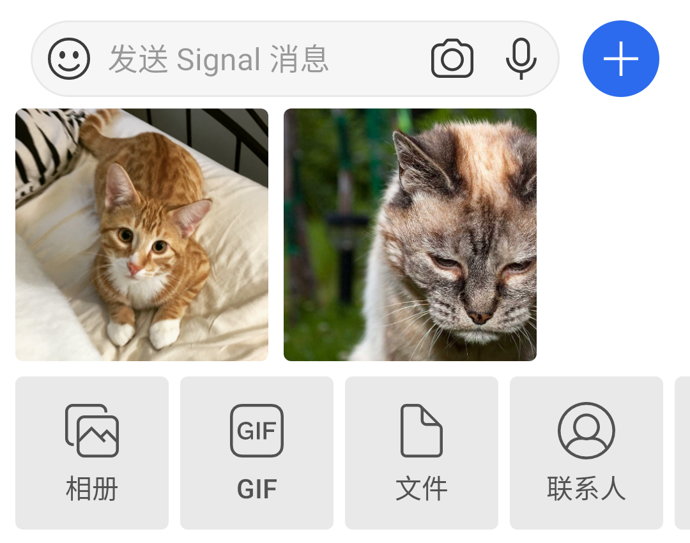

点击你要发送的媒体（可以是图片、GIF 或是视频），会根据对应媒体格式进入编辑器。

在图片编辑器里，你可以给剪裁图片、加文字、写写画画、打码甚至贴上贴纸；在视频编辑器里你可以粗略地剪辑视频。

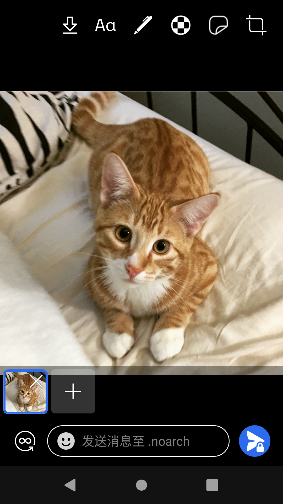

剪辑完成后点击右下角的 <i class="fas fa-paper-plane"></i> 来发送。

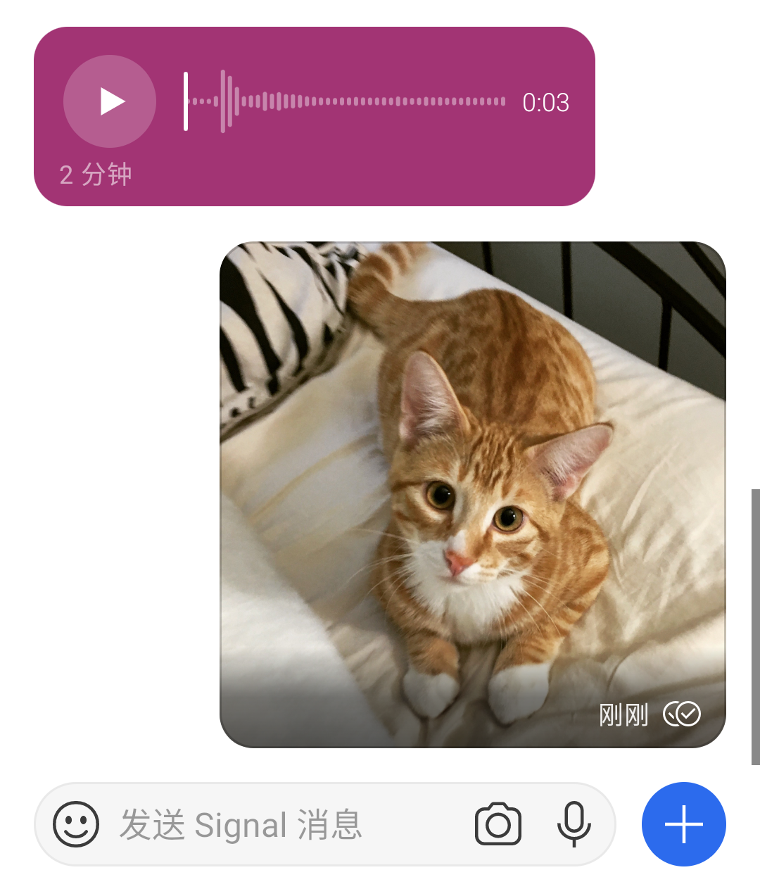

#### 多选媒体

点击 <i class="fas fa-plus"></i> 号调出的图片选择器只能选择一张图片并发送。如果你要一次性发一堆照片，刚才的方法就很麻烦。

还好 Signal 提供了照片多选功能。

在 <i class="fas fa-plus"></i> 号图片选择器中点击“相册”，你会进入一个文件夹视图：

> <i class="fas fa-info-circle"></i> 你也可以点击图片编辑器下方图片列表最右侧的 <i class="fas fa-plus"></i> 号进入文件夹视图。

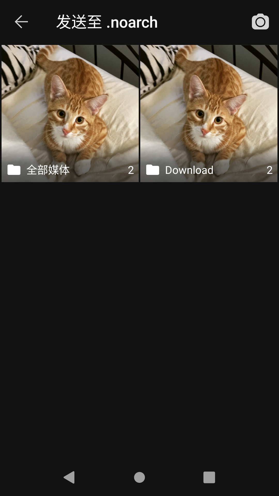

进入你要发送的图片所在文件夹（或是直接进入“全部媒体”），然后点击对应图片来选择。

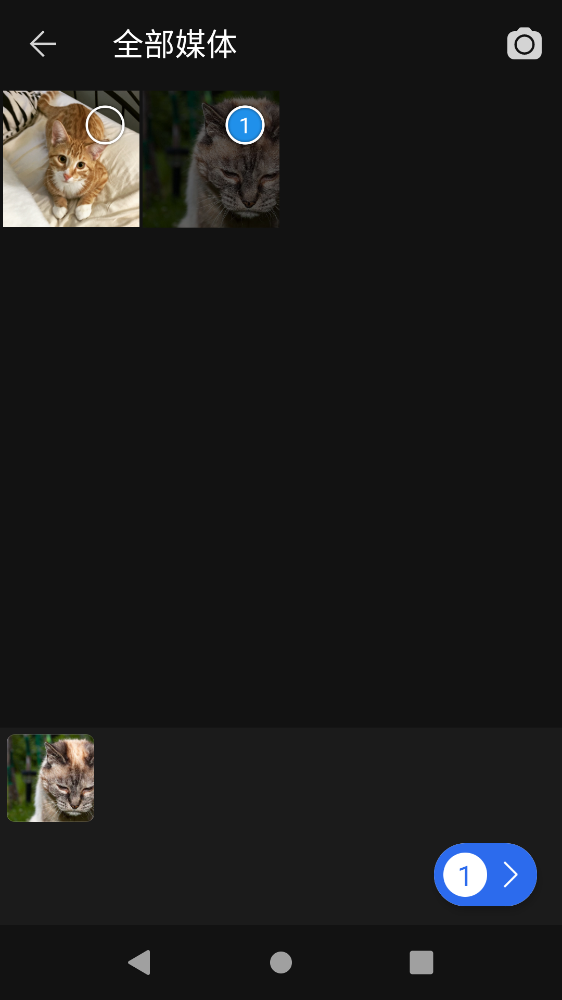

选中的图片会以一个带数字的圆圈表示，数字代表图片发送顺序。

选择完之后，点击 <i class="fas fa-chevron-right"></i> 就能进入你熟悉的图片编辑器；在图片编辑器里点相同位置的 <i class="fas fa-paper-plane"></i> 就可以一次性发送多个媒体。

#### 发原图（或文件）

> <i class="fas fa-bomb"></i> Signal 发送原图不会去除图片中可能敏感的 EXIF 信息。不知道这么做的风险可能使你泄露自己的地理位置、设备型号，还有更多信息。

Signal 默认压缩发送的图片，并会去除图片中可能泄露隐私的 [EXIF](https://en.wikipedia.org/wiki/Exif) 信息。

但有时候你需要发送原图，以保证发送图片的质量。

Signal 没有专门的“发原图”功能，但你可以将图片以“文件”形式发送，这样 Signal 就不会以任何形式处理图片。

在聊天界面 <i class="fas fa-plus"></i> 号菜单点击 <i class="fas fa-file-o"></i> 文件，你会被带到熟悉的 Android 文件选择器。

> <i class="fas fa-info-circle"></i> 如果你安装了多个文件管理器，Android 会问你要使用哪个。

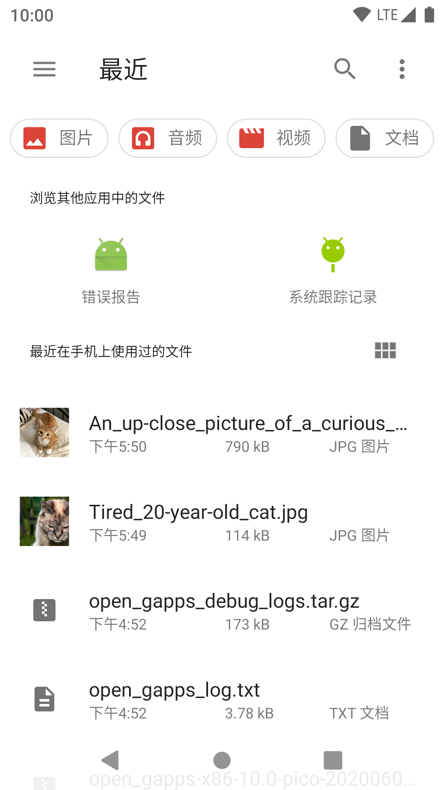

在文件管理器里选择你要发送的文件（只能选择一个），然后点击“选择”回到 Signal 聊天界面。

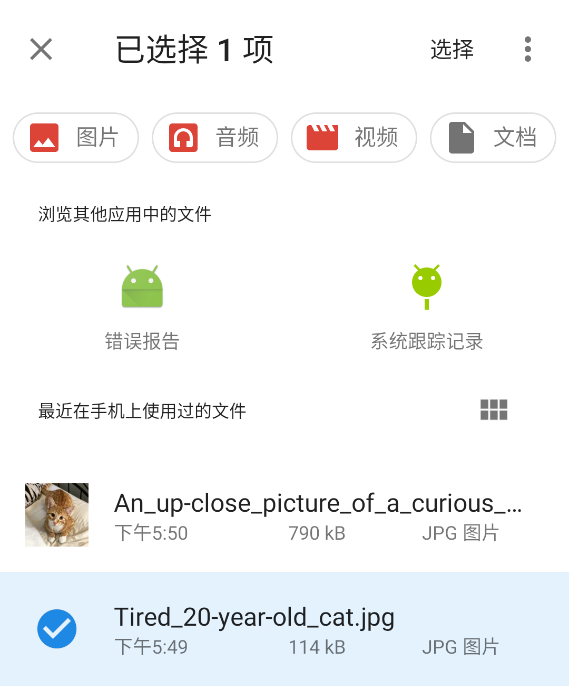

在聊天界面下方，你会看到刚才选中的文件，让你确认即将发送的文件；确认无误后即可发送。

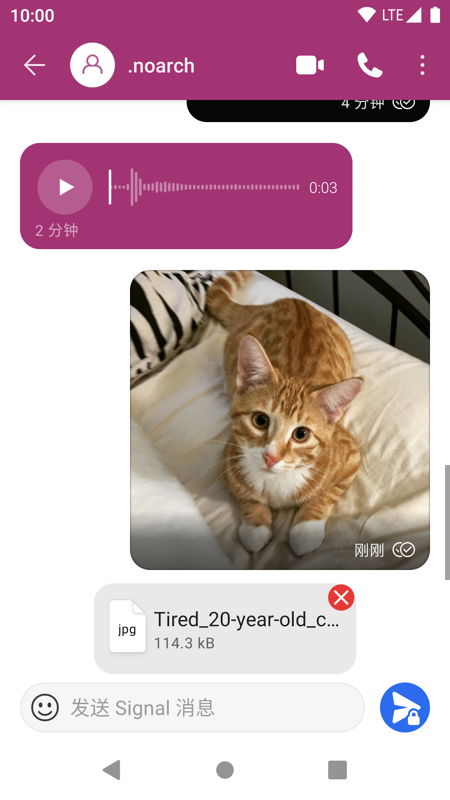

> <i class="fas fa-check-circle"></i> 有趣的是，尽管 Signal 不提供方便的无损图片发送，你却能预览发送出去和收到的无损图片。

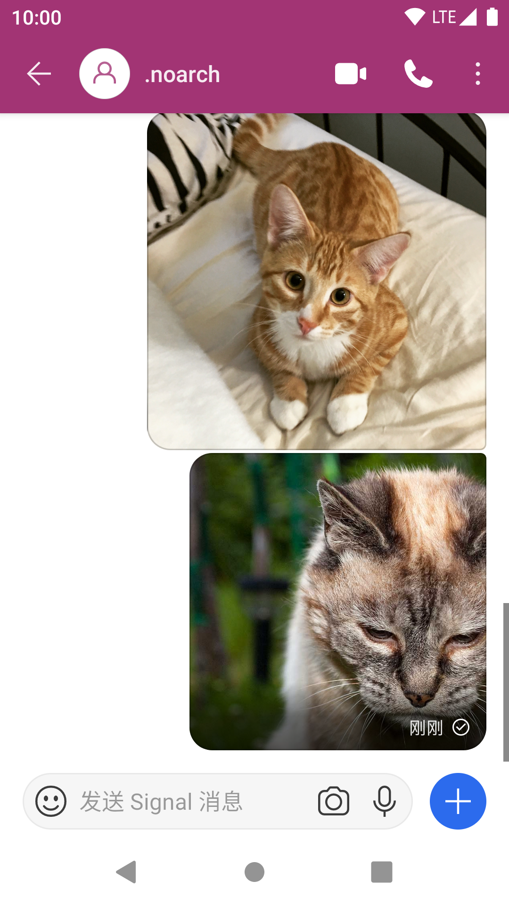

## 群聊

如果你要把一家人都拉进 Signal, 那么群聊则是你的首选。虽然 Signal 群聊在社交功能上不及一些其它社交为主的即时通讯，但作为只与紧密朋友联系的工具，Signal 群聊做得也不错。

创建群聊和开始新对话的入口一致，都是主界面右下角的 <i class="fas fa-plus"></i> 号。不同的是，在进入新建对话界面后你点击“ <i class="fas fa-user-friends"></i> 新建群组”：

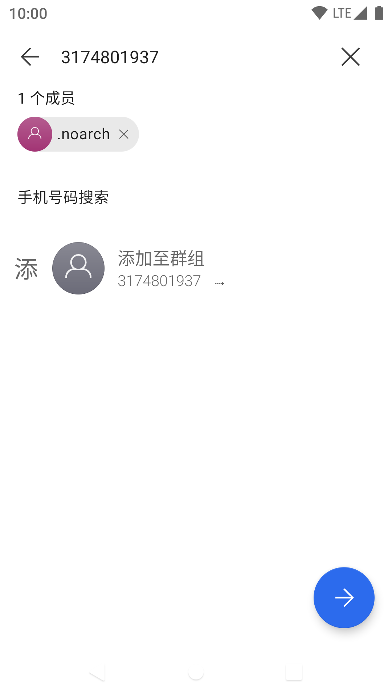

然后选择，或是挨个添加想要拉到群里的人，按 <i class="fas fa-arrow-right"></i> 继续然后输入群信息：

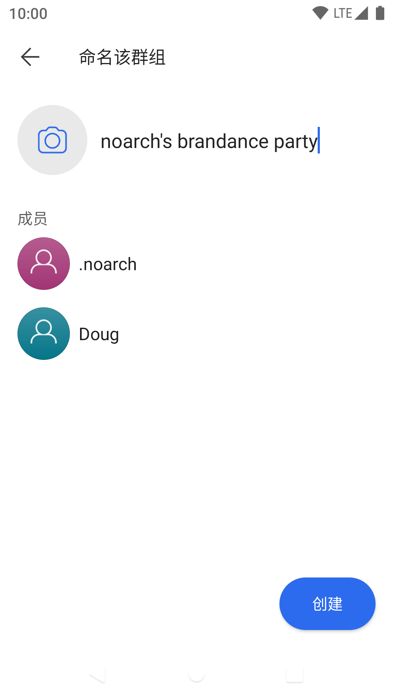

最后“创建”就建立了一个新群。

### @ 重要通知

像很多其它即时通讯一样，Signal 没有专门的 `@` 按钮；

如果你要 @ 一个人，直接用键盘输入 `@`, Signal 就会弹出一个搜索菜单。

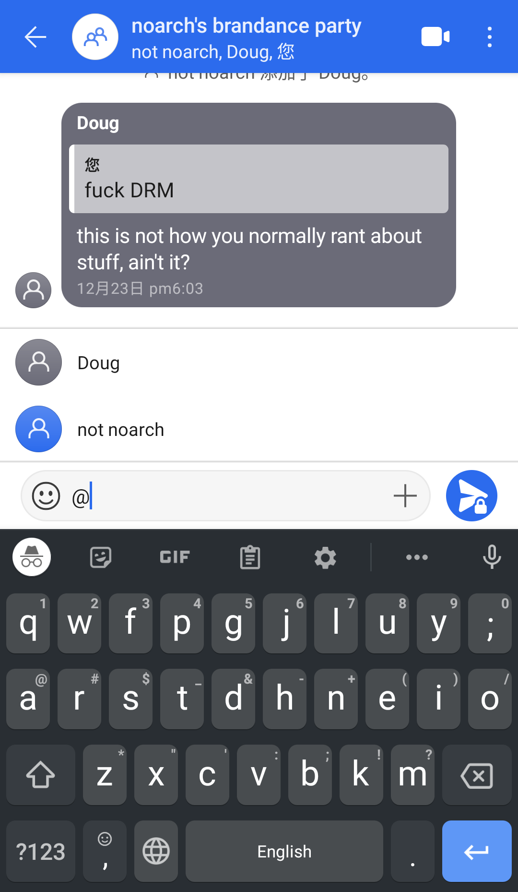

继续输入你要 @ 的用户名，找到目标，点击就可以将特别通知添加到消息里。

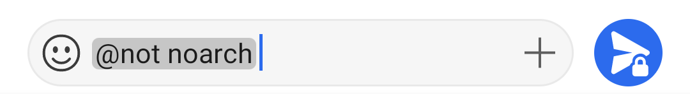

---

到此，noarch 已经介绍了 Signal 的所有核心功能和你一定要进行的隐私设置，剩下的功能你可以自己探索！

## 附加功能

如果你懒得自己探索所有 Signal 的好玩功能，那么 noarch 在这里列出一些给你吧。

### “回复”消息

在一个消息身上向右滑动可以“回复”。它在群里尤其有用，“回复”一个消息和 @ 一样可以特别提醒一个人。

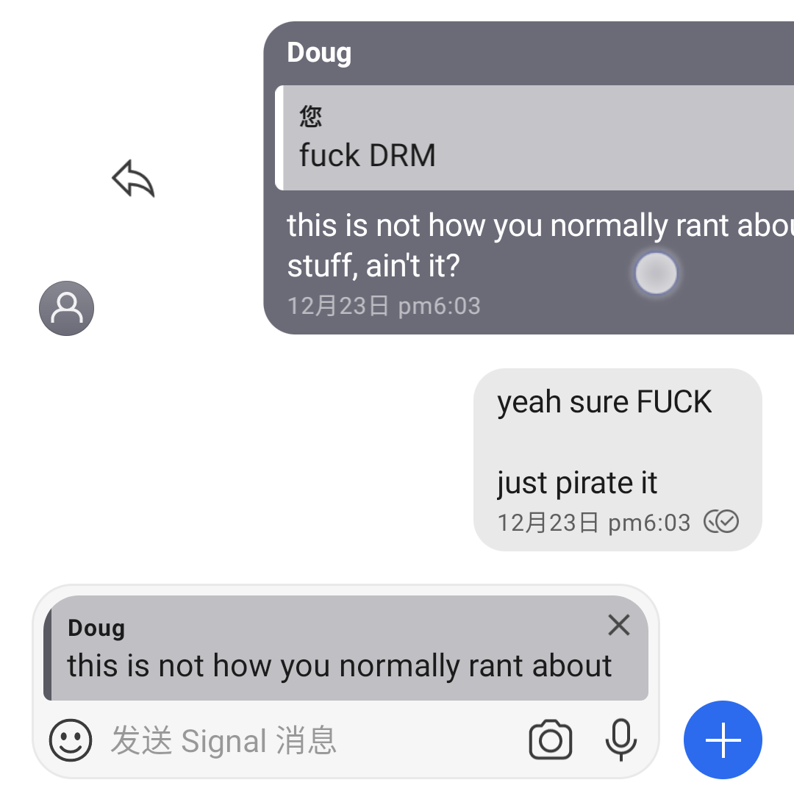

除了充当 @ 的功能之外，“回复”还可以帮你和朋友紧贴话题，避免出现误解。

### 端到端加密通话

还记得 noarch 在章节开头叫你设置的“总是转发通话”吗？没错，你可以用 Signal 打电话。

除了不消耗通话分钟数以外，Signal 在其网络电话中也使用了端到端加密，意味着你的通话**几乎不可能被窃听**。

在聊天界面点击 <i class="fas fa-phone-alt"></i> 打电话，你会被带到通话界面。

Signal 的通话界面长这样：

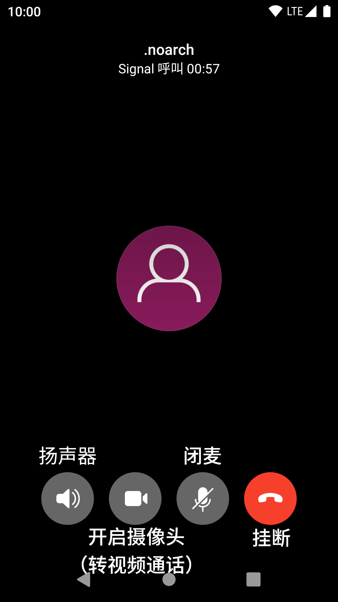

在聊天界面点击 <i class="fas fa-video"></i> 则可以直接打视频电话，不过你可以随意在视频和语音电话之间切换。

除此之外，Signal 还可以打群电话；打群电话的操作流程和私聊电话相似。不过，因为 Signal 的群通话不会通知成员，在开始群通话之前你需要事先通知群成员。

### 阅后即焚

> <i class="fas fa-bomb"></i> 请不要依赖 Signal 阅后即焚功能说出可能会后悔的话。虽然消息本身阅后即焚，但聊天另一方可以通过其它方式记录消息。

得益于端到端加密，Signal 的消息可以定时自毁。

点击聊天界面右上角的 <i class="fas fa-ellipsis-v"></i>，然后选择“阅后即焚”；或者点击对方头像进入个人信息页，那里也有“阅后即焚”选项。

Signal 会弹出一个定时器，你可以在这设定消息在阅读后多久自动消失。

设定定时器后，对方头像下方的状态会显示阅后即焚定时器。如果你这时发一条消息，它会在定时器过后消失。

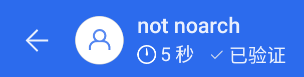

你可以重复上述步骤，进入阅后即焚定时器，将其设定为“关闭”来回到“正常”模式。

### 验证安全码

如果你看过 `privacy.noarch` 的[“公钥加密简介”](/Encryption/Pubkey/Pubkey.html)章节，你看到这应该一直有一个疑惑：“作为一个端到端加密聊天工具，为什么 Signal 不需要验证公钥指纹？”

答案是，你其实可以手动验证公钥指纹。

在聊天界面点击对方头像查看对方个人信息，然后滑动到底部，“查看安全码”。

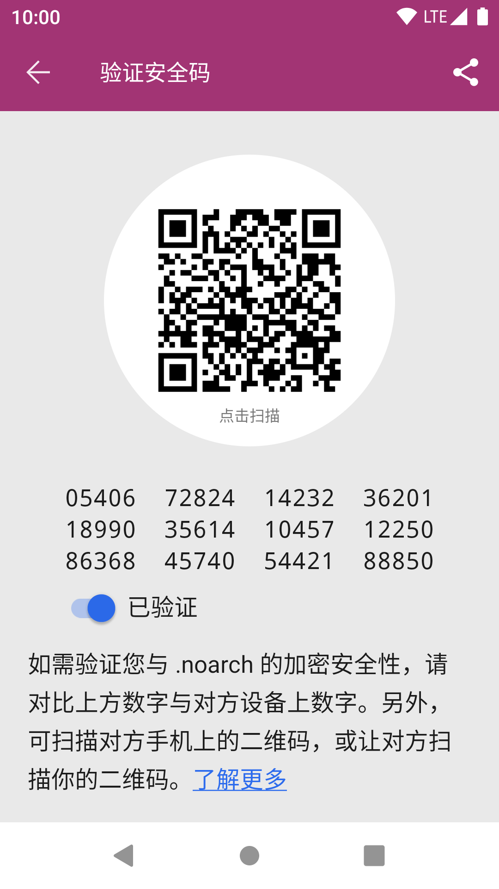

熟悉的公钥验证步骤来了：你现在可以和对方面对面验证安全码，或是用一个不同方式与对方核对安全码。

## 总结

上面 noarch 介绍了 Signal 的常见用法。现在，即使你不太会用其它及时通讯，也应该对 Signal 的操作比较熟悉了。

光看无用，现在去把自己的三次元朋友拉到 Signal 上吧！

记住，与你加密通讯的人越多，你的隐私在宏观上就越安全。
