# 使用 VHD(X) 部署原生多系统 ^

---

> <i class="fa fa-info-circle" aria-hidden="true"></i> **这是一篇进阶文章。** 为了保证简洁，本文会讲解更少的基础操作，而更注重细节和原理；尽管如此，*noarch* 也会尽量解释清楚每一个必要的步骤。  
> 在阅读本文之前，你应该已经了解了[监考软件](https://www.cipcourses.com/resources/how-does-online-proctoring-work/)，[虚拟机](https://zh.wikipedia.org/zh-cn/%E8%99%9B%E6%93%AC%E6%A9%9F%E5%99%A8)，[虚拟磁盘](https://zh.wikipedia.org/wiki/%E7%A3%81%E7%9B%98%E6%98%A0%E5%83%8F)以及 [Windows 启动](https://www.thewindowsclub.com/how-does-windows-10-boot)的基本概念，并且熟悉 [Windows 命令行的基本操作](https://www.youtube.com/watch?v=92lpSazVmA4)。如果你还没有，点击前面的链接来了解。

## *noarch* 的碎碎念

这篇文章开始编写时 (2020-10), 北美的 COVID-19 疫情依然水深火热：美国依然以每天 5w+ 确诊病例 稳 步 增 长 ，加拿大部分省份则见明显反弹。

你可能会疑惑：为什么 *noarch* 要在一篇 IT 文章上讲 COVID-19? 

原因是 COVID-19 “使得间谍软件合法化，并且学校强迫让学生安装他们” ([Forbes](https://www.forbes.com/sites/seanlawson/2020/04/24/are-schools-forcing-students-to-install-spyware-that-invades-their-privacy-as-a-result-of-the-coronavirus-lockdown/), [EFF](https://www.eff.org/deeplinks/2020/09/students-are-pushing-back-against-proctoring-surveillance-apps)).

简单来说：因为 COVID-19 疫情，学生需要完全上网课，同时也要在网上考试；而“为了防止考试作弊”，学校强制学生在考试时安装“监考软件”。

幸运的是，*noarch* 所在的高中依然部分开放，考试照常在学校进行，不需要面对监考软件。然而最近有大学的朋友给我发了这张图：

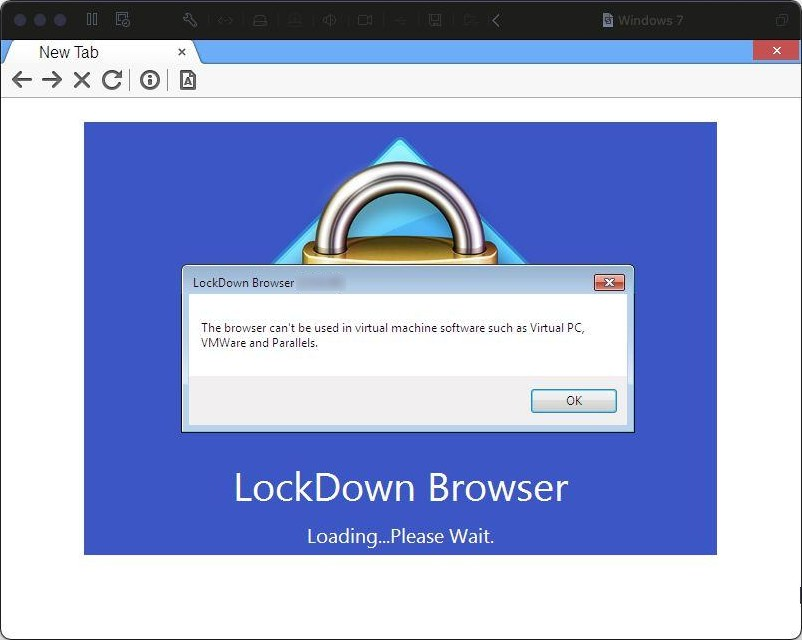

这张图里，她尝试在 VMware Fusion 虚拟机里运行监考软件；意料之中的是，监考软件检测到了虚拟机的存在并且拒绝启动。

如果你不知道对客户机隐藏虚拟化状态的方法，或是 *noarch* 将要介绍的使用 VHD 原生启动 Windows, 在 due date 的催促下，你可能就高挂白旗，在日常使用的系统乖乖装上了监考软件。

## 目标和限制

软件可以通过多种方法检测自己是否在虚拟机内运行。

例如 [`al-khaser`](https://github.com/LordNoteworthy/al-khaser) 就是一个检测虚拟机 / 调试器的 demo. 这个 demo 会通过检测 CPU 是否虚拟，检测虚拟设备及其驱动的存在等方法判断虚拟机的存在。

要绕过所有这些虚拟机检测非常复杂；因此人们也用多系统来隔离自己的软件，身份和数据。

传统的多系统虽然不是很复杂，但非常麻烦，也不够灵活：你需要给磁盘分区；根据你启动方式的不同，你需要用不同方法配置启动引导器...

微软在 Windows 7 及以后提供的[虚拟磁盘启动](https://docs.microsoft.com/zh-cn/windows-hardware/manufacture/desktop/deploy-windows-on-a-vhd--native-boot)功能则是在虚拟机和多系统之间的一个诡异“缝合怪”。**它有着虚拟磁盘的便利性（快照功能）以及原生多系统的性能优势，并且不常被检测为虚拟机。**

使用虚拟磁盘启动时，Windows 启动引导器会挂载虚拟磁盘并启动虚拟磁盘内的 Windows; 除此之外，虚拟磁盘内的 Windows 会直接使用所有物理硬件。 如果你接触过传统多系统，下面是虚拟磁盘启动和传统多系统的一些区别：

### 相比传统多系统
- <i class="fa fa-plus-circle" aria-hidden="true"></i> 因为基于虚拟磁盘，能像虚拟机一样创建“快照”
- <i class="fa fa-minus-circle" aria-hidden="true"></i> 无法“休眠”（暂停到磁盘）
 	- 但“睡眠”（暂停到内存）依然可用
- <i class="fa fa-minus-circle" aria-hidden="true"></i> 无法更新 Windows 的大版本（例如 Windows 10 1909 升级到 2004）
- <i class="fa fa-minus-circle" aria-hidden="true"></i> 位于虚拟磁盘内的 Windows 必须是专业版以上（专业版(N)，企业版(N)，教育版(N)...）

### 相比虚拟机
- <i class="fa fa-plus-circle" aria-hidden="true"></i> 能直接利用物理硬件，性能损失少
- <i class="fa fa-plus-circle" aria-hidden="true"></i> 较少被检测为“虚拟机”
- **<i class="fa fa-minus-circle" aria-hidden="true"></i> <i class="fa fa-exclamation-triangle" aria-hidden="true"></i> 无法控制软件对硬件的访问**
- **<i class="fa fa-minus-circle" aria-hidden="true"></i> <i class="fa fa-exclamation-triangle" aria-hidden="true"></i> 无法完全控制软件对你“主系统”数据的访问**

### 其它限制
- <i class="fa fa-info-circle" aria-hidden="true"></i> 用来启动的虚拟磁盘，以及存储这个虚拟磁盘文件的物理磁盘不能使用“动态分区”（一个微软专有的分区表格式）
- <i class="fa fa-info-circle" aria-hidden="true"></i> 虚拟磁盘文件不能位于一个 Samba 分享（网络卷）上
- <i class="fa fa-info-circle" aria-hidden="true"></i> 存储这个虚拟磁盘文件的物理卷不能使用 BitLocker 加密
- <i class="fa fa-info-circle" aria-hidden="true"></i> 存储这个虚拟磁盘文件的物理卷必须是 NTFS 或 exFAT (Windows 10 1809+) 格式

别怕，如果你没有听说过上述的功能，那么你大概率不需要这些功能，因此虚拟磁盘多系统非常适合你；如果你是上述功能的用户，你知道如何应对 ;)

## 先决条件

你需要准备：

- 一个运行着 Windows 10 的 PC
	- **<i class="fa fa-exclamation-triangle" aria-hidden="true"></i> Windows 10 on ARM 和 Windows 10 S 不支持多启动**
- 至少 20GiB 的磁盘空闲空间，*noarch* 建议至少保留 60 GiB 以便安装应用
- 不按流量计费的网络，因为你将要下载约 5GiB 的 Windows 安装镜像
- 该 PC 的“管理员” (Administrators) 权限
- 约 20 分钟的空闲时间

**我们开始吧！**

## 下载 Windows 安装镜像

在虚拟磁盘里安装 Windows 就像在虚拟机里安装 Windows. 首先你需要准备一个 `iso` 格式的 Windows 安装镜像。

你可以通过多种方法向微软获得 Windows 安装镜像，例如“媒体创建工具”：

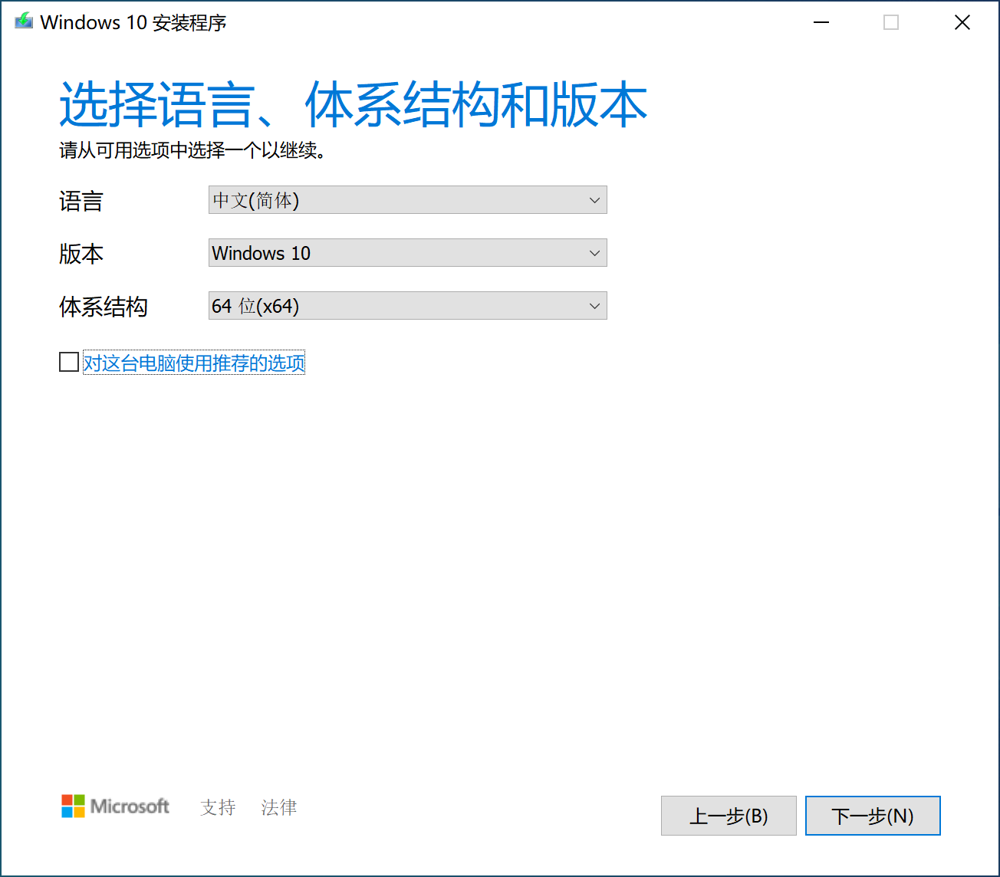

或者只为非 Windows 电脑开放的直接 `iso` 下载。

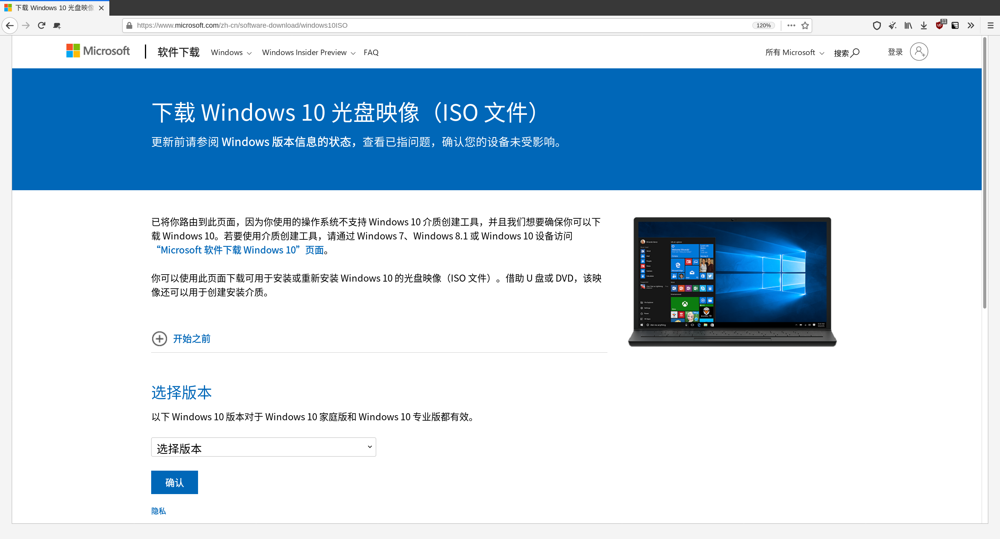

这两种方式 *noarch* 就不在此赘述；你可以在等待下载的同时进行下一步。

## 创建虚拟磁盘文件

接下来你需要创建一个虚拟磁盘 `vhdx` 文件。

右键点击 <i class="fa fa-windows" aria-hidden="true"></i> 键，或是按<code><i class="fa fa-windows" aria-hidden="true"></i> + X</code>，在弹出的菜单中选择“磁盘管理”：

> <i class="fa fa-info-circle" aria-hidden="true"></i> 如果你当前在使用一个标准账户，你需要以管理员打开 `PowerShell` / `CMD` 然后从那运行 `diskmgmt`.

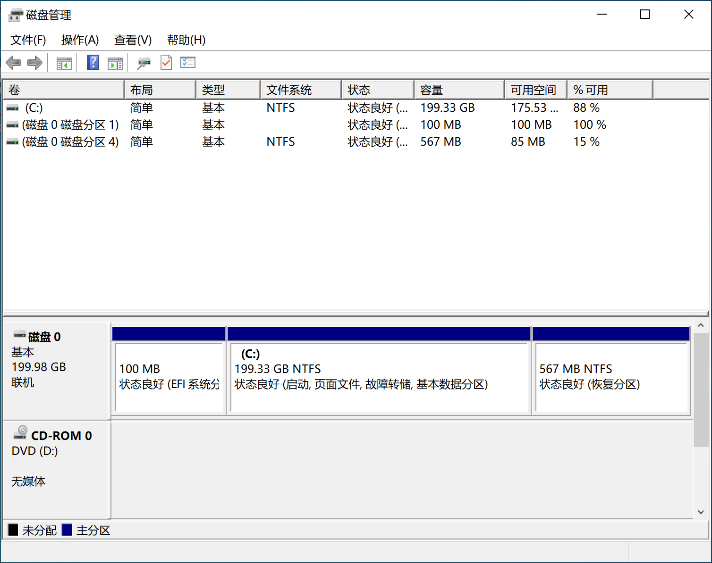

要创建一个虚拟磁盘，点击菜单栏的“操作”- “创建 VHD”：

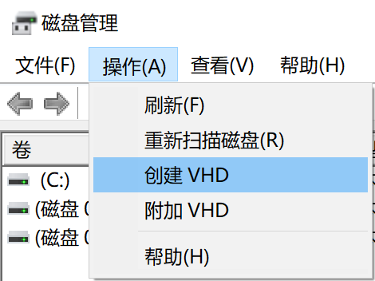

然后在弹出的窗口里选择 `VHDX - 动态扩展`，指定 VHD 的最大大小，然后选择虚拟磁盘文件的存储位置。

> <i class="fa fa-exclamation-triangle" aria-hidden="true"></i> `VHD` 的最大大小不能超过物理磁盘当前可用的空间大小。

> <i class="fa fa-info-circle" aria-hidden="true"></i> 如果你打算在虚拟磁盘里安装的是 Windows 7, 因为 Windows 7 无法从 `VHDX` 启动，你应该使用 `VHD` 作为虚拟磁盘格式。


填写完成后点击“确定”，你就可以在“磁盘管理”中看到新添加的虚拟磁盘了：

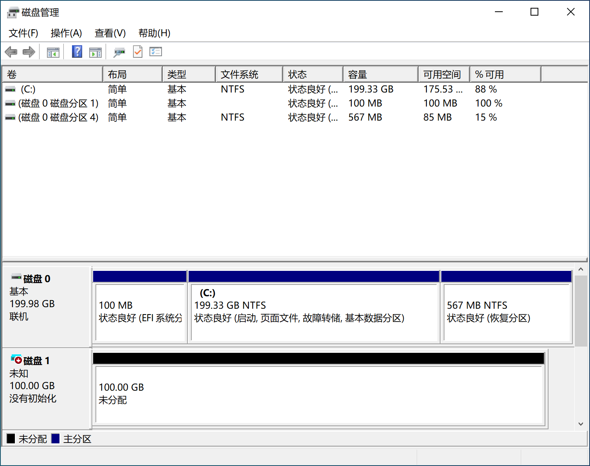

就像物理磁盘一样，你也需要初始化一个虚拟磁盘：为其创建一个分区表，然后创建一个分区。

右击左侧的“没有初始化”，选择“初始化磁盘”；然后在弹出的窗口点击“确定”。

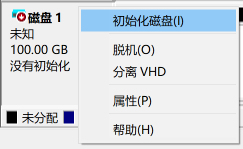  
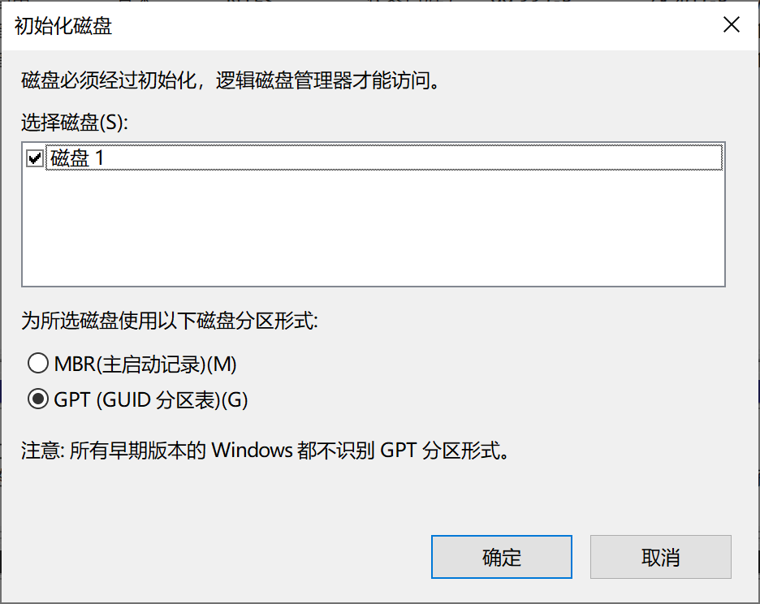

这步做完后你就得到了一个准备被分区的磁盘：

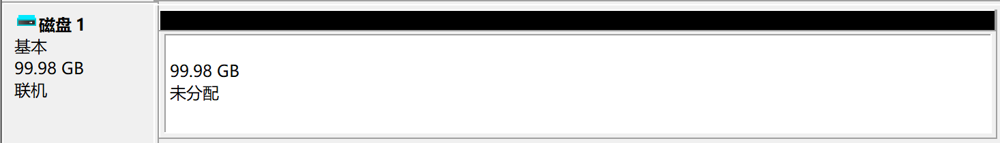

接下来你就可以按照正常的方法给这个虚拟磁盘分区。*noarch* 在这里只给虚拟磁盘创建一个 NTFS 分区：

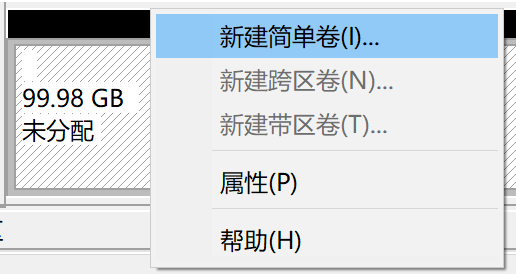
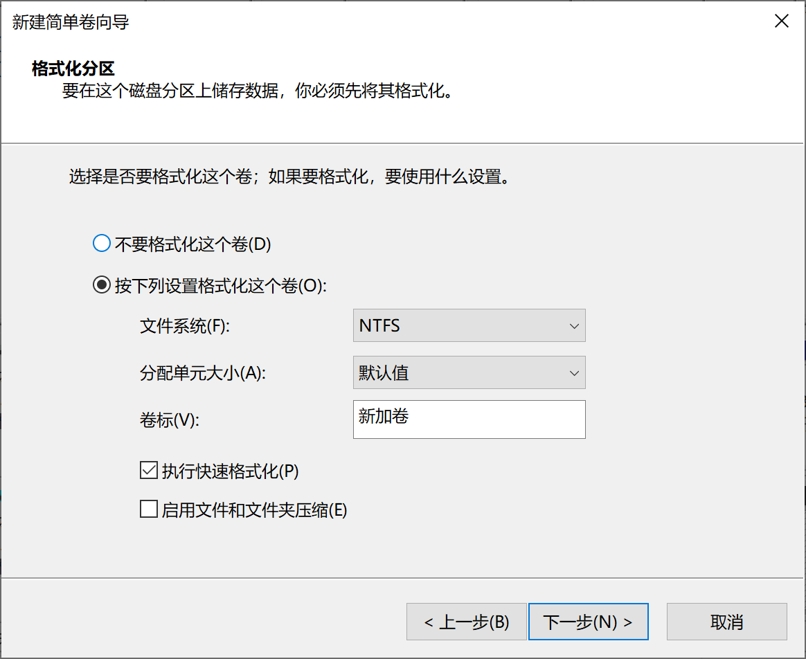

在“新建简单卷向导”里一路点击“下一步”，你就得到了一个可用的虚拟磁盘分区。

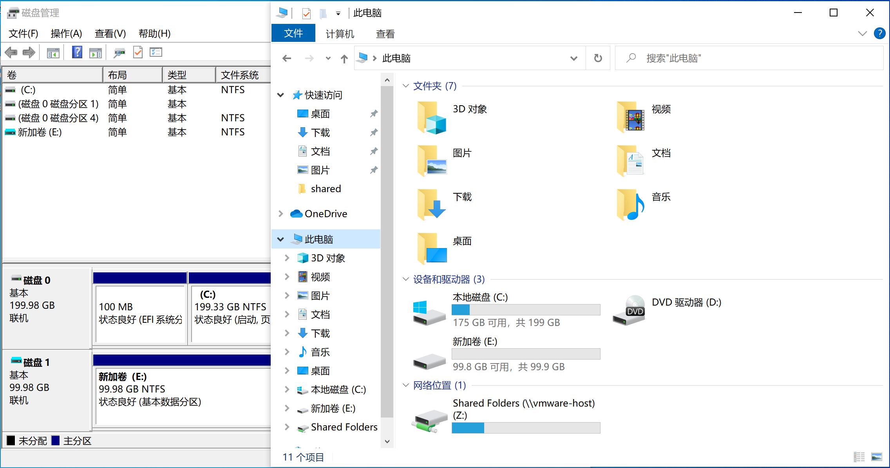

> <i class="fa fa-exclamation-triangle" aria-hidden="true"></i> 虚拟磁盘的最大大小不能超过当前磁盘可用空间的大小。这是因为虚拟磁盘内的 Windows 在启动时会为了防止磁盘写入错误，将自己扩展到虚拟磁盘的最大大小，并在关机时将自己缩小到实际数据量的大小。

## “解压” Windows

接下来是本文最重要的一步：将 Windows 解压到虚拟磁盘里。

这是 *noarch* 想要写这篇文章的主要原因：*noarch* 找到的描述在虚拟磁盘里安装 Windows 的现有中文文章，均使用某种第三方工具或脚本将 Windows “解压”到目标虚拟磁盘。这些工具多数只为对应的教程所写，没有被长期维护，不够可靠。

实际上你可以使用 Windows 自带的工具 `DISM` 简单地“解压” Windows 安装镜像。

首先，在文件资源管理器里装载你刚刚下载的 Windows 安装光盘：


然后你就可以在“此电脑”里看到“一个新光盘的插入”。

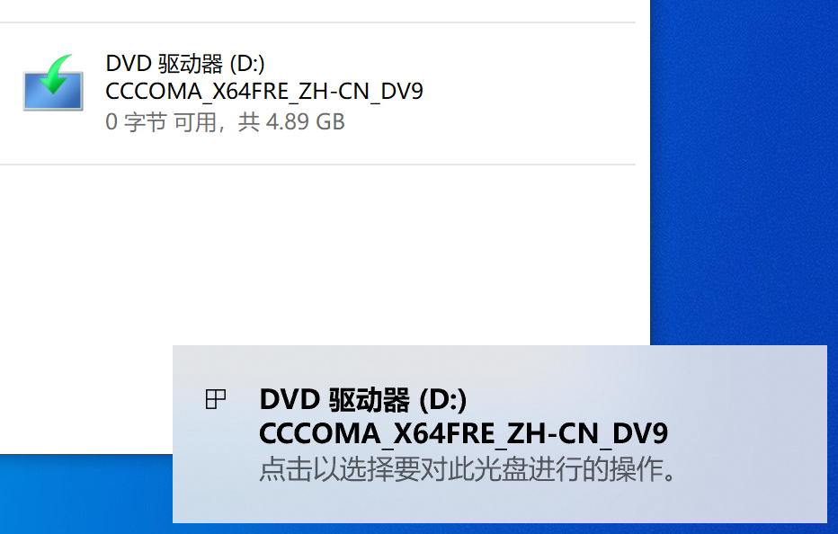

你可以右击然后“打开”（不是“从媒体安装或运行程序”）刚刚装载的 `iso` 镜像。

如果你是直接下载的 `iso`, 你可以在装载的“光盘”里找到 `sources\install.wim`.

> <i class="fa fa-info-circle" aria-hidden="true"></i> 如果你是使用“媒体创建工具”创建的 `iso`, 这个文件则会是 `install.esd` 而不是 `install.wim`.
>
> 如果你的是 `install.esd`, 请将下面所有命令中 `install.wim` 替换成 `install.esd`.


<code><i class="fa fa-windows" aria-hidden="true"></i> + X</code>, 用管理员权限打开 `Windows PowerShell` 或 `CMD`:


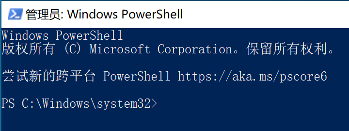

我们接下来会用 `DISM` 来查看和“解压”这个镜像。

`install.wim` 是一个 `WinImage` 镜像；`WinImage` 是微软在 Windows Vista 发布时推出的一个镜像格式。

其一个重要特性是可以在一个镜像中差分多个子镜像，而不显著增加主镜像的大小。因此，它取代了 Windows XP 及之前的文件复制，专门用来包装 Windows, 使得多个不同的 Windows 版本 (edition) 可以被包装在一个安装光盘里。

同样地，我们下载的 Windows 10 安装镜像中的 `WinImage` 镜像也包含多个版本；你在“解压”时需要选择一个 Windows 版本，在 `PowerShell` 里运行这个命令来列出 `install.wim` 的所有子镜像：

```
dism /Get-ImageInfo /ImageFile:[你的 install.wim 位置]
```

> <i class="fa fa-exclamation-triangle" aria-hidden="true"></i> 你需要将上方的 `[你的 install.wim 位置]` 替换成你 `install.wim` 的实际位置。同样你也需要替换所有后续使用方括号 `[]` 引用的数值。

这是 *noarch* 的运行结果：

```
PS C:\Windows\system32> dism /Get-ImageInfo /ImageFile:D:\sources\install.wim

部署映像服务和管理工具
版本: 10.0.19041.329

映像详细信息: D:\sources\install.wim

索引: 1
名称: Windows 10 家庭版
描述: Windows 10 家庭版
大小: 14,691,877,788 字节

索引: 2
名称: Windows 10 家庭单语言版
描述: Windows 10 家庭单语言版
大小: 14,691,375,165 字节

索引: 3
名称: Windows 10 教育版
描述: Windows 10 教育版
大小: 14,935,497,806 字节

索引: 4
名称: Windows 10 专业版
描述: Windows 10 专业版
大小: 14,935,765,881 字节

索引: 5
名称: Windows 10 专业教育版
描述: Windows 10 专业教育版
大小: 14,935,436,224 字节

索引: 6
名称: Windows 10 专业工作站版
描述: Windows 10 专业工作站版
大小: 14,935,467,015 字节

操作成功完成。
```

在运行完上述命令后请选择 ~~困难~~ 一个 Windows 版本，并记住它的“索引”号。

*noarch* 在这里选择 “Windows 10 专业工作站版”子镜像，其“索引”是6.

关于 Windows 10 各个版本 (edition) 的区别，请见 [https://www.microsoft.com/zh-cn/WindowsForBusiness/Compare](https://www.microsoft.com/zh-cn/WindowsForBusiness/Compare).

记住索引后，你可以用一行命令将 Windows “解压”到虚拟磁盘内：

```
dism /Apply-Image /ImageFile:[你的 install.wim 位置] /Index:[你选择的版本“索引”] /ApplyDir:[你虚拟磁盘的盘符] /Verify /Check-Integrity
```

上方命令选项的含义：
- `/Apply-Image` : 应用（“解压”）指定的镜像
	- `/ImageFile:` : 指定要处理的镜像位置
		- `/Index:` : 指定子镜像的索引
	- `/ApplyDir:` : 指定“解压”的目标目录
	- `/Verify` : 在复制后验证结果正确
	- `/Check-Integrity` : 验证镜像的完整性

> <i class="fa fa-exclamation-triangle" aria-hidden="true"></i> 在上方的 `DISM` 命令里，许多选项具有从属关系。例如你不能将 `/Index:` 移动到 `/ApplyDir` 后面，因为 `/Index:` 从属于 `/ImageFile:`. 如果你运行时出错了，建议你检查一下选项的顺序。

在 *noarch* 的例子里，是执行这个命令：

```
dism /Apply-Image /ImageFile:D:\sources\install.wim /Index:6 /ApplyDir:E: /Verify /Check-Integrity
```

运行这行命令，稍等片刻，`DISM` 就会开始将 Windows “解压”到虚拟磁盘：

```
PS C:\Windows\system32> DISM /Apply-Image /ImageFile:D:\sources\install.wim /Index:6 /ApplyDir:E: /Verify /Check-Integrity

部署映像服务和管理工具
版本: 10.0.19041.572

正在应用映像
[================           28.0%                          ]
```

根据你的 PC 配置，“解压”的过程会消耗 5 ~ 20 分钟。`DISM` 会在完成后返回：

```
部署映像服务和管理工具
版本: 10.0.19041.572

正在应用映像
[==========================100.0%==========================]
操作成功完成。
```

到此，我们安装 Windows 的过程已经完成大半了。下面我们将要为新安装的 Windows 添加一个启动项，并且重启进入新的 Windows 安装进行配置。

## 配置启动项

同样在管理员权限的 `PowerShell` 里，运行：

```
bcdboot [你虚拟磁盘的盘符:]\Windows
```

上方命令选项的含义：
- `/d` : 保留目前的默认启动项，不将新启动项设置为默认；这会保证 Windows 启动引导器依然由安装在物理磁盘的 Windows 提供。
- `/l zh-CN` : 设置新添加的启动引导器语言为简体中文。`bcdboot` 命令添加的启动项默认语言是美式英语 `en-us`.
	- 如果你在安装一个繁体中文 Windows, 请使用 `/l zh-TW`.

例如 *noarch* 的虚拟磁盘盘符为 `E:` , 这是我的运行结果：

```
PS C:\Windows\system32> bcdboot /d /l zh-CN E:\Windows
已成功创建启动文件。
```

这一步会将你在虚拟磁盘内的 Windows 添加到 [`BOOTMGR`](https://www.thewindowsclub.com/how-does-windows-10-boot) 的启动选项里。从现在起，你在开机时将需要选择进入安装在物理磁盘上的 Windows 或是虚拟磁盘上的 Windows. 

理论上，这一步做完后，你就可以重启，然后选择新的 Windows 了；在启动时你会看到“选择操作系统”界面，其中含有 `VHD` 的就是你安装在虚拟磁盘内的 Windows.

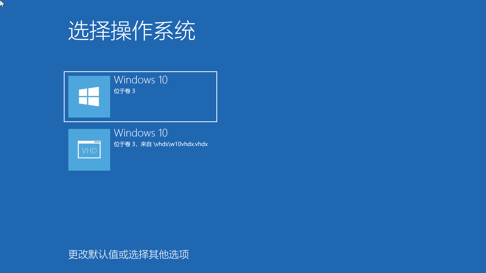

### 重命名启动项

为了更好地区分虚拟和物理磁盘中的操作系统，你可能想给刚刚添加的启动项取一个不同的名字。要给启动项改名，你需要用到 `bcdedit`.

在 `BOOTMGR` 的启动项数据库里，每个启动项都有一个唯一的 `UUID`; 要对一个特定的启动项进行修改，你需要先获取它们的 `UUID`.

不添加任何选项运行 `bcdedit` 将会获取目前所有启动项的信息：

```
PS C:\Windows\system32> bcdedit

Windows 启动管理器
--------------------
标识符                  {bootmgr}
device                  partition=\Device\HarddiskVolume1
path                    \EFI\Microsoft\Boot\bootmgfw.efi
description             Windows Boot Manager
locale                  zh-CN
inherit                 {globalsettings}
default                 {current}
resumeobject            {edd55b4c-0bc1-11eb-8106-a0043c6d1b90}
displayorder            {edd55b4d-0bc1-11eb-8106-a0043c6d1b90}
                        {current}
toolsdisplayorder       {memdiag}
timeout                 30

Windows 启动加载器
-------------------
标识符                  {edd55b4d-0bc1-11eb-8106-a0043c6d1b90}
device                  partition=E:
path                    \Windows\system32\winload.efi
description             Windows 10
locale                  zh-CN
inherit                 {bootloadersettings}
isolatedcontext         Yes
allowedinmemorysettings 0x15000075
osdevice                partition=E:
systemroot              \Windows
resumeobject            {edd55b4c-0bc1-11eb-8106-a0043c6d1b90}
nx                      OptIn
bootmenupolicy          Standard

Windows 启动加载器
-------------------
标识符                  {current}
device                  partition=C:
path                    \Windows\system32\winload.efi
description             Windows 10
locale                  zh-CN
inherit                 {bootloadersettings}
recoverysequence        {edd55b42-0bc1-11eb-8106-a0043c6d1b90}
displaymessageoverride  Recovery
recoveryenabled         Yes
isolatedcontext         Yes
allowedinmemorysettings 0x15000075
osdevice                partition=C:
systemroot              \Windows
resumeobject            {edd55b40-0bc1-11eb-8106-a0043c6d1b90}
nx                      OptIn
bootmenupolicy          Standard
```

在每个 "Windows 启动加载器" 下的 `标识符` 就是我们要用的 `UUID`.

`device` 行代表启动项所使用的设备；目前我们的虚拟磁盘依然在挂载状态，所以 `device` 会返回当前虚拟磁盘被挂载到的盘符。在 *noarch* 的例子里，它是 `E:`, 对应的 `UUID` 是 `{edd55b4d-0bc1-11eb-8106-a0043c6d1b90}`.

选中然后右击鼠标复制这个标识符，然后运行：

```
bcdedit /set "[你的启动项 UUID]" description "[启动项描述]"
```

> <i class="fa fa-exclamation-triangle" aria-hidden="true"></i> 因为 `PowerShell` 与 `CMD` 对待字符串的方式不同， 在 `PowerShell` 里，启动项 `UUID` 以及描述需要用双引号 `"` 或单引号 `'` 括起来。

在 *noarch* 的例子里，这是我运行的实际命令以及结果：

```
PS C:\Windows\system32> bcdedit /set "{edd55b4d-0bc1-11eb-8106-a0043c6d1b90}" description "位于 VHDX 内的 Windows 10 专业工作站版"
操作成功完成。
```

操作完成后，你就可以重启进入新安装的 Windows 了。

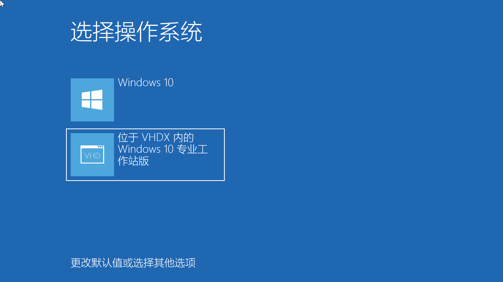

## 配置新安装的 Windows

重启选择新安装的 Windows 后，Windows 可能会多重启几次；而这些重启依然会通过原系统的启动引导器进行，因此你需要在电脑前 ~~坐和放宽~~ 并且准备在启动菜单中选择虚拟磁盘内的 Windows 安装。

*noarch* 将不在此赘述 `OOBE`（开箱体验），详细的过程请看 [OOBE 注意事项（未完成）。]()

### 激活

如果你在一台预装了正版 Windows 的机器上安装对应版本的 Windows（通常为 Windows 家庭单语言版），Windows 会读取主板固件内的数字证书自动激活。如果 Windows 没有自动激活，你需要购买一个 Windows 的授权。

因为法律原因（没错，求生欲挺强），*noarch* 将不描述<a href="https://kms.cangshui.net" style="color:#333333">使用 KMS 服务器激活的方法。</a>

~~使用微软®软件正版授权 安全 稳定 声誉~~

### 安装驱动

进入 ` Windows 设置 -> 更新和安全 -> Windows 更新 `, 手动检查更新。Windows 会通过 Windows Update 自动安装关键的硬件驱动。

如果你要手动安装驱动，虚拟磁盘内的 Windows 在驱动安装上和直接在物理磁盘内安装基本无异。

### 卸载 (unmount) 物理分区

> <i class="fa fa-bomb" aria-hidden="true"></i> **永远加密和备份高敏感性和珍贵的数据。** 下面的方法只能避免常见的文件操作，并不能阻止专门为了盗取或摧毁已卸载磁盘内数据的恶意软件。

你应该不想这个系统内的应用读取你直接存储在物理磁盘内的文件。然而 Windows 会自动挂载所有检测到的磁盘和分区，使得所有的应用都能访问其中的内容：

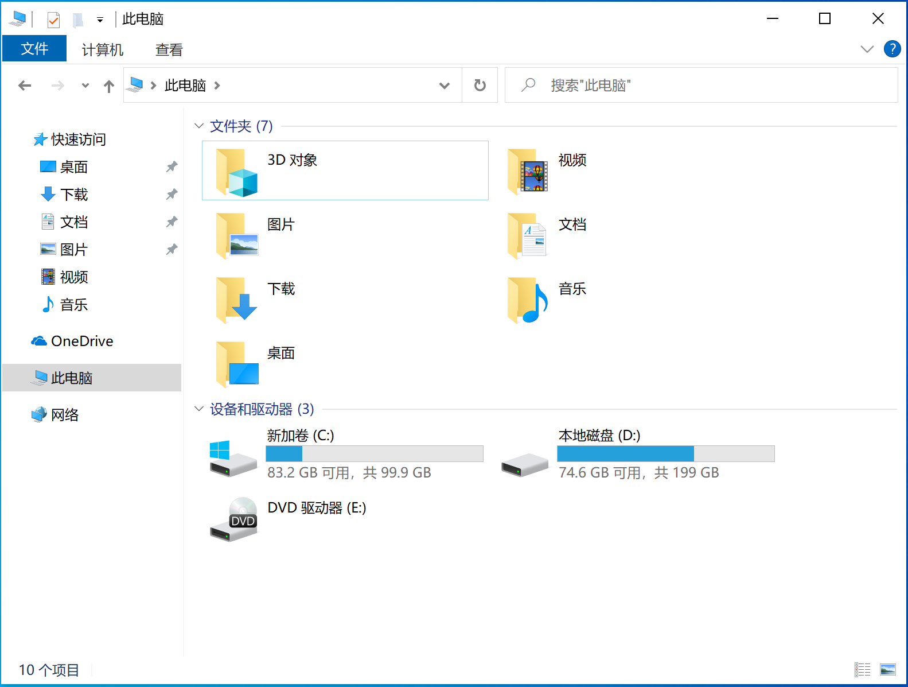

要卸载 (unmount, 取消装载，而不是移除) 物理磁盘，你同样需要使用磁盘管理 `diskmgmt`.

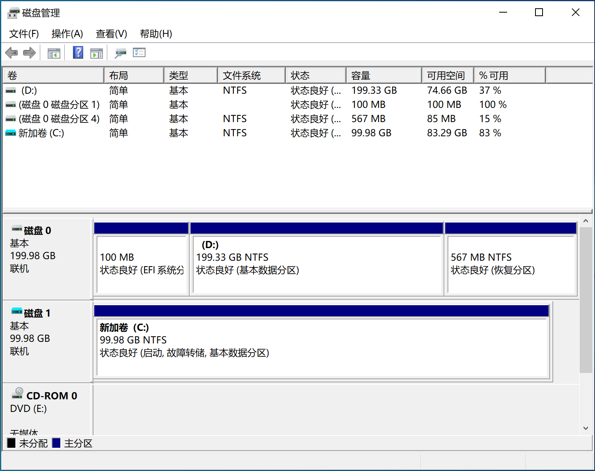

右击你要卸载的分区，选择“更改驱动器号和路径”：

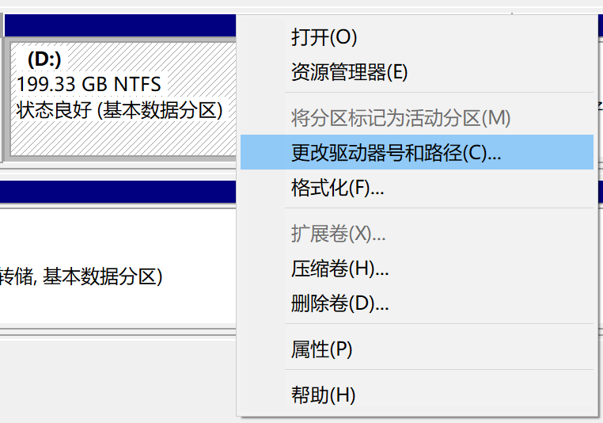

在弹出的窗口里选中当前的驱动器号，然后“删除”。同时你需要两次确认操作：

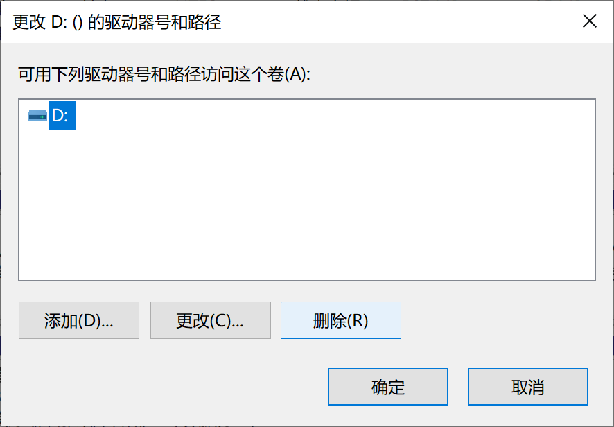

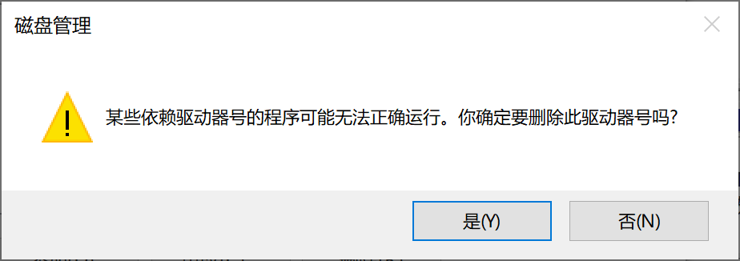

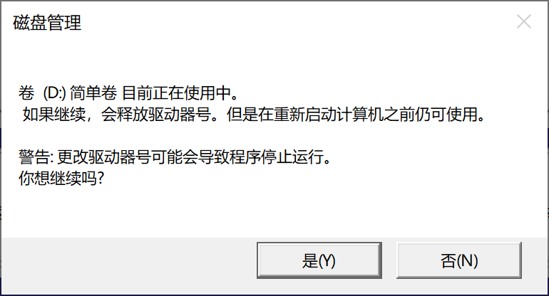

对所有自动装载的物理分区重复上述操作，你就能卸载所有想隔离的物理分区了。你甚至可以卸载包含着当前虚拟磁盘文件的物理分区，而 Windows 依然能访问这个虚拟磁盘文件。

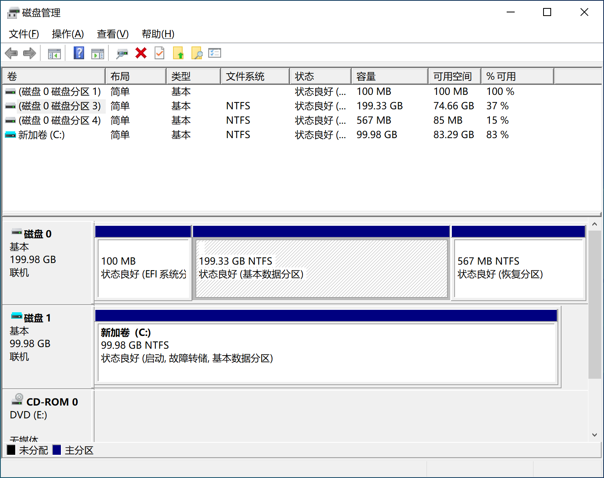

### 虚拟内存

如果你在上一步遇到了问题，原因很可能是 Windows 在你要卸载的物理卷上启用了虚拟内存。要顺利卸载，你需要先在禁止 Windo𥥈ws 在它们上面存储虚拟内存分页文件。

在 <code>性能选项（<i class="fa fa-windows"></i> + R -> SystemPropertiesPerformance.exe）-> 高级 -> 虚拟内存 -> 更改</code> ，取消选择“自动管理所有驱动器的分页文件大小”。然后挨个选择你要卸载的分区，然后选择“无分页文件”：


[Windows 不支持在虚拟磁盘存放虚拟内存分页文件；](https://social.technet.microsoft.com/Forums/windows/en-US/dd78df78-7025-4ed7-ac47-2310e814c68f/native-vhd-boot-and-swapfile?forum=w7itprovirt)因此，如果你需要使用虚拟内存，请至少保留一个物理卷的挂载。

没有物理卷存放虚拟内存，Windows 会在没有虚拟内存的情况下运行。如果你 PC 的内存较少 ( <=4GiB ), 你可能需要注意内存的使用，以免内存不足，应用无法启动或正常运行。

## 在另一个 Windows 中访问虚拟磁盘

安装完成之后，要在另一个 Windows 中访问这个虚拟磁盘内的文件，你需要手动挂载该虚拟磁盘。

打开磁盘管理 `diskmgmt`, 在顶部菜单点击 `操作 -> 附加 VHD`: 


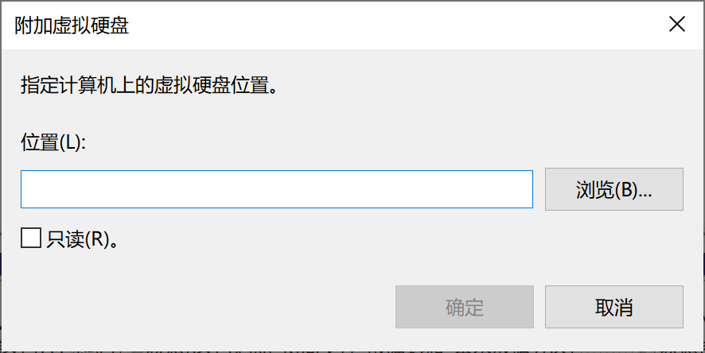

选择你之前创建的 `vhdx`, 点击“确定”。

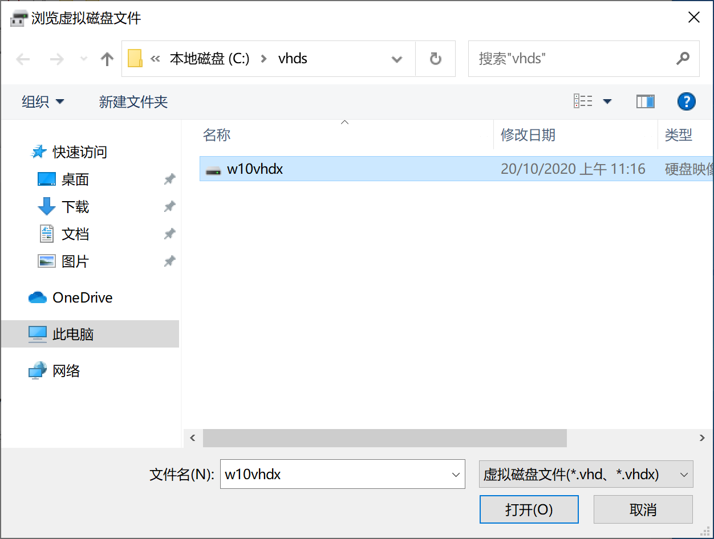

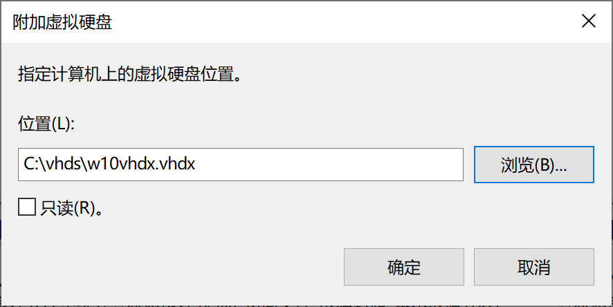

你就可以在文件资源管理器中访问这个虚拟磁盘了。

这个虚拟磁盘会在重启时被卸载；你也可以在访问完后手动卸载该虚拟磁盘。

在磁盘管理中右击挂载过的虚拟磁盘，选择“分离 VHD”：

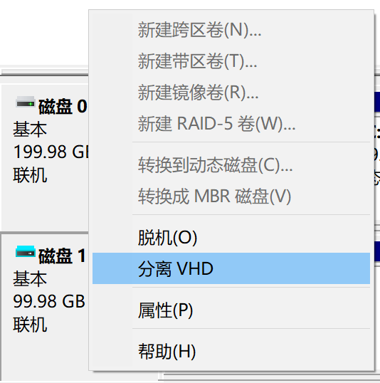

然后确认。

> <i class="fa fa-info-circle" aria-hidden="true"></i> 如果 Windows 提示该磁盘正在被占用，关闭所有文件资源管理器的窗口，再试一次。


## 操作差分虚拟磁盘 / 快照

### 创建

就像其它的虚拟地盘格式，你也可以通过差分 `VHD` 来为虚拟磁盘内的系统创建“快照”。

你需要用到 Windows 的命令行磁盘管理工具 `diskpart`.

以管理员权限打开 `PowerShell`, 启动 `diskpart`:

```
PS C:\Windows\system32> diskpart

Microsoft DiskPart 版本 10.0.19041.1

Copyright (C) Microsoft Corporation.
在计算机上: DESKTOP-JPN5V0H

DISKPART>
```

在 `diskpart` 里创建一个拆分 `vhd`: 

```
DISKPART> create vdisk file=[你要创建的拆分 VHD 位置] parent=[原 VHDX 位置]
```

例如：

```
DISKPART> create vdisk file=C:\vhds\w10vhdx-diff.vhdx parent=C:\vhds\w10vhdx.vhdx

  100 百分比已完成

DiskPart 已成功创建虚拟磁盘文件。
```

然后你需要按照[在另一个 Windows 中访问虚拟磁盘](#在另一个-windows-中访问虚拟磁盘)中的步骤挂载此差分虚拟磁盘。

创建完成后，你需要重复[配置启动项](#配置启动项)和[重命名启动项](#重命名启动项)中的步骤，并将这些步骤中的虚拟磁盘文件换成你刚刚创建的拆分虚拟磁盘。

将拆分虚拟磁盘添加到启动项后，你在启动到虚拟磁盘时，需要选择拆分虚拟磁盘，而不是源虚拟磁盘：

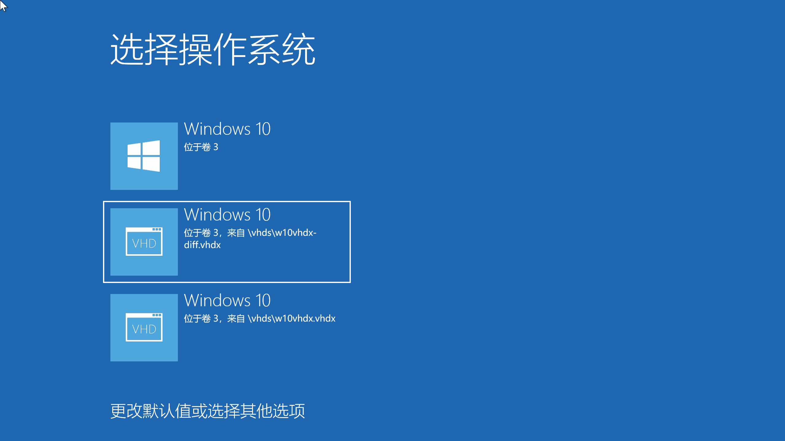

> <i class="fa fa-bomb" aria-hidden="true"></i> 如果你在这时从源虚拟磁盘启动，你由此创建的**所有**差分磁盘将会失效。

### 恢复

要恢复“快照”，只需要删除你在“创建快照”时使用的差分磁盘，然后删除其启动项：

```
bcdedit /delete "[你的启动项 UUID]"
```

例如：

```
bcdedit /delete "{6e430704-1163-11eb-b935-d3152726ad7a}"
```

最后再次按照[创建](#创建)中的步骤创建新的拆分磁盘。

## 总结

最后 *noarch* 再次提醒，**VHD 以及其它双系统手段不能作为对恶意软件的防护**。

它能做到的，是提升软件访问你数据的门槛，以及防止软件注册后台服务实时监控你的行为。

光看不做没用，如果你面对监考软件或“不想用却必须要用”软件的威胁，现在就去试试吧。
