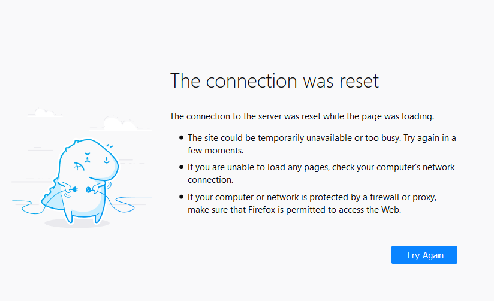
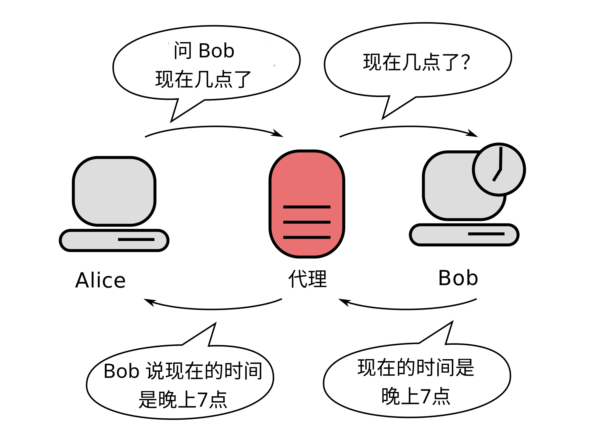

# 突破网络长城

---

## “翻墙”是什么？

根据 Wikipedia, “翻墙”又叫“[突破网络审查](https://en.wikipedia.org/wiki/Internet_censorship_circumvention)”，是**通过多种方法来规避[网络审查](https://en.wikipedia.org/wiki/Internet_censorship)的行为**。

## 为什么要“翻墙”？

当你在阅读这篇文章的时候，你应该已经意识到了“墙”的存在：

防火墙，一个知名的例子是[防火长城](https://en.wikipedia.org/wiki/Great_Firewall)，会**检测并切断特定的连接**。

上图展现的是一个“连接被重置”错误信息。“连接重置”是防火长城常使用的一个封阻手段：你在访问网站之前，需要先和目标网站建立一个连接。除了特殊例外，中国的所有国际出口连接均经过防火长城。当防火长城检测到应该被禁止的连接，会在中途假装目标服务器向客户端发送“连接重置”指令，使得客户端以为另一端中止了连接。客户端因此也中止连接，防火长城对连接的阻断达成。

继续以防火长城为例，防火长城的目的是维护中国政府对网络信息的审查。其封阻的网站和服务包括但不限于未遵守中国政府审查的社交媒体、“色情”、“恐怖”、以及对中国政府不利的新闻和政治宣传。要访问这些网站和服务，**你需要绕过防火墙的审查**。

## 代理工具如何“翻墙”？

“[代理服务器](https://en.wikipedia.org/wiki/Proxy_server)”是一种常见的翻墙方式。其基本原理是**通过一个中间人把信息送达目标地址**（网站、服务...）。

  
[来源](https://commons.wikimedia.org/wiki/File:Proxy_concept_en.svg)，由 *noarch* 翻译

从上图可以看出，“代理”是信息交换过程中的“中间人”。在使用代理访问“被墙”网站的时候，向被墙网站的请求先经过代理服务器，而这个代理服务器并没有“被墙”，可以访问。该代理服务器本身也在“墙外” - 它处于中国大陆之外，并不受审查。通过一个没有“被墙”，也不受墙管理的代理服务器中转，你就可以访问被墙的网站和服务了。

## “翻墙”的安全性如何？

目前可用的，商业和开放的“翻墙”技术都能**以[加密](https://en.wikipedia.org/wiki/Encryption)来保证你的信息安全**。你的代理流量会被以不同的形式加密传输，保证除了你的设备和代理服务器之外没有人能窃取你的代理流量。以 [AES-128](https://en.wikipedia.org/wiki/Advanced_Encryption_Standard)（一种加密算法） 为例，除了使用[旁路攻击](https://en.wikipedia.org/wiki/Side-channel_attack)及[社会工程](https://en.wikipedia.org/wiki/Social_engineering_(security))攻击（例如诈骗、审问密钥拥有者），理论上攻击者需要穷举高达 2128 个密钥来破解 AES-128 加密。

你可能会有疑问，*如果我的代理提供者想要窃取我的信息呢？*

如果你在访问一个 [HTTPS](https://en.wikipedia.org/wiki/HTTPS) 加密的网站，你不用担心代理提供者窃取你的信息。这层 HTTPS 加密只有你和你访问的网站能解密 - 即使是你的代理提供商也不能解密你和其它 HTTPS 网站的流量。如果你在通过代理通话，以 Telegram 为例，Telegram 的语音和视频通话是[端到端加密](https://en.wikipedia.org/wiki/End-to-end_encryption)的：这意味着只有你和电话另一边的人能解密这个通话。无论是你的代理提供者，还是 Telegram 官方都无法解密你的通话内容。

比起破解代理通道的内容，防火墙更倾向使用“[流量特征识别](https://en.wikipedia.org/wiki/Traffic_classification)”。防火墙通过数据包分析等方法区分代理流量与其它浏览流量；当防火墙识别到大量非正常流量时，会对流量的目标，也就是代理服务器进行封锁。

[数据混淆](https://en.wikipedia.org/wiki/Data_masking)是一种反制流量特征识别的方法；通过混淆，代理流量被**伪装成正常的浏览流量**，绕过防火墙的检测。以 [ShadowsocksR](https://en.wikipedia.org/wiki/Shadowsocks#ShadowsocksR) 使用的 tls1.2\_ticket\_auth 为例，它将代理数据伪装成 [TLS](https://en.wikipedia.org/wiki/Transport_Layer_Security) 协议的[握手](https://en.wikipedia.org/wiki/Handshaking)请求，以欺骗防火墙。

## “翻墙”后不要做什么？

下面总结一些人们在“翻墙”后常犯的一些错误：

<i class="fa fa-bomb" aria-hidden="true"></i> **通过代理登录墙内的帐号。** 这相当于向监控者宣布“我在使用代理”。

<i class="fa fa-bomb" aria-hidden="true"></i> **在墙外的帐号上使用与墙内帐号一样的信息，** 或者在墙外社交平台上公布自己墙内的信息。这相当于向监控者宣布“这是我的墙外帐号，我在墙外发布了\*\*\*”。

<i class="fa fa-bomb" aria-hidden="true"></i> **通过公共代理进行 P2P 传输。** 大多数（尤其是免费的）代理提供商禁止例如“种子”下载的 P2P 传输。除非代理提供商特别声明允许，尝试这样做可能会导致种子下载失败，甚至是代理帐号被封禁。如果你自己租用服务器搭建代理，请参考服务器提供商的条款。

<i class="fa fa-bomb" aria-hidden="true"></i> **在购买时填写真实的住址及银行卡。** 如果你遇到了一个监控者运营的钓鱼网站，你将会遇到不可预测的后果。如果你需要在墙外购买真实物品，请使用代购或填写邮件代收站的地址，并使用虚拟信用卡或加密货币。

<i class="fa fa-bomb" aria-hidden="true"></i> **允许输入法联网。** 商业的输入法大多数包含“云输入”功能，该功能会将你输入的内容上传至输入法提供商的服务器上进行分析。当你用它们输入“敏感词”时会带来不可预料的后果。

<i class="fa fa-bomb" aria-hidden="true"></i> **使用“杀毒软件”。** 得益于封闭的安全策略， Android 设备在绝大多数情况下不需要“杀毒软件”。任何的商业 Android “杀毒软件” 均是为了向你展示广告以及监控你的活动。

<i class="fa fa-bomb" aria-hidden="true"></i> **公开分享你的代理服务器信息。** 除非有特殊准备，严禁公开发布你的代理服务器（或是代理服务帐号）信息。这些信息可以帮助监控者找出你的身份。

<i class="fa fa-bomb" aria-hidden="true"></i> **进行未加密的连接。** 在进行未加密的连接时（例如访问使用明文 HTTP 协议的网站），你的代理提供者（在使用 Tor 时，是你的 "Exit Guard"）将能窃取和修改你发送和接收到的信息。
